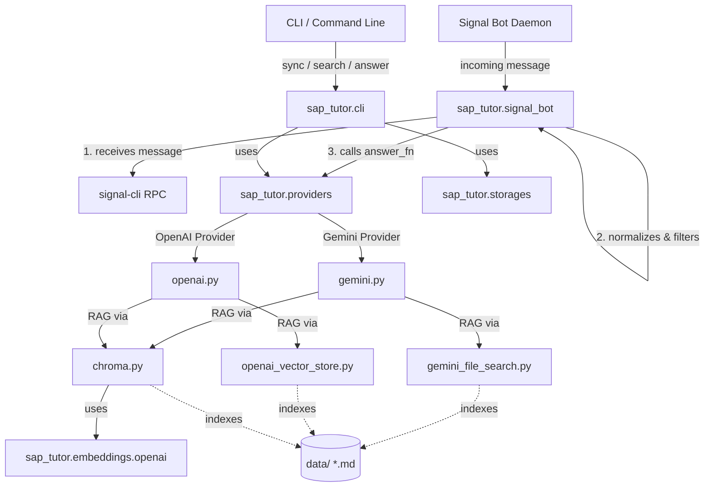

# SAP Tutor 🎓🤖

**SAP Tutor** — це інтелектуальний асистент викладача SAP, побудований на базі архітектури RAG (Retrieval-Augmented Generation). Система дозволяє індексувати навчальні матеріали у форматі Markdown та використовувати передові мовні моделі (LLM) для надання точних відповідей на запитання користувачів. Бот інтегрується із Signal для автоматичної підтримки студентів та викладачів у реальному часі.

Проект орієнтований на детермінованість, модульність та безпеку: LLM використовується виключно для інтерпретації намірів і формування відповідей на основі суворого контексту бази знань, тоді як всі операції з даними чітко розмежовані.

---

## 🚀 Основні можливості

- **Гнучка RAG-архітектура**: підтримка різних провайдерів та сховищ для пошуку й генерації відповідей.
- **Підтримка LLM-провайдерів**:
  - ♊ **Gemini** (через офіційний Google GenAI SDK з моделями на кшталт `gemini-2.5-flash`).
  - 🧠 **OpenAI** (через офіційний OpenAI SDK з моделями на кшталт `gpt-4.1-mini`).
- **Модульні сховища документів (Storages)**:
  - 📁 **Gemini File Search**: вбудована система пошуку по файлах Google GenAI.
  - 📁 **OpenAI Vector Store**: вбудоване векторне схожіще OpenAI Assistants API.
  - 📁 **Chroma DB**: локальна векторна база даних для повністю автономного або гібридного семантичного пошуку.
- **Локальні та хмарні ембединги**: підтримка створення векторних представлень через OpenAI Embeddings.
- **Чат-транспорт Signal Bot**:
  - Інтеграція з Signal через `signal-cli` (JSON-RPC).
  - Автоматичне відстеження оброблених повідомлень для уникнення повторних відповідей.
  - Робота в групах та приватних чатах (активація за префіксом `/faq` або автоматично у тестовому режимі).
- **Повнофункціональний CLI**: керування індексуванням, тестування відповідей та пошуку, запуск бота через командний рядок.

---

## 📐 Архітектура системи

Взаємодія компонентів системи виглядає наступним чином:



---

## 📂 Структура проекту

```text
eteacher/
├── sap_tutor/                # Головний пакет Python
│   ├── embeddings/           # Модулі генерації векторних представлень
│   │   ├── __init__.py
│   │   └── openai.py         # Генерація ембедингів через OpenAI API
│   ├── providers/            # Модулі LLM (оркестрація відповідей та RAG)
│   │   ├── __init__.py
│   │   ├── gemini.py         # Провайдер Google Gemini RAG
│   │   └── openai.py         # Провайдер OpenAI RAG
│   ├── storages/             # Модулі збереження та пошуку документів
│   │   ├── __init__.py
│   │   ├── chroma.py         # Локальне сховище Chroma DB
│   │   ├── gemini_file_search.py  # Хмарне сховище Gemini File Search
│   │   └── openai_vector_store.py # Хмарне сховище OpenAI Assistants API
│   ├── cli.py                # Інтерфейс командного рядка (Cyclopts)
│   ├── files.py              # Робота з файловою системою та станом
│   └── signal_bot.py         # Демон Signal бота (інтеграція з RPC)
├── data/                     # База знань: Markdown матеріали (*.md)
├── docs/                     # Проектна документація та архітектурні нотатки
├── Dockerfile                # Docker-контейнер з підтримкою python та signal-cli
├── Makefile                  # Скорочення для збірки та реєстрації Signal бота
├── main.py                   # Точка входу для CLI програми
├── pyproject.toml            # Опис проекту та залежностей (uv-сумісний)
└── uv.lock                   # Зафіксовані залежності проекту
```

---

## 🛠️ Встановлення та налаштування

Проект використовує сучасний пакетний менеджер [uv](https://github.com/astral-sh/uv) для швидкого та надійного керування залежностями.

### 1. Клонування репозиторію та створення оточення

```bash
# Встановіть uv, якщо ще не встановлено
curl -LsSf https://astral.sh/uv/install.sh | sh

# Створіть віртуальне оточення та встановіть залежності
uv sync
```

### 2. Змінні оточення

Створіть файл `.env` у корені проекту та вкажіть ваші API ключі залежно від провайдерів, які плануєте використовувати:

```env
# Для використання провайдера Gemini та Gemini File Search
GEMINI_API_KEY="your-gemini-api-key"

# Для використання провайдера OpenAI, OpenAI Vector Store та OpenAI Embeddings
OPENAI_API_KEY="your-openai-api-key"

# Налаштування Signal бота (опціонально)
SIGNAL_RPC_URL="http://127.0.0.1:8080/api/v1/rpc"
SIGNAL_ACCOUNT="+380XXXXXXXXX"
```

---

## 💻 Використання CLI (Командного рядка)

Точка входу в програму — `main.py`. Ви можете виконувати чотири основні команди.

### 1. Синхронізація документів (`sync`)
Завантажує ваші Markdown файли з директорії `data/` (за замовчуванням) до обраного сховища.

```bash
# Синхронізація у хмару Gemini File Search (за замовчуванням)
uv run main.py sync --storage gemini_file_search

# Синхронізація у локальну базу Chroma (використовує OpenAI ембединги)
uv run main.py sync --storage chroma

# Синхронізація у хмару OpenAI Vector Store
uv run main.py sync --storage openai_vector_store
```

### 2. Отримання відповіді на запитання (`answer`)
Формує відповідь на запит на основі бази знань у вибраному сховищі.

```bash
# Запит через Gemini (за замовчуванням) та Gemini File Search (за замовчуванням)
uv run main.py answer "Як сторнувати документ матеріалу?"

# Запит через OpenAI та локальний Chroma індекс
uv run main.py answer --query "Як сторнувати документ?" --provider openai --storage chroma

# Запит із обмеженням кількості знайдених джерел (limit)
uv run main.py answer --query "Які бувають рухи матеріалів?" --limit 3
```

> [!NOTE]  
> Відповіді генеруються виключно українською мовою на основі знайдених документів. Якщо інформації у базі знань недостатньо для відповіді, модель відкрито про це повідомить, що запобігає галюцинаціям.

### 3. Семантичний пошук (`search`)
Пошук документів та виведення релевантних фрагментів без генерації текстової відповіді моделі (підтримується для Chroma).

```bash
uv run main.py search --query "сторнування" --storage chroma --limit 3
```

Ви отримаєте список знайдених файлів із відстанями (distance) та прев'ю вмісту.

### 4. Запуск Signal бота (`signal_bot`)
Запуск демона, який постійно опитує Signal RPC сервер та автоматично відповідає на запити.

```bash
# Запуск бота у тестовому режимі (відповідає на всі повідомлення)
uv run main.py signal_bot --test-mode

# Запуск бота у стандартному режимі (відповідає лише на повідомлення з префіксом "/faq <запит>")
uv run main.py signal_bot --provider gemini --storage gemini_file_search
```

---

## 🤖 Запуск Signal-бота через Docker та signal-cli

Бот використовує протокол JSON-RPC для спілкування з клієнтом `signal-cli`.

### Схема роботи з signal-cli

1. **Реєстрація номеру**:
   Для запуску необхідно спочатку зареєструвати номер телефону в мережі Signal. Для цього можна скористатися вбудованим у `Makefile` спрощенням:
   ```bash
   # Вкажіть ваш номер у Makefile (змінна SIGNAL_USER) та виконайте реєстрацію:
   make register
   ```
2. **Збірка Docker-образу**:
   ```bash
   make build
   ```
3. **Запуск контейнера**:
   Клієнт `signal-cli-native` підтримує збереження сесії у локальному томі `signal-cli-state` для збереження авторизації між перезапусками.
   ```bash
   make run
   ```

Для стабільної роботи бота переконайтеся, що демон `signal-cli` запущений у режимі ручного отримання повідомлень (`--receive-mode=manual`).

---

## 📘 Правила написання бази знань (Markdown)

Для отримання максимально точних та якісних відповідей від RAG системи, рекомендується дотримуватися наступних правил при створенні файлів у папці `data/`:

1. **Один документ — одна тема**: не створюйте гігантські файли. Краще розділити інформацію на дрібні логічні файли (наприклад, `data/transactions/migo.md`, `data/faq/storno.md`).
2. **Наявність метаданих (Frontmatter)**: додавайте на початку файлу службову інформацію, це полегшує пошук:
   ```markdown
   ---
   id: sap_storno_material
   title: Сторнування документів матеріалу (MIGO / MBST)
   tags: [sap, mm, storno, migo]
   ---
   ```
3. **Чітка структура заголовків**: використовуйте логічну ієрархію заголовків (`#`, `##`, `###`) та пишіть тексти зрозумілою мовою, яку користувачі вживатимуть у пошукових запитах.
