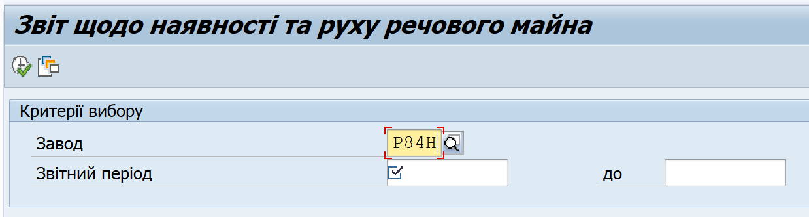
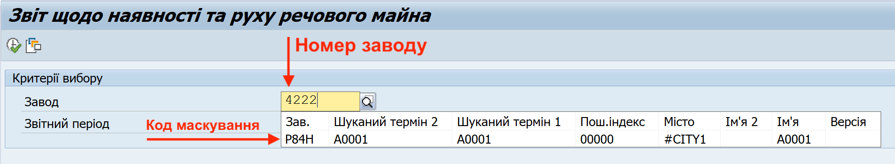
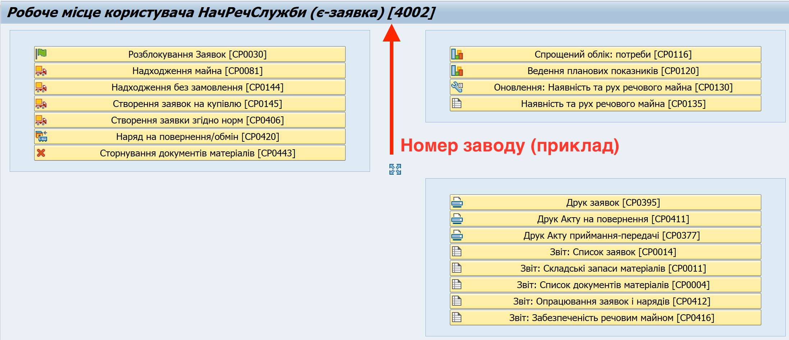
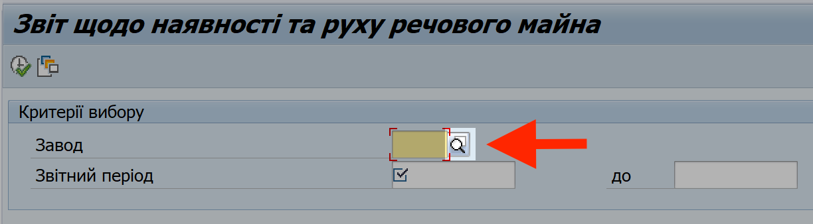
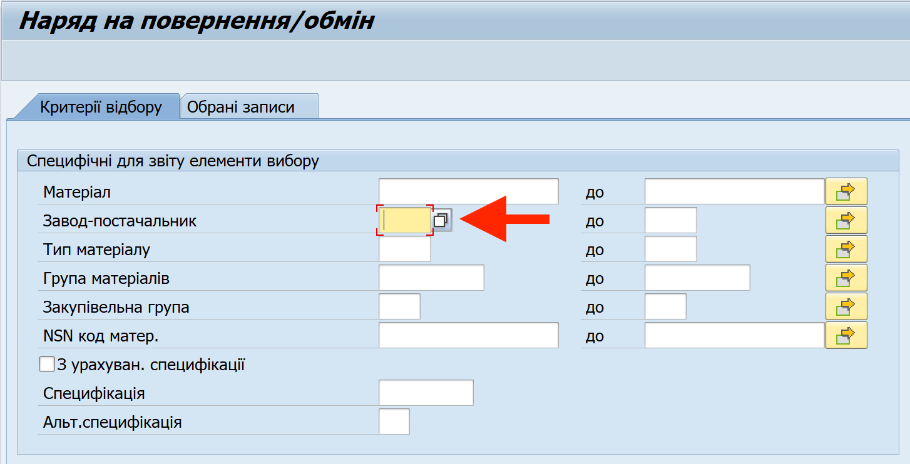
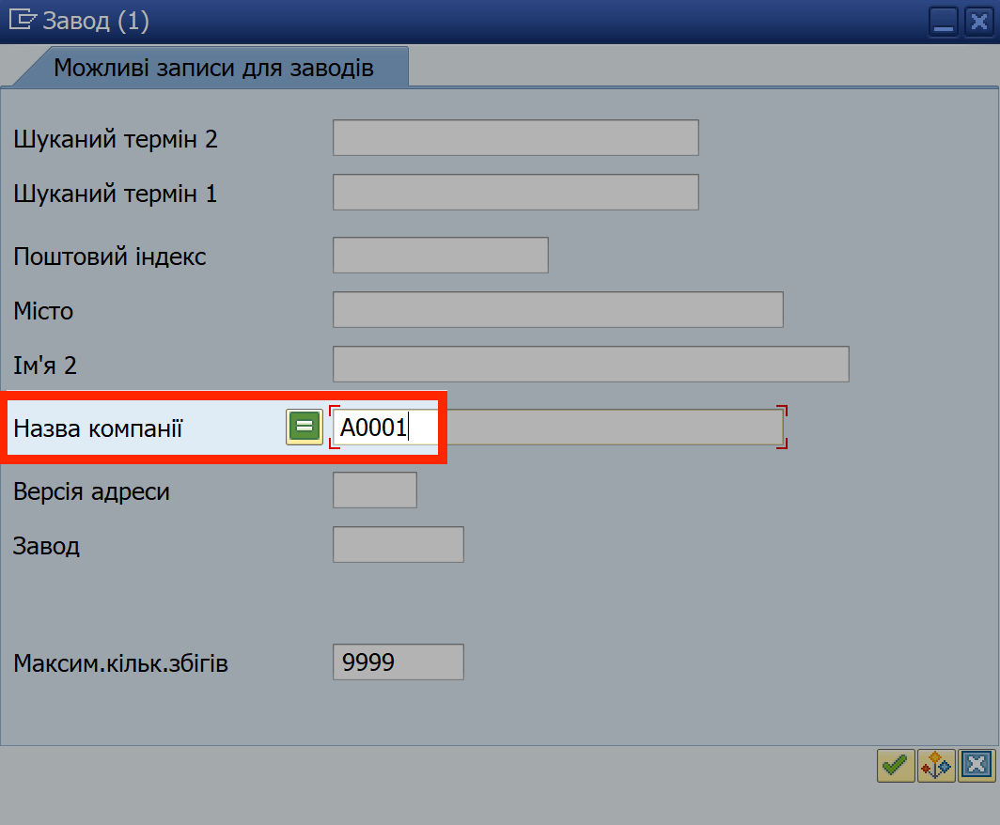
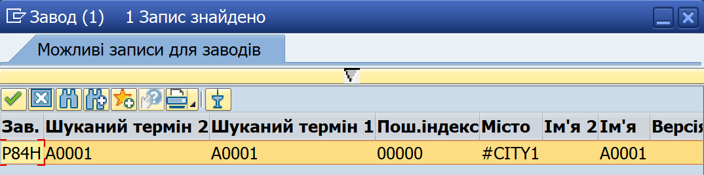

## Введення номеру заводу (з кодом маскування)

Починаючи з березня 2025, в системі (SAP) запроваджується механізм **маскування номерів заводів**.

Номери заводів у всіх транзакціях та звітних формах в системі будуть приховані (хоч і лишаються чинними та не змінюються). При заповненні поля "Завод" у всіх операціях, система автоматично замінює введений номер заводу кодом маскування.

{width="4.444444444444445in" height="1.1991119860017498in"}

{width="6.299212598425197in" height="1.1614173228346456in"}

Код маскування, який приховує номери заводів від перегляду, є частиною функціоналу захисту даних, призначених для службового користування. Інша складова захисту даних – збереження номерів військових частин ПОЗА СИСТЕМОЮ, у окремій базі даних, та відображення цих номерів лише під час роботи.

**Для заповнення поля "Завод", використовуйте відомий вам номер заводу.** Цей номер, дійсний для вашого облікового запису, зазначений на верхній панелі вікні "Робоче місце користувача".

{width="6.13759186351706in" height="2.6574070428696412in"}

Після введення, система замінить номер заводу тимчасовим кодом маскування, який складається з чотирьох латинських літер та/або цифр.

{width="6.299212598425197in" height="1.1614173228346456in"}

Система періодично змінює код маскування для кожного заводу.

> Тому рекомендуємо не запам'ятовувати код маскування, а радше вводити саме номер заводу.

**Якщо ви не знаєте номер вашого заводу** (або номер заводу-постачальника, який вимагається у деяких операціях), та **номер заводу не відображається у вікні "Робоче місце користувача"**, скористайтесь функцією Пошуку. Виконайте наступні кроки:

1\. Справа від поля "Завод", натисніть кнопку пошуку {width="0.2361111111111111in" height="0.2638888888888889in"}.

{width="4.694003718285215in" height="1.2962970253718284in"}

{width="5.111111111111111in" height="2.608125546806649in"}

2\. У вікні "Завод", у полі "Назва компанії", вкажіть код вашої військової частини у форматі "А0000".

Використовуйте літери "а" або "А" українською розкладкою клавіатури.

{width="3.1978729221347333in" height="2.638888888888889in"}

3\. У вікні "Можливі записи для заводів", двічі натисніть рядок, який відповідає вказаному номеру в/частини. Якщо жодного запису не знайдено, повторіть крок 2, ввівши коректний код в/частини.

{width="4.324074803149606in" height="1.0789774715660543in"}

4\. Система знову відобразить вікно з пункту 1, у якому поле "Завод" буде заповнене кодом маскування.\
\
Після заповнення поля, можна виконувати потрібну операцію.

{width="4.611111111111111in" height="1.2440791776027997in"}
