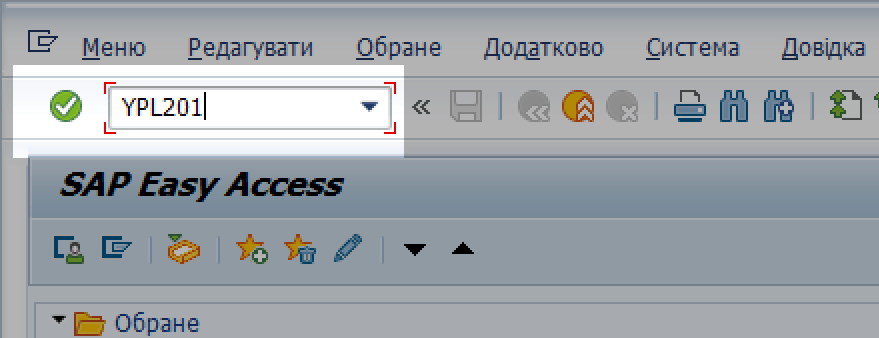
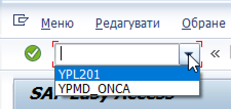

## Виконання транзакцій за їх системним кодом

Транзакцією називається будь-яка операція, яка виконується у програмі LIS.

Іноді, для зручності та швидкого доступу, розробники створюють для транзакцій окремі кнопки-кокпіти або "гарячі клавіши". Якщо розробники не створили кнопки-кокпіту для транзакції, то її треба запускати за допомогою її коду-ідентифікатору у системі.

Щоб запустити транзакцію зі стартового вікна LIS, виконайте такі кроки:

1\. Увійдіть у систему LIS. Відкриється вікно "SAP Easy Access".

> ℹ️ Див. деталі у розділі ["Вхід до системи"](#вхід-до-системи-загальні-кроки).

2\. У полі у лівому верхньому куті, надрукуйте код транзакції.

3\. Натисніть кнопку {width="0.25in" height="0.25in"} ("Виконати") або клавішу "Enter" на клавіатурі комп'ютера щоб почати виконання транзакції.

{width="4.475247156605424in" height="1.722817147856518in"}

**Повторний запуск транзакцій.** Система зберігає перелік всіх транзакцій, які ви виконували раніше. Для того, щоб запустити транзакцію повторно, виконайте такі кроки:

1\. У правому боці поля транзакцій, натисніть трикутник та оберіть транзакцію зі списку збережених.

{width="2.6354166666666665in" height="1.241573709536308in"}

2\. 2. Натисніть кнопку {width="0.25in" height="0.25in"} ("Виконати") , щоб почати виконання транзакції.

