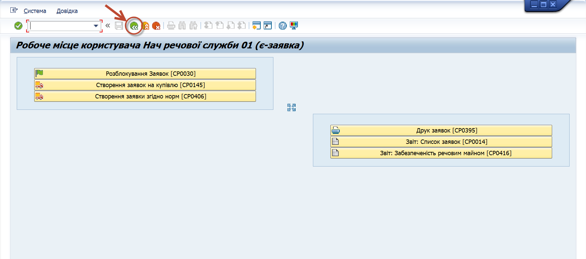
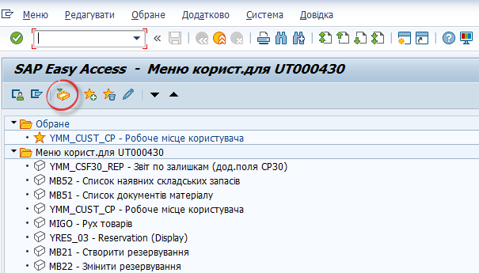
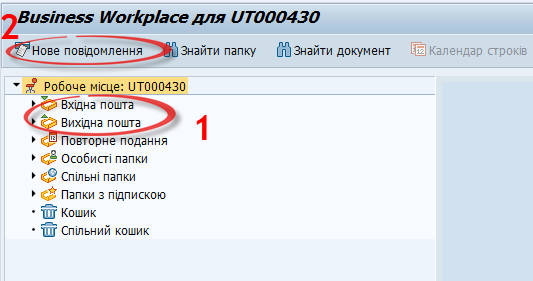
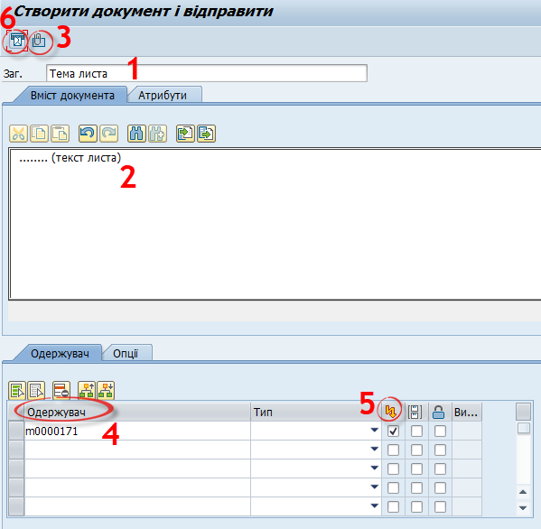
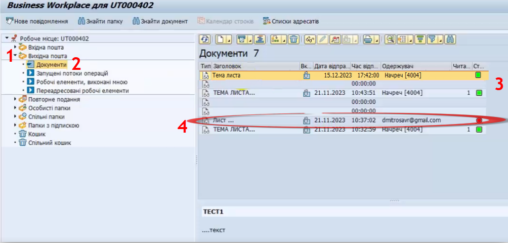
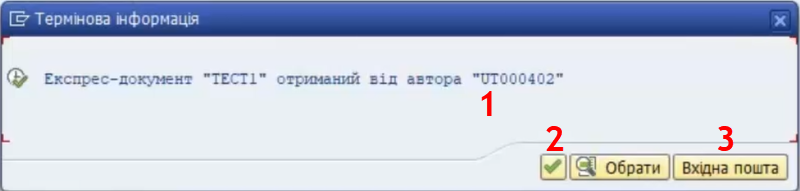

## Внутрішня пошта у модулі SAP Business Workplace

Для захищеної комунікації між користувачами система на базі SAP має відповідний функціонал, використання якого подібне електронним поштовим сервісам.

Нижче описані кроки, які необхідно виконати в системі для відправки листа, його отримання і прочитання.

1\. Після входу в систему зазвичай ви бачите вікно виду:

{width="6.352419072615923in" height="2.8185968941382327in"}\
Нам необхідно відкрити вікно «SAP Easy Access», для цього натисніть кнопку {width="0.2396172353455818in" height="0.22919838145231847in"}.

У вікні «SAP Easy Access» в меню користувача необхідно натиснути на піктограму {width="0.33338035870516186in" height="0.3021259842519685in"} SAP Business Workplace чи комбінацію клавіш Ctrl+F12.

{width="5.64898731408574in" height="3.22132217847769in"}

2\. Відкриється вікно внутрішньої пошти, де можна переглянути відправлені і отримані листи (**1**). Для створення нового натисніть на кнопку «Нове повідомлення» (**2**).

{width="5.551388888888889in" height="2.92671697287839in"}

3\. Відкриється вікно внутрішньої пошти, в якому:

(**1**) -- в поле «Заг.» напишіть тему листа;

(**2**) -- в полі «Вміст документа» напишіть текст листа ;

(**3**) -- прикріпіть файл-додаток за потреби;

(**4**) -- зазначте у відповідному полі логін в системі одержувача;

(**5**) -- зробіть відмітку навпроти адресата у стовпику «Відправлен.: експрес» для його невідкладного сповіщення про отримання листа;

(**6**) -- натисніть {width="0.27087160979877517in" height="0.28128937007874016in"} «Відправити».

{width="6.238803587051619in" height="6.103403324584427in"}

4\. Перевірити відправлені листи можна, обравши у вікні «Business Workplace» категорію «Вихідна пошта» (**1**) і натиснувши в ній на «Документи» (**2**). Праворуч відобразяться листи з адресатами, датами і часом відправки (**3**).

**!!** Для відправки листів внутрішньою поштою SAP, у полі "Одержувач" (**4**) використовуйте **логіни (імена користувачів)** конкретних користувачів системи. Дізнатись такий логін можна тільки особисто, спитавши про це у користувача.

***Примітка.** Спроба відправити лист, вписавши у поле «Одержувач» загальноприйняту електронну адресу користувача буде невдалою, адже це **внутрішня пошта системи**, а не поштовий сервіс! (**4**)*

{width="6.299212598425197in" height="3.0118110236220472in"}

5\. Користувач, якому було направлено лист, побачить інформацію про його отримання у відповідному вікні.

Залежно від відправника (1) отримувач може продовжити працювати і відкласти лист, натиснувши на кнопку «Підтвердити» (2) чи кліком на «Вхідна пошта» (3) одразу перейти для прочитання пошти у вже описане вікно «Business Workplace».

{width="4.96080271216098in" height="1.1841251093613299in"}

