## Редагування заявок

До часу розблокування відповідальним на ОЦЗ отриманої електронної заявки від ВЧ, яка є довольчою для інших ВЧ (управління бригади, полку...) начальник РЕЧ служби, який її створив, може внести зміни в неї, скасувавши власне розблокування (узгодження) і повернувши назад в обробку. Така термінова необхідність може виникнути, наприклад, якщо невдовзі після оформлення і потрапляння її на розгляд ОЦЗ приходить бойове розпорядження щодо постановки/зняття на/з РЕЧ забезпечення нового підрозділу (медичної роти/підпорядкованого батальйону).

В такому випадку необхідно пересвідчитись в системі, що заявка ще не розблокована ОЦЗ (не узгоджена довольчим органом для бригади, полку...). Після цього одразу відкликати в системі власне розблокування (узгодження) і паралельно через особисті канали комунікації попередити відповідальну особу ОЦЗ, що заявка відкликана для термінового внесення в неї змін.

Зміни можуть бути у вигляді зміни кількості майна, додавання нових чи видалення наявних матеріалів (найменувань майна).

Нижче описані безпосередні кроки, які необхідно виконати в системі для внесення змін у заявку.

1. Увійдіть у систему SAP (ІКС УЛЗ) та відкрийте вікно "Робоче місце користувача", якщо воно не відкрилося автоматично.
   Див. розділи:
- ["Вхід до системи"](../%D0%9F%D0%BE%D1%87%D0%B0%D1%82%D0%BE%D0%BA-%D1%80%D0%BE%D0%B1%D0%BE%D1%82%D0%B8-%D1%83-%D1%81%D0%B8%D1%81%D1%82%D0%B5%D0%BC%D1%96.md#вхід-до-системи-загальні-кроки).

- ["Початкове вікно роботи з системою"](../%D0%9F%D0%BE%D1%87%D0%B0%D1%82%D0%BE%D0%BA-%D1%80%D0%BE%D0%B1%D0%BE%D1%82%D0%B8-%D1%83-%D1%81%D0%B8%D1%81%D1%82%D0%B5%D0%BC%D1%96.md#початкове-вікно-роботи-з-системою).

2. На робочому місці користувача натисніть на кнопку "Розблокування Заявок".

{width="5.123114610673666in" height="0.3165977690288714in"}

3. У новому вікні необхідно активувати відображення розблокованих заявок (**1**), ввести номер потрібної заявки (**2**) і перейти в «Обрані записи» (**3**).

> [!NOTE] 
> Для внесення будь-яких змін в заявку необхідно скасувати власне її розблокування (відкликати свій електронний підпис ІКС УЛЗ з неї) чим повернути її з розгляду ОЦЗ назад у ВЧ.*

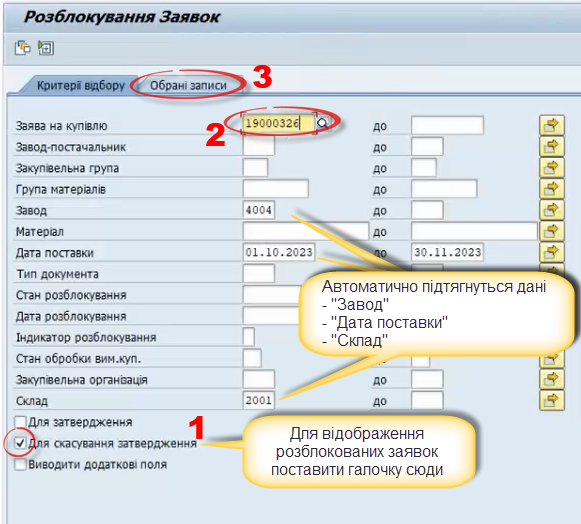{width="5.861292650918635in" height="5.286259842519685in"}

4. У наступному вікні перенести по вже знайомому алгоритму всі записи матеріалів заявки у кошик обробки (**1**), (**2**) і натиснути на кнопку «Скасувати затвердження» (**3**). Після цього натисканням на номер заявки в рядку будь-якого матеріалу (**4**) відкрити вікно відображення інформації по заявці.

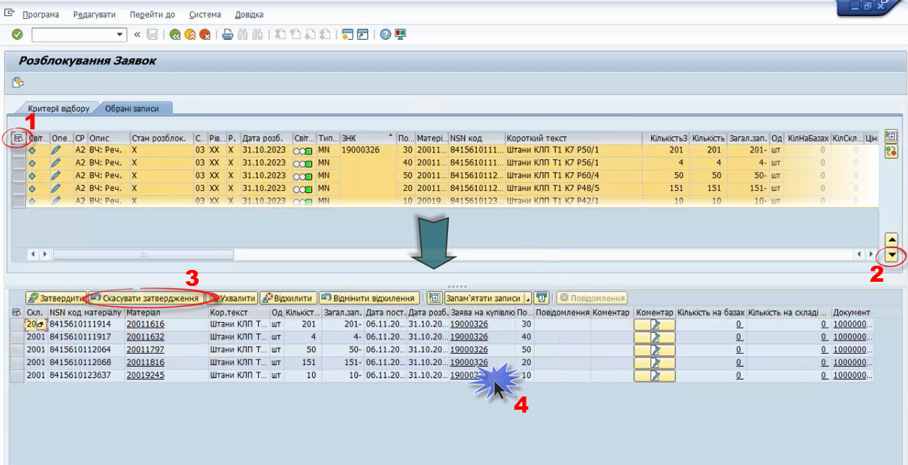{width="6.299212598425197in" height="3.2283464566929134in"}

5. В ньому у категорії «Стратегія розблокування» можна пересвідчитись в успішній відміні деблокування начальником РЕЧ служби (на місці зеленої галочки жовтий трикутник) (**1**), що свідчить про повернення заявки на рівень ВЧ -- ОЦЗ в системі одразу перестане її бачити.

***Примітки.***

***1.** Якщо заявка вже була розглянута і розблокована (узгоджена) ОЦЗ, повернути її назад на редагування для внесення змін буде неможливо.*

***2.** Як тільки Вам стане відомо про необхідність редагування заявки, одразу потрібно її повернути (зняти розблокування своє) і попередити ОЦЗ про її повернення через термінову необхідність.*

Далі потрібно натиснути на кнопку «Відобразити/змінити» (**2**), в результаті чого записи матеріалів стануть доступними до корегування. Заходячи в кількість замовленого майна можна змінити кількість замовленого майна (**3**).

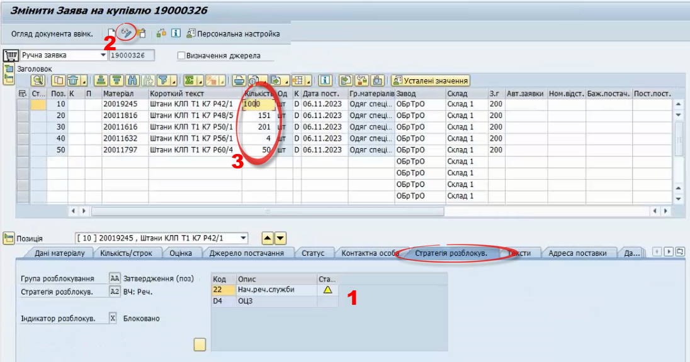{width="6.299212598425197in" height="3.311023622047244in"}

6\. Щоб видалити позицію майна із заявки необхідно виділити потрібний рядок (**1**) і натиснути на кнопку «Видалити» у навігаційній панелі стандартних кнопок (**2**). У діалоговому вікні, яке з'явиться, підтвердити видалення позиції (**3**).

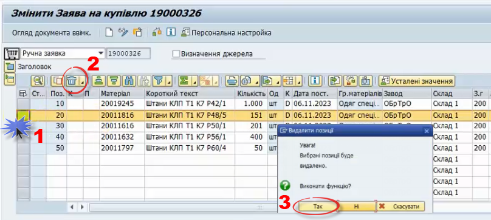{width="6.299212598425197in" height="2.822834645669291in"}

7\. Щоб додати позицію майна до заявки необхідно виділити нижній рядок (**1**) і натиснути на кнопку «Копіювати позицію» у навігаційній панелі стандартних кнопок (**2**).

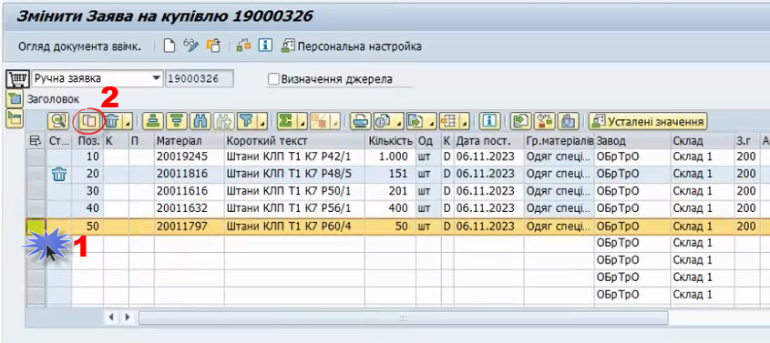{width="6.299212598425197in" height="2.811023622047244in"}

> 7.1. Скопійована позиція буде додана нижнім рядком до існуючих записів матеріалів (**1**). Далі у стовпчику «Матеріал» необхідно натиснути на піктограму біля номеру матеріалу цієї позиції {width="0.19375in" height="0.19375in"} (під ним воно внесене в систему) (**2**).

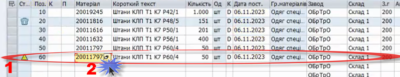{width="6.299212598425197in" height="1.2244094488188977in"}

> 7.2. У вікні, що відкриється, в полі «Опис матеріалу» написати і з обох боків виділити «сніжинками» скорочену назву і розмір потрібного майна (**1**).
>
> Запустити дію натисканням на кнопку «Почати пошук» (**2**).

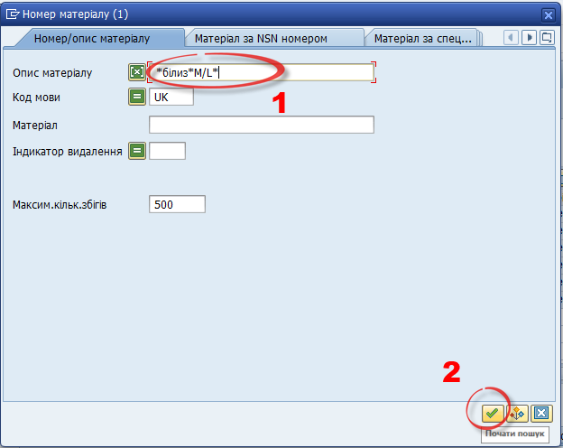{width="4.509313210848644in" height="3.5843241469816274in"}

> 7.3. Відкриється вікно «Номер матеріалу (1)» (Знайдені записи), в якому маєте обрати потрібне майно (**1**) і подвійним натисканням «миші» на нього чи на кнопку «Копіювати» (**2**) перемістити в редаговану заявку.

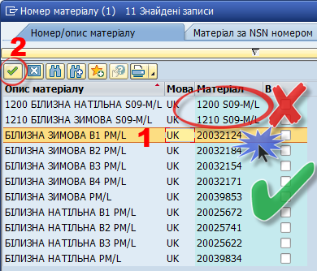{width="4.410243875765529in" height="3.7769772528433947in"}

***Примітка.** Матеріал має складатись з **8 цифр**! Якщо Ви виберете позицію з різними комбінаціями літер-цифр, то не зможете її додати у замовлення, адже це не матеріал, а розмірна сітка матеріалу.*

> 7.4. У чарунці коду матеріалу з'явиться щойно обраний.
>
> (**1**) - натисніть клавішу Enter і підтягнеться назва обраного майна, яка відповідає коду, під яким матеріал внесений в систему.
>
> (**2**) - введіть потрібну для замовлення кількість майна.
>
> (**3**) -- зверніть увагу на автоматично змінену дату поставки доданого майна, відкорегуйте за необхідності.

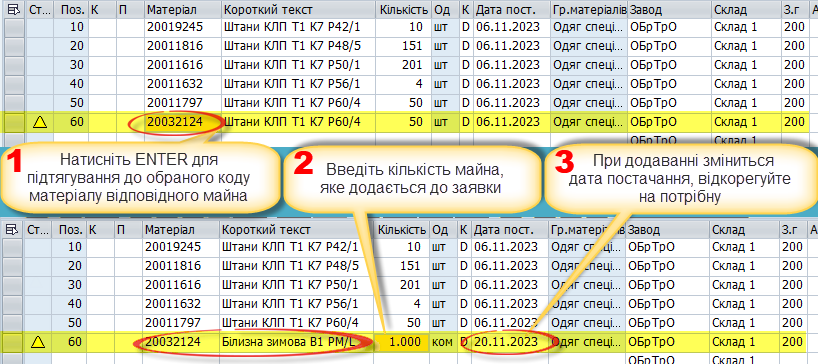{width="6.299212598425197in" height="2.8031496062992125in"}

> 8\. Внесені в заявку зміни необхідно зберегти, натиснувши на відповідну кнопку вгорі екрану (**1**).

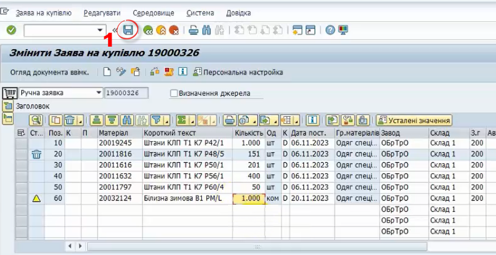{width="6.299212598425197in" height="3.2401574803149606in"}

9\. Система поверне в екран з кошиком обробки, під яким буде сповіщення про внесені в заявку зміни (**1**).

Зверніть увагу, щойно внесені зміни в заявку не відображатимуться (**1**), а буде представлений її первинний варіант -- це не помилка! Для відображення актуальних даних по заявці потрібно вийти на робоче місце користувача і повторно зайти з допомогою кнопки СР0030.

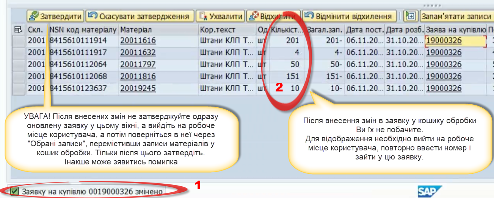{width="6.299212598425197in" height="2.5354330708661417in"}

10\. Виходимо з транзакції, натискаючи декілька разів клавішу «F3» або кнопку {width="0.2604166666666667in" height="0.2708333333333333in"} «Назад» чи {width="0.2708333333333333in" height="0.2916666666666667in"} «Вгору». У діалоговому вікні, що з'явиться, натисніть на «Ні» для очищення кошика обробки від наявних там записів матеріалів, які були опрацьовані.

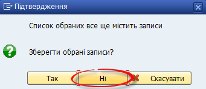{width="4.39582239720035in" height="1.9078652668416447in"}

11\. Для затвердження зміненої заявки виконайте дії, описані у пунктах 16-20 підрозділу 2.3 «Кроки процесу оформлення-подачі «єЗаявки» в системі» з входу.

При вході в обрані записи галочка відображення заявок має стояти навпроти «Для затвердження».

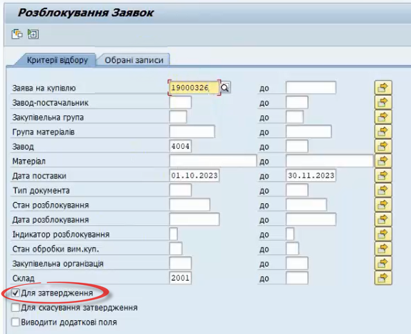{width="6.1867268153980755in" height="5.030621172353456in"}

12\. При переході в «Обрані записи» вже у верхньому екрані можна переконатися в успішності внесених змін.

(**1**) - виділіть всі записи матеріалів відредагованої заявки;

(**2**) -- перенесіть їх в кошик обробки;

(**3**) -- затвердіть однойменною кнопкою для відправки заявки на розгляд ОЦЗ

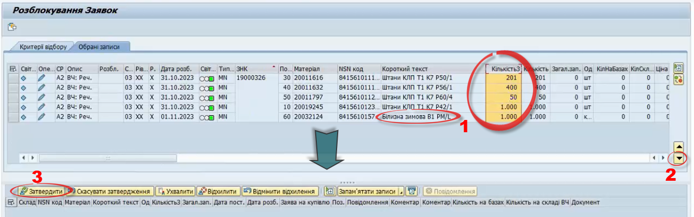{width="6.299212598425197in" height="1.9724409448818898in"}

13\. Натисніть на номер заявки в кошику обробки для відображення інформації по ній.

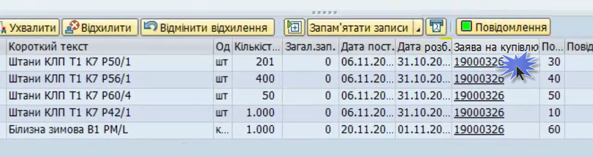{width="6.299212598425197in" height="1.6771653543307086in"}

14\. У категорії «Стратегія розблокування» можна переконатися, що заявка розблокована начальником РЕЧ служби і потрапила на розгляд ОЦЗ (**1**), у верхній частині екрану можна побачити, що з первинної заявки було видалено одну позицію (**2**), навпроти якої стоїть значок «урни».

Переглядаючи кожну позицію (**3**) в панелі «Позиція» можна зрозуміти, які саме позиції із заявки були погоджені.

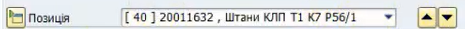{width="4.843144138232721in" height="0.3020450568678915in"}

***Примітка.** Для зручного перегляду статусу затвердження по кожній позиції заявки рекомендується використовувати транзакцію **ZMM_TF***

Не всі вони можуть бути на ОЦЗ, а тому не всі розблоковані/узгоджені цим довольчим органом. По узгодженим позиціям в «Стратегії розблокування» навпроти ОЦЗ стоятиме {width="0.3125437445319335in" height="0.27087160979877517in"} зелена «галочка».

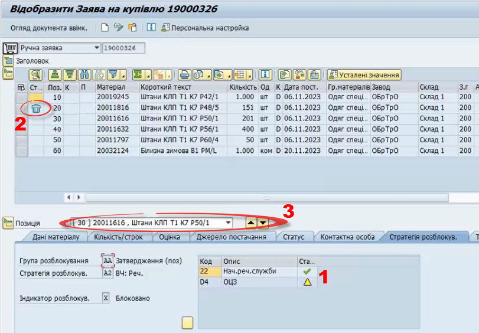{width="6.299212598425197in" height="4.381889763779528in"}

15\. Виходимо з транзакції, натискаючи декілька разів клавішу «F3» або кнопку {width="0.2604166666666667in" height="0.2708333333333333in"} «Назад» чи {width="0.2708333333333333in" height="0.2916666666666667in"} «Вгору». У діалоговому вікні, що з'явиться, натисніть на «Ні» для очищення кошика обробки від наявних там записів матеріалів, які були опрацьовані.

{width="4.39582239720035in" height="1.9078652668416447in"}

В результаті виконаних дій у створену заявку були внесені необхідні зміни, після чого вона повторно була направлена на розгляд ОЦЗ.

***Примітка.** При розгляді ваших заявок ОЦЗ може в коментарях описати зауваження. Для їх перегляду необхідно в «Розблокуванні заявок» обрати відображення вже затверджених заявок, перемістити у «кошик обробки» записи матеріалів заявки, після чого отримаєте можливість переглянути коментарі у відповідній категорії.*

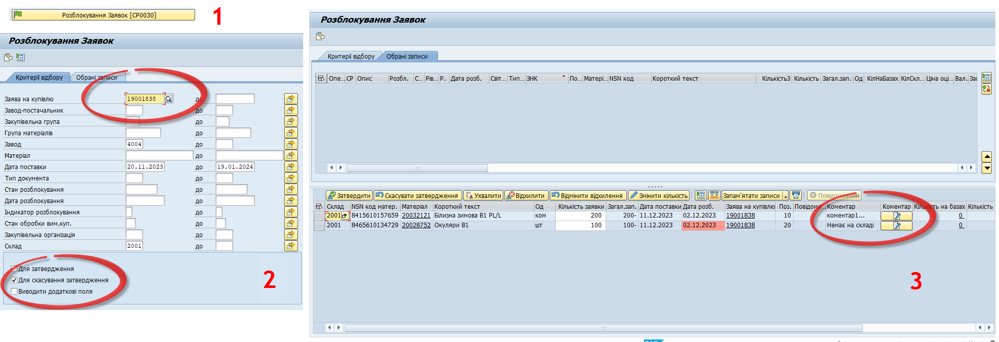{width="6.299212598425197in" height="2.15748031496063in"}

