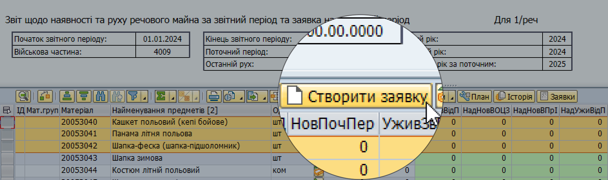
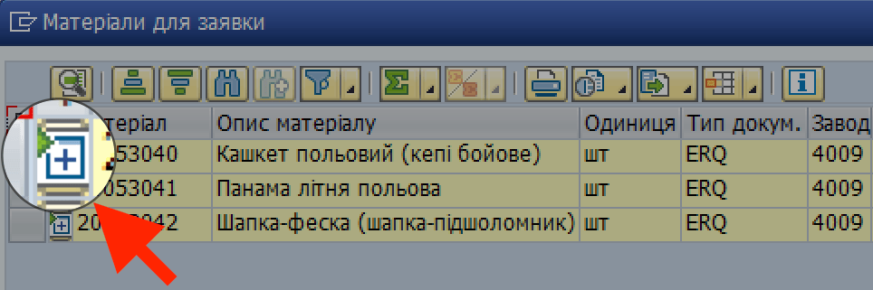
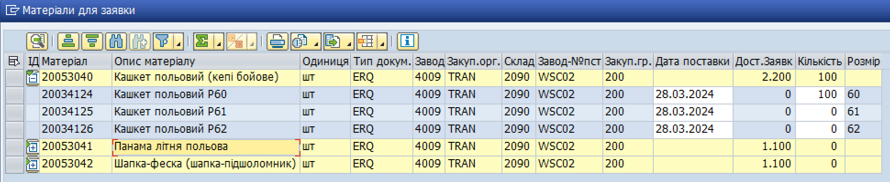

## Створення заявки на замовлення майна

**1. Увійдіть у систему LIS та сформуйте е-Звіт.**

ℹ️ Для детальної інформації, див. розділ ["Формування е-Звіту в системі LIS (кроки)"](../%D0%B5%D0%97%D0%B2%D1%96%D1%82-%D1%83-%D1%81%D0%B8%D1%81%D1%82%D0%B5%D0%BC%D1%96-%D0%9B%D0%86%D0%A1-SAP/%D0%A4%D0%BE%D1%80%D0%BC%D1%83%D0%B2%D0%B0%D0%BD%D0%BD%D1%8F-%D0%B5%D0%97%D0%B2%D1%96%D1%82%D1%83-%D1%83-%D1%81%D0%B8%D1%81%D1%82%D0%B5%D0%BC%D1%96%D0%9B%D0%86%D0%A1-%D0%BA%D1%80%D0%BE%D0%BA%D0%B8.md#формування-езвіту-у-системі-ліс-кроки).

**2. Виділить рядки з потрібними матеріалами та натисніть кнопку "Створити заявку".**

{width="6.7022659667541555in" height="1.9900995188101487in"}

**3. Оберіть розміри та кількість матеріалу, а також дату постачання.**

3.1. У вікні "Матеріали для заявки", у колонці "ІД", натисніть кнопку {width="0.3611111111111111in" height="0.25in"} у рядку з потрібним матеріалом, щоб відобразити доступні розміри та дати для замовлення.

{width="4.217821522309711in" height="1.4001071741032372in"}

Рядок з матеріалом розгорнеться на декілька рядків, у кожному з яких буде представлено доступний розмір.

3.2. У колонці "Кількість", введіть кількість одиниць обраного розміру для замовлення, а також бажану дату поставки.

{width="6.299212598425197in" height="1.2913385826771653in"}

4\. Збережіть заявку, натиснувши кнопку {width="0.25in" height="0.2638888888888889in"} у правому нижньому куті вікна "Матеріали для заявки".

🟢 Якщо помилок немає, то після збереження у лівому нижньому куті відобразиться номер заявки на замовлення. Для подальшої роботи з заявкою, розблокуйте її на рівні начальника речової служби.

