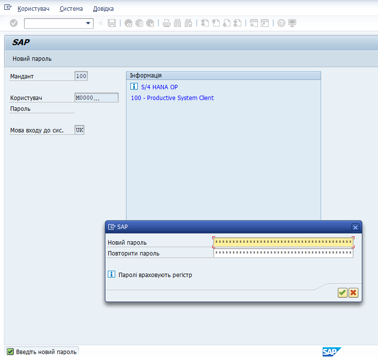

Після отримання від служби підтримки нового тимчасового паролю, необхідно одразу змінити його при вході в систему. Для цього з'явиться відповідне вікно, у верхньому рядку якого потрібно ввести новий пароль, а у нижньому -- повторити-підтвердити його.

{width="5.357490157480315in" height="5.058462379702537in"}
