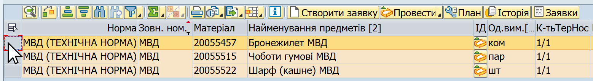
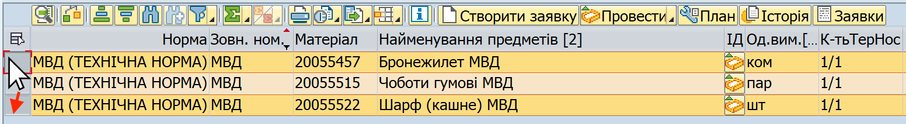
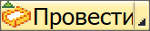
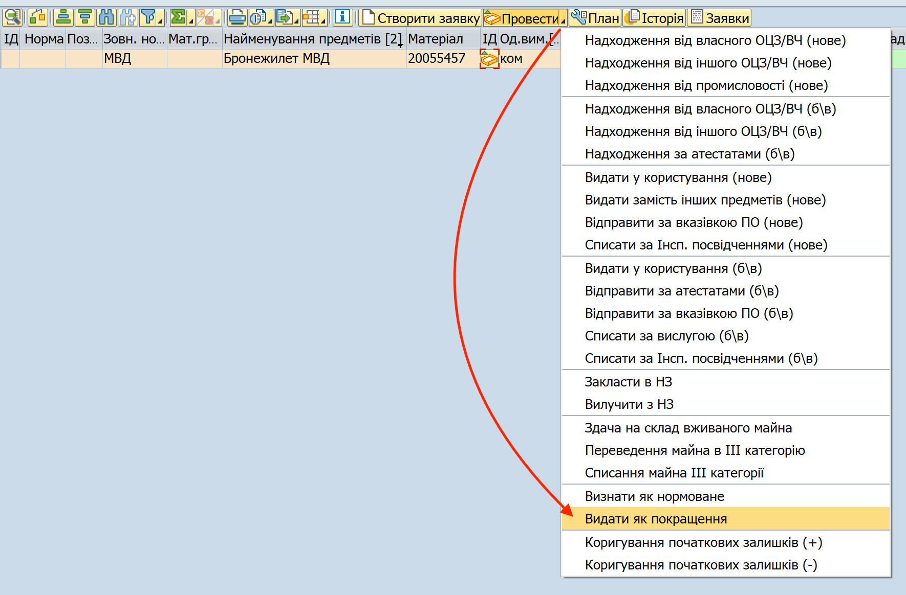
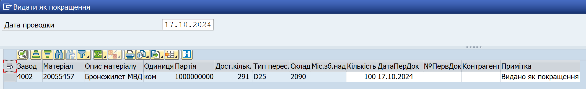
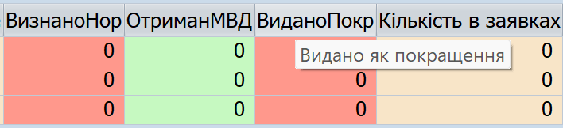

## "Видати як покращення": облік майна МВД, виданого в користування поза нормами забезпечення

За допомогою операції **"Видати як покращення"** в системі, фахівці речових служб можуть, в рамках еЗвіту, списати відповідне майно МВД із запасу військової частини без встановлення термінів носіння, та зробити запис в історії операцій, що відображається у стовпці "Видано як покращення".

Щоб провести операцію "Видати як покращення", виконайте наступні кроки.

1\. Сформуйте еЗвіт.

Див. розділ ["Формування еЗвіту в системі (кроки)"](../%D0%B5%D0%97%D0%B2%D1%96%D1%82-%D1%83-%D1%81%D0%B8%D1%81%D1%82%D0%B5%D0%BC%D1%96-%D0%9B%D0%86%D0%A1-SAP/%D0%A4%D0%BE%D1%80%D0%BC%D1%83%D0%B2%D0%B0%D0%BD%D0%BD%D1%8F-%D0%B5%D0%97%D0%B2%D1%96%D1%82%D1%83-%D1%83-%D1%81%D0%B8%D1%81%D1%82%D0%B5%D0%BC%D1%96%D0%9B%D0%86%D0%A1-%D0%BA%D1%80%D0%BE%D0%BA%D0%B8.md#формування-езвіту-у-системі-ліс-кроки).

2\. У еЗвіті, оберіть один або декілька рядків майна МВД та почніть операцію "Видати як покращення".

2.1. У вікні еЗвіту, виділіть рядок (або декілька рядків) з майном, з яким потрібно провести операцію.

Щоб виділити рядок, натисніть лівою кнопкою миші на сірий квадрат з лівого боку потрібного рядку. Обраний рядок змінить колір на жовтий.

{width="5.483333333333333in" height="0.7533048993875765in"}

Щоб виділити декілька рядків, розташованих поруч, протягніть натиснутий курсор мишки вниз чи вверх, щоб захопити потрібні рядки.

Щоб виділити декілька рядків, не розташованих поруч, після виділення одного рядку, натисніть клавішу "Ctrl" (Control) та, утримуючи її натиснутою, виділіть інші рядки, один за одним.

{width="5.41803258967629in" height="0.7473359580052493in"}

2.2. Натисніть стрілку на правому боці кнопки {width="0.7868853893263342in" height="0.16313429571303587in"} та у меню, що відкриється, оберіть "Видати як покращення".

{width="4.555555555555555in" height="2.995987532808399in"}

Або, у рядку з потрібним матеріалом у еЗвіті, у стовпці "ІД" натисніть піктограму {width="0.17417979002624673in" height="0.1844258530183727in"} та оберіть "Видати як покращення".

Якщо потрібно провести операцію руху одразу з декількома матеріалами:

\- Оберіть рядки з потрібними матеріалами у еЗвіті.

\- Натисніть стрілку у правому боці кнопки {width="0.7864293525809274in" height="0.16304024496937883in"} та оберіть "Видати як покращення".

Детальні кроки описані у розділі [**"Загальні кроки проведення операцій з руху майна"**](#_Загальні_кроки_проведення).

3\. У полях вікна "Видати як покращення", вкажіть такі дані для кожного матеріалу у операції:

{width="6.268055555555556in" height="0.9590277777777778in"}

+-------------------------------+----------------------------------------------------------------------------------------+
| **Назва поля\                 | **Дані\**                                                                              |
| (стовпця)**                   |                                                                                        |
+===============================+========================================================================================+
| **Кількість**                 | Вкажіть кількість виданого майна, у відповідних одиницях обліку.                       |
+-------------------------------+----------------------------------------------------------------------------------------+
| **Дата первинного документа\  | Вкажіть дату облікового документу, згідно якого було видано майно МВД.                 |
| (ДатаПерДок)**                |                                                                                        |
|                               | Це може бути зведена відомість або роздавальна відомість.                              |
+-------------------------------+----------------------------------------------------------------------------------------+
| **Номер первинного документа\ | Вкажіть назву та номер облікового документу, згідно якого було видано майно МВД.       |
| (№ПервДок)**                  |                                                                                        |
|                               | Це може бути зведена відомість або роздавальна відомість.                              |
+-------------------------------+----------------------------------------------------------------------------------------+
| **Контрагент**                | Якщо можливо, вкажіть, кому було видано майно (наприклад, номер підрозділу).           |
|                               |                                                                                        |
|                               | Якщо ідентифікувати контрагента неможливо, вкажіть "-" або "\-\--" (прочерк).      |
+-------------------------------+----------------------------------------------------------------------------------------+
| **Примітка**                  | Додаткова та уточнююча інформація про операцію або первинний обліковий документ.       |
|                               |                                                                                        |
|                               | Якщо ви вважаєте, що графа не потребує додаткової інформації, вкажіть "-" (прочерк). |
+-------------------------------+----------------------------------------------------------------------------------------+

4\. Натисніть кнопку "Провести" {width="0.2037040682414698in" height="0.2037040682414698in"} у нижньому правому куті вікна щоб завершити операцію.

5\. Проведіть оперативне оновлення даних у системі. Для цього, використайте операцію-кокпіт "Оновлення: наявність та рух речового майна \[CP0130\]".

Див. розділ ["Оперативне оновлення даних з наявності та руху майна"](../%D0%9E%D0%BF%D0%B5%D1%80%D0%B0%D1%82%D0%B8%D0%B2%D0%BD%D0%B5-%D0%BE%D0%BD%D0%BE%D0%B2%D0%BB%D0%B5%D0%BD%D0%BD%D1%8F-%D0%B4%D0%B0%D0%BD%D0%B8%D1%85-%D0%B7-%D0%BD%D0%B0%D1%8F%D0%B2%D0%BD%D0%BE%D1%81%D1%82%D1%96-%D1%82%D0%B0-%D1%80%D1%83%D1%85%D1%83-%D0%BC%D0%B0%D0%B9%D0%BD%D0%B0.md#оперативне-оновлення-даних-з-наявності-та-руху-майна).

**Результати.** Після виконання операції "Видати як покращення" та оперативного оновлення даних в системі:

\- Проведене майно МВД буде відображено у стовпці еЗвіту **"Видано як покращення"**.

{width="3.7685181539807524in" height="0.8622878390201225in"}

\- Кількість у стовпці еЗвіту "Наявність нового на кінець звітного періоду \[23\]" для відповідного майна МВД зменшиться.

По замовчанню, стовпець "Видано як покращення" відображається у правій частині еЗвіту. Щоб побачити цей стовпець, прокрутіть стовпці еЗвіту вправо, використовуючи полосу прокрутки в нижній частині еЗвіту.

Для зручності, ви можете перетягнути стовпець "Видано як покращення" у іншу позицію в еЗвіті, та зберегти нову позицію як окремий формат.

Щоб дізнатись детальні кроки, див. розділи:\
[- Відображення стовпців у еЗвіті для зручної роботи](../%D0%B5%D0%97%D0%B2%D1%96%D1%82-%D1%83-%D1%81%D0%B8%D1%81%D1%82%D0%B5%D0%BC%D1%96-%D0%9B%D0%86%D0%A1-SAP/%D0%92%D1%96%D0%B4%D0%BE%D0%B1%D1%80%D0%B0%D0%B6%D0%B5%D0%BD%D0%BD%D1%8F-%D1%81%D1%82%D0%BE%D0%B2%D0%BF%D1%86%D1%96%D0%B2-%D1%83-%D0%B5%D0%97%D0%B2%D1%96%D1%82%D1%96-%D0%B4%D0%BB%D1%8F-%D0%B7%D1%80%D1%83%D1%87%D0%BD%D0%BE%D1%97-%D1%80%D0%BE%D0%B1%D0%BE%D1%82%D0%B8.md#відображення-стовпців-у-езвіті-для-зручної-роботи)\
[- Формати відображення даних у еЗвіті](../%D0%B5%D0%97%D0%B2%D1%96%D1%82-%D1%83-%D1%81%D0%B8%D1%81%D1%82%D0%B5%D0%BC%D1%96-%D0%9B%D0%86%D0%A1-SAP/%D0%A4%D0%BE%D1%80%D0%BC%D0%B0%D1%82%D0%B8-%D0%B2%D1%96%D0%B4%D0%BE%D0%B1%D1%80%D0%B0%D0%B6%D0%B5%D0%BD%D0%BD%D1%8F-%D0%B4%D0%B0%D0%BD%D0%B8%D1%85-%D1%83-%D0%B5%D0%97%D0%B2%D1%96%D1%82%D1%96.md#формати-відображення-даних-у-езвіті)

