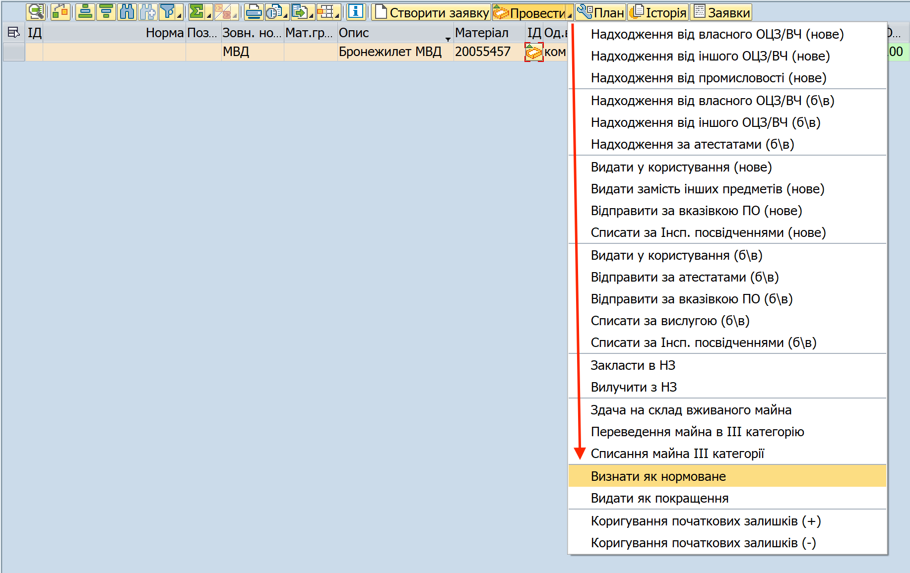
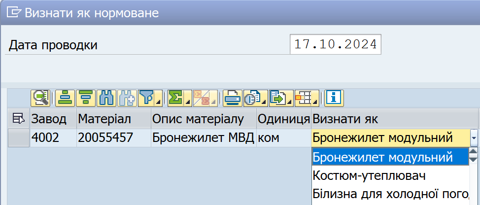
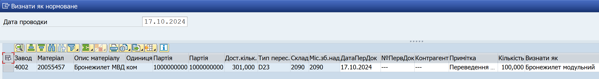
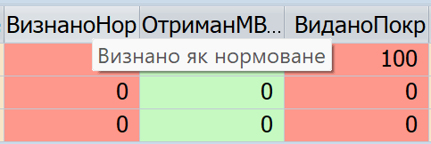
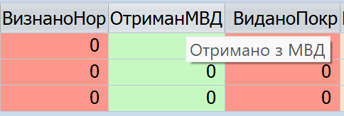

## "Визнати як нормоване": облік майна МВД в рамках норм забезпечення

За допомогою операції **"Визнати як нормоване"** в системі, фахівці речових служб можуть, в рамках еЗвіту, "перекладати" запас майна МВД на відповідник позиції норми (тобто, на конкретне найменування майна, яке обліковується згідно норм забезпечення).

В результаті "визнання нормованим":

\- зменшуються запаси відповідного майна МВД. Ця зміна додатково відображається у червоному стовпці еЗвіту "Визнано як нормоване".

\- збільшуються запаси нормованого майна, в яке "перекладається" майно МВД. Ця зміна додатково відображається у зеленому стовпці еЗвіту "Отримано з МВД".

Після здійснення операції, проведене майно МВД може обліковуватися як нормоване, та з ним можна проводити всі операції, доступні для відповідного майна у еЗвіті.

### Документи для визнання майна МВД нормованим

Щоб обліковувати МВД як майно згідно норм забезпечення, необхідні наступні документи:

**1. Наказ командира в/частини про визнання отриманого майна МВД нормованим.** Наказ видається на основі висновку комісії, спеціально створеної у в/частині.

**2. Акт зміни якісного стану** для відповідного майна МВД. Саме цей Акт потрібно вказувати як первинний обліковий документ при проводці операції "Визнати як нормоване" в системі.

### Кроки проведення операції в ІКС УЛЗ (SAP)

Щоб провести операцію "Визнати як нормоване", виконайте наступні кроки.

1\. Сформуйте еЗвіт.

Див. розділ ["Формування еЗвіту в системі (кроки)"](../%D0%B5%D0%97%D0%B2%D1%96%D1%82-%D1%83-%D1%81%D0%B8%D1%81%D1%82%D0%B5%D0%BC%D1%96-%D0%9B%D0%86%D0%A1-SAP/%D0%A4%D0%BE%D1%80%D0%BC%D1%83%D0%B2%D0%B0%D0%BD%D0%BD%D1%8F-%D0%B5%D0%97%D0%B2%D1%96%D1%82%D1%83-%D1%83-%D1%81%D0%B8%D1%81%D1%82%D0%B5%D0%BC%D1%96%D0%9B%D0%86%D0%A1-%D0%BA%D1%80%D0%BE%D0%BA%D0%B8.md#формування-езвіту-у-системі-ліс-кроки).

2\. У еЗвіті, оберіть один або декілька рядків майна МВД та почніть операцію "Визнати як нормоване".

2.1. У вікні еЗвіту, виділіть рядок (або декілька рядків) з майном, з яким потрібно провести операцію.

Щоб виділити рядок, натисніть лівою кнопкою миші на сірий квадрат з лівого боку потрібного рядку. Обраний рядок змінить колір на жовтий.

{width="5.483333333333333in" height="0.7533048993875765in"}

Щоб виділити декілька рядків, розташованих поруч, протягніть натиснутий курсор мишки вниз чи вверх, щоб захопити потрібні рядки.

Щоб виділити декілька рядків, не розташованих поруч, після виділення одного рядку, натисніть клавішу "Ctrl" (Control) та, утримуючи її натиснутою, виділіть інші рядки, один за одним.

{width="5.41803258967629in" height="0.7473359580052493in"}

2.2. Натисніть стрілку на правому боці кнопки {width="0.7868853893263342in" height="0.16313429571303587in"} та у меню, що відкриється, оберіть "Визнати як нормоване".

{width="4.451211723534558in" height="2.8055555555555554in"}

Або, у рядку з потрібним матеріалом у еЗвіті, у стовпці "ІД" натисніть піктограму {width="0.17417979002624673in" height="0.1844258530183727in"} та оберіть "Визнати як нормоване".

Якщо потрібно провести операцію руху одразу з декількома матеріалами:

\- Оберіть рядки з потрібними матеріалами у еЗвіті.

\- Натисніть стрілку у правому боці кнопки {width="0.7864293525809274in" height="0.16304024496937883in"} та оберіть "Визнати як нормоване".

Детальні кроки описані у розділі [**"Загальні кроки проведення операцій з руху майна"**](#_Загальні_кроки_проведення).

3\. У вікні "Визнати як нормоване", у полі "Визнати як", оберіть зі списку нормоване майно, до якого буде "перекладено" майно МВД.

{width="3.787037401574803in" height="1.6174409448818898in"}

4\. У інших полях вікна "Визнати як нормоване", вкажіть такі дані для кожного матеріалу у операції:

{width="6.268055555555556in" height="0.8354166666666667in"}

+--------------------------------+------------------------------------------------------------------------------------------------------+
| **Поле**                       | **Дані**                                                                                             |
+================================+======================================================================================================+
| **Дата проводки**              | Вкажіть поточну дату.                                                                                |
+--------------------------------+------------------------------------------------------------------------------------------------------+
| **Дата первинного документу\   | Вкажіть дату Акту зміни якісного стану, згідно якого майно МВД було визнано нормованим.              |
| (ДатаПерДок)**                 |                                                                                                      |
|                                | Наприклад: 01.10.2024                                                                                |
+--------------------------------+------------------------------------------------------------------------------------------------------+
| **Номер первинного документу** | Вкажіть "Акт зміни якісного стану" та номер цього акту.                                            |
|                                |                                                                                                      |
| **(№ПервДок)**                 | Наприклад: "Акт зміни якісного стану 123/345"                                                      |
+--------------------------------+------------------------------------------------------------------------------------------------------+
| **Контрагент**                 | Вкажіть "-" або "\-\--" (прочерк).                                                               |
+--------------------------------+------------------------------------------------------------------------------------------------------+
| **Примітка**                   | Вкажіть будь-яку додаткову або уточнюючу інформацію про операцію.                                    |
|                                |                                                                                                      |
|                                | Якщо ви вважаєте, що графа не потребує додаткової інформації, вкажіть "-" або "\-\--" (прочерк). |
+--------------------------------+------------------------------------------------------------------------------------------------------+

5\. Коли ви заповните всі необхідні поля, натисніть кнопку "Провести" {width="0.2037040682414698in" height="0.2037040682414698in"} у правому нижньому куті вікна, щоб завершити операцію.

6\. Проведіть оперативне оновлення даних у системі.\
Для цього, використайте операцію-кокпіт "Оновлення: наявність та рух речового майна \[CP0130\]". Операція доступна у вікні "Робоче місце користувача".

Див. розділ ["Оперативне оновлення даних з наявності та руху майна"](../%D0%9E%D0%BF%D0%B5%D1%80%D0%B0%D1%82%D0%B8%D0%B2%D0%BD%D0%B5-%D0%BE%D0%BD%D0%BE%D0%B2%D0%BB%D0%B5%D0%BD%D0%BD%D1%8F-%D0%B4%D0%B0%D0%BD%D0%B8%D1%85-%D0%B7-%D0%BD%D0%B0%D1%8F%D0%B2%D0%BD%D0%BE%D1%81%D1%82%D1%96-%D1%82%D0%B0-%D1%80%D1%83%D1%85%D1%83-%D0%BC%D0%B0%D0%B9%D0%BD%D0%B0.md#оперативне-оновлення-даних-з-наявності-та-руху-майна).

**Результати.** Після виконання операції "Визнати як нормоване" та оперативного оновлення даних в системі:

\- Кількість майна МВД, визнаного нормованим, збільшиться у червоному стовпці еЗвіту **"Визнано як нормоване"**. Це означає, що самого майна МВД у залишках стало менше.

{width="2.8796292650918636in" height="0.9678423009623797in"}

Водночас, кількість цього майна МВД зменшиться у стовпцях еЗвіту "Наявність нового на кінець звітного періоду \[23\]" чи "Наявність уживаного на кінець звітного періоду \[24\]" (в залежності від категорії майна, з яким було проведено операцію).

\- Кількість нормованого майна-відповідника, яким було визнано майно МВД, збільшиться у зеленому стовпці еЗвіту **"Отримано з МВД"**.

{width="2.8055555555555554in" height="0.9506419510061243in"}

\- Водночас, кількість такого нормованого майна збільшиться у стовпцях еЗвіту "Наявність нового на кінець звітного періоду \[23\]" чи "Наявність уживаного на кінець звітного періоду \[24\]" (в залежності від категорії майна, з яким було проведено операцію).

По замовчанню, стовпці "Визнано як нормоване" та "Отримано з МВД" відображаються у правій частині еЗвіту. Щоб побачити ці стовпці, прокрутить стовпці еЗвіту вправо, використовуючи полосу прокрутки в нижній частині еЗвіту.

Для зручності, ви можете перетягнути "Визнано як нормоване" та "Отримано з МВД" у іншу позицію в еЗвіті, та зберегти нові позиції цих стовпців як окремий формат.

Щоб дізнатись детальні кроки, див. розділи:\
[- Відображення стовпців у еЗвіті для зручної роботи](../%D0%B5%D0%97%D0%B2%D1%96%D1%82-%D1%83-%D1%81%D0%B8%D1%81%D1%82%D0%B5%D0%BC%D1%96-%D0%9B%D0%86%D0%A1-SAP/%D0%92%D1%96%D0%B4%D0%BE%D0%B1%D1%80%D0%B0%D0%B6%D0%B5%D0%BD%D0%BD%D1%8F-%D1%81%D1%82%D0%BE%D0%B2%D0%BF%D1%86%D1%96%D0%B2-%D1%83-%D0%B5%D0%97%D0%B2%D1%96%D1%82%D1%96-%D0%B4%D0%BB%D1%8F-%D0%B7%D1%80%D1%83%D1%87%D0%BD%D0%BE%D1%97-%D1%80%D0%BE%D0%B1%D0%BE%D1%82%D0%B8.md#відображення-стовпців-у-езвіті-для-зручної-роботи)\
[- Формати відображення даних у еЗвіті](../%D0%B5%D0%97%D0%B2%D1%96%D1%82-%D1%83-%D1%81%D0%B8%D1%81%D1%82%D0%B5%D0%BC%D1%96-%D0%9B%D0%86%D0%A1-SAP/%D0%A4%D0%BE%D1%80%D0%BC%D0%B0%D1%82%D0%B8-%D0%B2%D1%96%D0%B4%D0%BE%D0%B1%D1%80%D0%B0%D0%B6%D0%B5%D0%BD%D0%BD%D1%8F-%D0%B4%D0%B0%D0%BD%D0%B8%D1%85-%D1%83-%D0%B5%D0%97%D0%B2%D1%96%D1%82%D1%96.md#формати-відображення-даних-у-езвіті)

