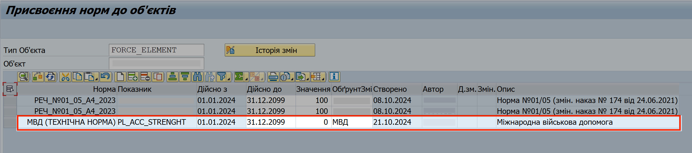
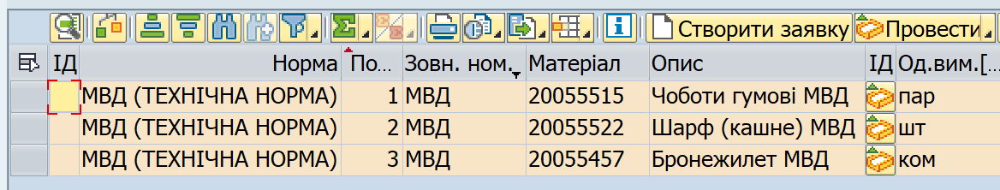

## Відображення майна МВД у еЗвіті за допомогою плану потреб

### Додавання найменувань майна МВД до еЗвіту

Для відображення групових найменувань майна МВД у еЗвіті, до **плану потреб** вашого заводу в системі ЛІС (SAP) додайте норму "МВД (ТЕХНІЧНА НОРМА)".

Щоб зробити це, виконайте наступні кроки:

1\. За допомогою операції "Ведення планових показників", додайте до планових показників норму забезпечення **"МВД (Технічна норма)"**, вказавши наступні дані:

+---------------------------------+-----------------------------------------------------------------------------------------------------------------------------------------------------------------------------------------------------------------+
| **Показник (стовпець)**         | **Значення\**                                                                                                                                                                                                   |
+=================================+=================================================================================================================================================================================================================+
| **Норма**                       | Оберіть *МВД (ТЕХНІЧНА НОРМА)*                                                                                                                                                                                  |
|                                 |                                                                                                                                                                                                                 |
|                                 | Щоб вибрати цю норму зі списку можливих, у лівій частині поля "Норма", натисніть кнопку {width="0.11666666666666667in" height="0.12314851268591426in"}.                           |
|                                 |                                                                                                                                                                                                                 |
|                                 | У вікні "Ідентифікатор норми" зі списком норм, оберіть рядок з нормою "МВД (ТЕХНІЧНА НОРМА)" та двічі натисніть його. Потрібна норма буде автоматично вставлена у поле "Норма" (з якого ви почали пошук). |
+---------------------------------+-----------------------------------------------------------------------------------------------------------------------------------------------------------------------------------------------------------------+
| **Показник**                    | Оберіть *PL_ACC_STRENGHT*                                                                                                                                                                                       |
|                                 |                                                                                                                                                                                                                 |
|                                 | Щоб вибрати іншу норму зі списку можливих, у боковій частині поля, натисніть кнопку {width="0.11666666666666667in" height="0.12314851268591426in"}.                                 |
|                                 |                                                                                                                                                                                                                 |
|                                 | У вікні зі списком значень, що відкриється, оберіть рядок з потрібним значенням та двічі натисніть його. Значення буде автоматично вставлене у поле "Показник" (з якого ви почали пошук).                     |
+---------------------------------+-----------------------------------------------------------------------------------------------------------------------------------------------------------------------------------------------------------------+
| **Дійсно з**                    | Оберіть у меню-календарі або надрукуйте *01.01.2024*                                                                                                                                                            |
+---------------------------------+-----------------------------------------------------------------------------------------------------------------------------------------------------------------------------------------------------------------+
| **Дійсно до**                   | Оберіть у меню-календарі або надрукуйте *31.12.2024*                                                                                                                                                            |
+---------------------------------+-----------------------------------------------------------------------------------------------------------------------------------------------------------------------------------------------------------------+
| **Значення**                    | Вкажіть *0* (нуль)                                                                                                                                                                                              |
+---------------------------------+-----------------------------------------------------------------------------------------------------------------------------------------------------------------------------------------------------------------+
| **Обґрунтування останніх змін** | Вкажіть *"Облік майна МВД"*                                                                                                                                                                                   |
+---------------------------------+-----------------------------------------------------------------------------------------------------------------------------------------------------------------------------------------------------------------+

{width="6.622104111986002in" height="1.4754101049868766in"}

Детальні кроки роботи з плановими показниками описані у розділі [**"Ведення планових показників (налаштування плану потреб): вибір норм та чисельності особового складу"**](../%D0%9F%D0%BB%D0%B0%D0%BD-%D0%BF%D0%BE%D1%82%D1%80%D0%B5%D0%B1-%D0%B7%D0%B3%D1%96%D0%B4%D0%BD%D0%BE-%D0%BD%D0%BE%D1%80%D0%BC-%D0%B7%D0%B0%D0%B1%D0%B5%D0%B7%D0%BF%D0%B5%D1%87%D0%B5%D0%BD%D0%BD%D1%8F/%D0%92%D0%B5%D0%B4%D0%B5%D0%BD%D0%BD%D1%8F-%D0%BF%D0%BB%D0%B0%D0%BD%D0%BE%D0%B2%D0%B8%D1%85-%D0%BF%D0%BE%D0%BA%D0%B0%D0%B7%D0%BD%D0%B8%D0%BA%D1%96%D0%B2-%D0%B2%D0%B8%D0%B1%D1%96%D1%80-%D0%BD%D0%BE%D1%80%D0%BC-%D1%82%D0%B0-%D1%87%D0%B8%D1%81%D0%B5%D0%BB%D1%8C%D0%BD%D0%BE%D1%81%D1%82%D1%96-%D0%BE%D1%81%D0%BE%D0%B1%D0%BE%D0%B2%D0%BE%D0%B3%D0%BE-%D1%81%D0%BA%D0%BB%D0%B0%D0%B4%D1%83.md#ведення-планових-показників-вибір-норм-та-чисельності-особового-складу).

2\. Створіть новий план потреб для вашого заводу в системі ЛІС, який враховуватиме додану норму "МВД". Щоб створити новий план, видаліть існуючий план потреб, а також видаліть системні записи, пов'язані з планом потреб, який ви щойно видалили.

Детальні кроки операції з редагування існуючого плану потреб описані у розділі [**"Зміна плану потреб"**](#_Зміна_плану_потреб).

Коли у системі ЛІС створено план потреб, який включає норму "МВД (Технічна норма)", у еЗвіті буде відображено ВСІ групові найменування майна МВД, налаштовані в системі ЛІС. Це дасть вам можливість провести необхідні операції з тими найменуваннями майна, з якими ви маєте справу у вашій в/частині.

Рядки з майном МВД у еЗвіті мають наступні особливості при відображені:

\- Виділені рожевим кольором\
- У стовпці "Норма" мають позначку "МВД (Технічна норма)"

\- У стовпці "Зовнішній номер" мають позначку "МВД"

\- У стовпці "Найменування предметів", після основної назви мають позначку "МВД".

{width="6.268055555555556in" height="1.1916666666666667in"}

### Видалення з еЗвіту найменувань МВД, з якими не було операцій

Повний перелік майна МВД, доступний у еЗвіті, складається з багатьох позицій. З більшістю з них ваша речова служба може не працювати, тож ви можете видалити ті найменування, з якими у еЗвіті не зафіксовано жодного руху (надходження, витрат, списань, тощо).

Щоб видалити такі найменування з еЗвіту, достатньо видалити норму "МВД (Технічна норма)" з планових показників, та створити оновлений план потреб. Ті найменування, з якими ви проводили рухи, залишаться у еЗвіті. Так само, коли нове майно МВД буде автоматично додано до еЗвіту після надходження з ОЦЗ, таке майно відобразиться у еЗвіті без додавання норми МВД до плану потреб.

