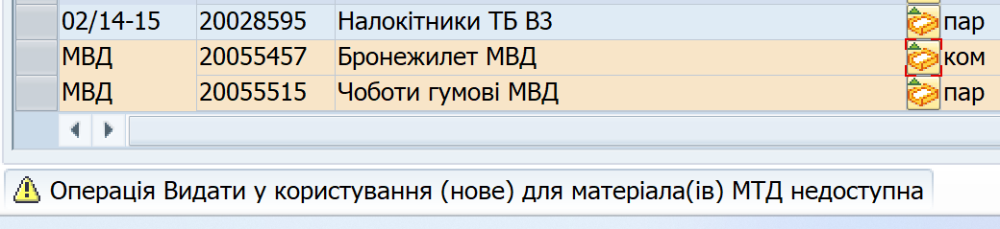

## Операції з надходження, доступні для майна МВД у еЗвіті

Для майна МВД у еЗвіті доступні такі операції:

\- Надходження від власного ОЦЗ/ВЧ (нове) **\***

\- Надходження від іншого ОЦЗ/ВЧ (нове)

\- Надходження від промисловості (нове)

\- Надходження від власного ОЦЗ/ВЧ (б/в) **\***

\- Надходження від іншого ОЦЗ/ВЧ (б/в)

\- Надходження за атестатами (б/в)

\- Коригування початкових залишків (+) **\***

\- Коригування початкових залишків (+) **\***

> **\*** Ці операції повинні бути розблоковані органом постачання для вашого заводу в системі ЛІС.

Вказані операції проводяться так само, як і з нормованим майном, та не потребують особливої інформації чи кроків для проведення.

Для детальної інформації про те, як проводити операції з надходження, див. розділ ["Операції щодо руху майна впродовж звітного періоду"](#операції-щодо-руху-майна-у-езвіті).

{width="0.19444444444444445in" height="0.19444444444444445in"} Решта операцій з руху майна у еЗвіті **заблоковані для майна МВД**. Якщо ви запустите таку операцію, система відмовить у проведенні та продемонструє повідомлення *"Операція для матеріала(ів) МТД недоступна"*.

{width="6.268055555555556in" height="1.4347222222222222in"}

