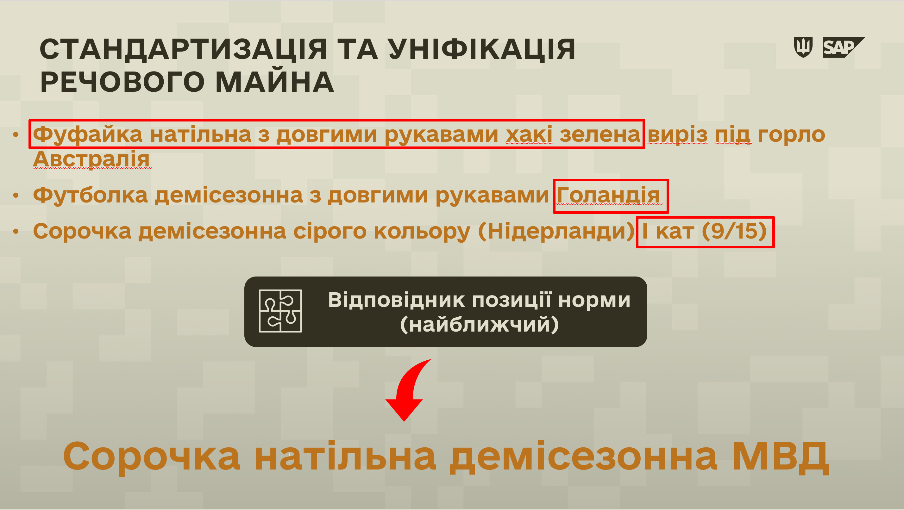

## Підготовка до роботи з обліком майна МВД у системі ЛІС (SAP)

Майно МВД відображається у еЗвіті системи ЛІС за допомогою **групової назви**, без урахування додаткових характеристик (країни походження, кольору, конструктивних особливостей тощо). Групова назва створюється на основі найближчого відповідника позиції норми (групового матеріалу).

Завдяки груповій назві досягається стандартизація та уніфікація майна. Інакше кажучи, користувачі системи можуть чітко зрозуміти, якому саме нормованому майну відповідають декілька його відповідників з майна МВД.

При обліку майна МВД у ЛІС (SAP) на ОЦЗ, використовуються такі саме групові (уніфіковані) назви майна МВД. Як ознаки партії, додається лише країна походження та окрема примітка "МВД".

{width="6.268055555555556in" height="3.5381944444444446in"}

Відповідно, щоб підготуватись до роботи з майном МВД у еЗвіті та у системі ЛІС, фахівці речових служб мають виконати наступні завдання.

I. З'ясувати, скільки майна МВД є у розпорядженні в/частини на складах (залишки).

II\. З'ясувати, скільки майна МВД було видано впродовж звітного року: в якості задоволення основних норм забезпечення та в якості покращення.

III\. Встановити, які найменування майна МВД з тих, з якими працювала в/частина, будуть об'єднані у групові матеріали у еЗвіті системи ЛІС.

Для виконання цього завдання, використовуйте [Довідник МВД](%D0%94%D0%BE%D0%B2%D1%96%D0%B4%D0%BD%D0%B8%D0%BA-%D0%BC%D0%B0%D0%B9%D0%BD%D0%B0-%D0%9C%D0%92%D0%94-%D1%83-%D1%81%D0%B8%D1%81%D1%82%D0%B5%D0%BC%D1%96-%D0%9B%D0%86%D0%A1.md#довідник-майна-мвд-у-системі-ліс).

НАПРИКЛАД:

**ЯКЩО** у розпорядженні в/частини було 3 наступних найменування майна МВД:

> 1\. Фуфайка натільна з довгими рукавами хакі зелена виріз під горло Австралія
>
> 2\. Футболка демісезонна з довгими рукавами Нідерланди
>
> 3\. Сорочка демісезонна сірого кольору (Нідерланди) І кат (9/15)

**ТО** у еЗвіті ці найменування будуть обліковуватися як один груповий матеріал: "Сорочка натільна демісезонна МВД".

IV\. Підготувати та мати у розпорядженні детальну інформацію про те, залишки якого саме майна МВД (у оригінальних, або початкових найменуваннях) будуть об'єднані у групові найменування при введенні залишків та надходжень, та у якій кількості.

Така інформація необхідна для звітності перед органами постачання та управління (ОЦЗ, ЦУРЗ тощо).

Для виконання цього завдання, використовуйте [Довідник МВД](%D0%94%D0%BE%D0%B2%D1%96%D0%B4%D0%BD%D0%B8%D0%BA-%D0%BC%D0%B0%D0%B9%D0%BD%D0%B0-%D0%9C%D0%92%D0%94-%D1%83-%D1%81%D0%B8%D1%81%D1%82%D0%B5%D0%BC%D1%96-%D0%9B%D0%86%D0%A1.md#довідник-майна-мвд-у-системі-ліс).\
\
Завдання IV можна виконати після введення залишків майна МВД до еЗвіту, але воно повинно бути виконано обов'язково.

НАПРИКЛАД:

**ЯКЩО** речова служба в/частини,

станом на момент початку обліку майна у еЗвіті,

звітує у еЗвіті про залишки 600 одиниць групового матеріалу "Сорочка натільна демісезонна МВД",

ТО, у окремих документах (на кшталт електронних таблиць Excel),\
речова служба повинна мати детальну інформацію про те,\
з яких оригінальних (початкових) найменувань майна МВД складаються залишки групового матеріалу, як-то:\
­­­­

1.  200 одиниць найменування "Футболка демісезонна з довгими рукавами Нідерланди"

2.  200 одиниць найменування "Фуфайка натільна з довгими рукавами хакі зелена виріз під горло Австралія"

3.  200 одиниць найменування "Сорочка демісезонна сірого кольору (Нідерланди) І кат (9/15)"

Маючи інформацію про кількість майна МВД, яке буде відображено у еЗвіті, можна переходити до фактичного обліку.

