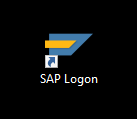
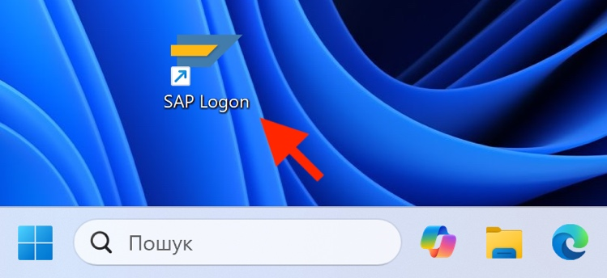
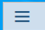
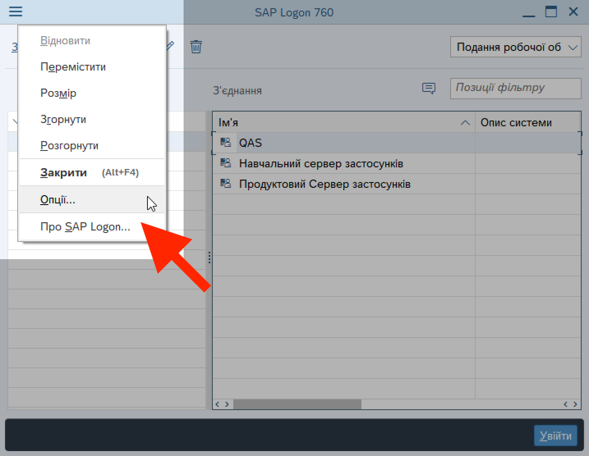
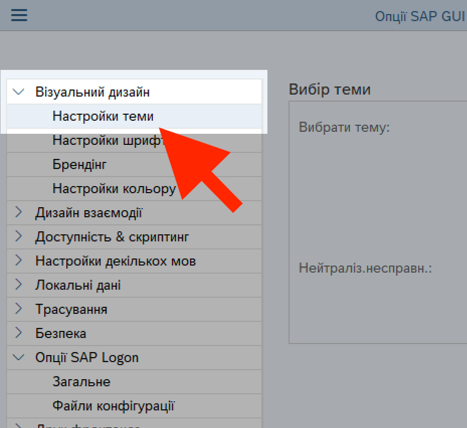
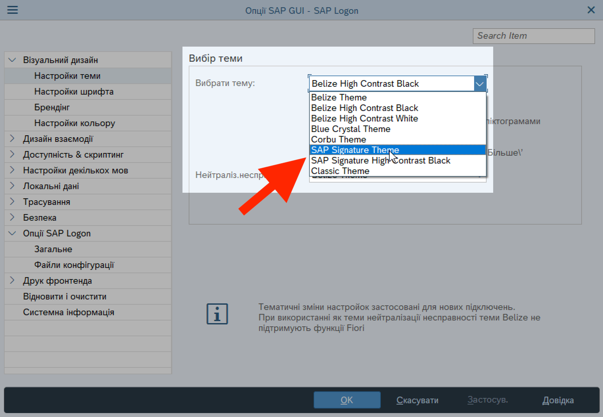
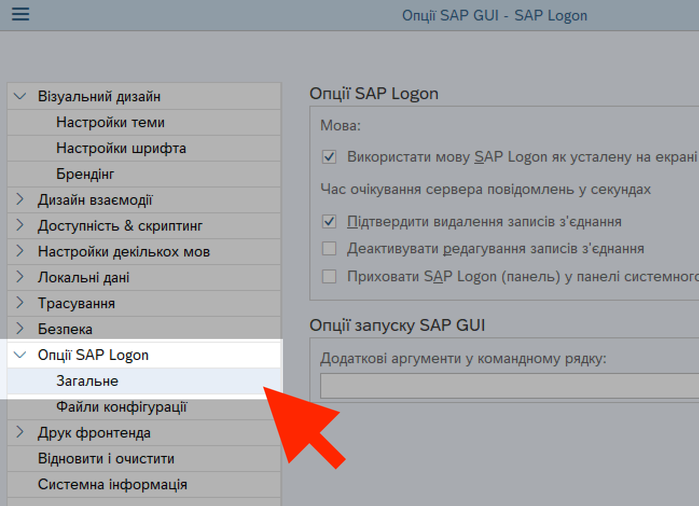
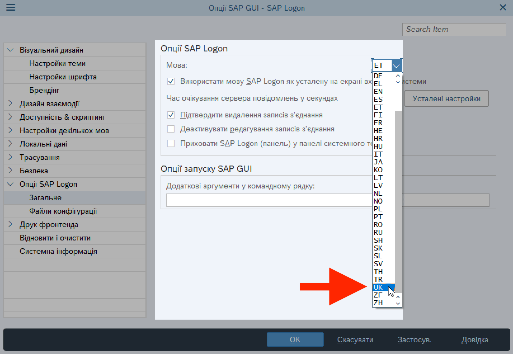
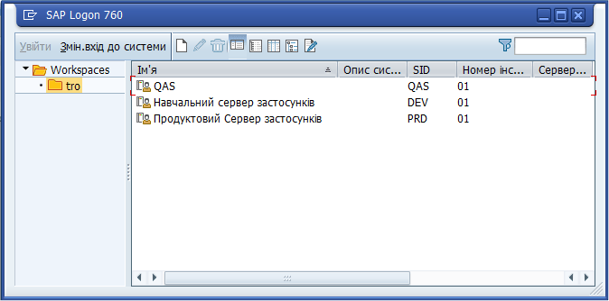

# Обов'язкові налаштування вигляду системи перед початком роботи

## Налаштування мови та графічного інтерфейсу (системної теми)

Налаштування, описані у цьому розділі, необхідні для того, щоб інтерфейс LIS коректно відображався у всіх операціях.

Виконайте наступні кроки:

1\. Запустіть програму SAP, натиснувши іконку **SAP Logon** на робочому столі Windows.

{width="1.4272823709536309in" height="1.2397561242344708in"}

{width="3.3923075240594924in" height="1.5579483814523185in"}

2\. Відкрийте меню налаштувань: натисніть {width="0.32938429571303585in" height="0.21958880139982503in"} у лівому верхньому куті вікна SAP, та у контекстному меню оберіть Опції (Options).

{width="4.3584787839020125in" height="3.3796292650918636in"}

3\. У лівій панелі вікна опцій, натисніть "Візуальний дизайн" (Visual Design) і в списку, що відкриється знизу, виберіть "Настройки теми" (Theme Settings).

{width="3.8009580052493437in" height="3.4814807524059495in"}

4\. В центральному вікні опцій, у списку "Вибір теми" (Theme Selection), оберіть "SAP Signature Theme".

{width="6.299212598425197in" height="4.362204724409449in"}

5\. У лівій панелі вікна опцій, натисніть "Опції SAP Logon" (SAP Logon Options) і в списку, що відкриється знизу, виберіть "Загальне" (General).

{width="4.40594050743657in" height="3.18875656167979in"}

6\. В центральному вікні опцій, відкрийте список "Мова" та оберіть "UK".

{width="6.299212598425197in" height="4.346456692913386in"}

7\. Натисніть ОК в нижній частині вікна опцій щоб зберегти зміни.

Після цього, закрийте LIS (SAP). При наступному запуску програми, потрібна візуальна тема та українська мова інтерфейсу будуть застосовані автоматично.

Після запуску, вікно SAP Logon повинно виглядати так, як на ілюстрації внизу. Якщо ви відкриваєте SAP на комп'ютері у ЗАТК "Слід", у вікні "SAP Logon" буде тільки одне ім'я підключення – "Продуктовий Сервер застосунків".

{width="6.5905839895013125in" height="3.2659569116360454in"}
 

