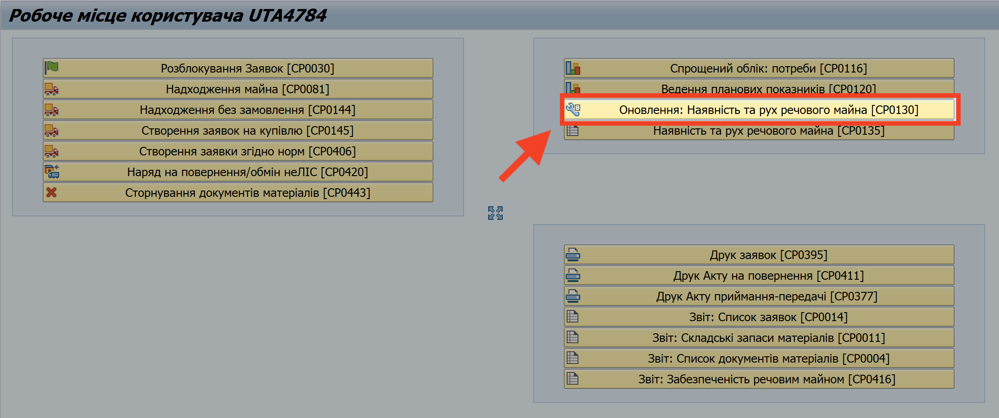
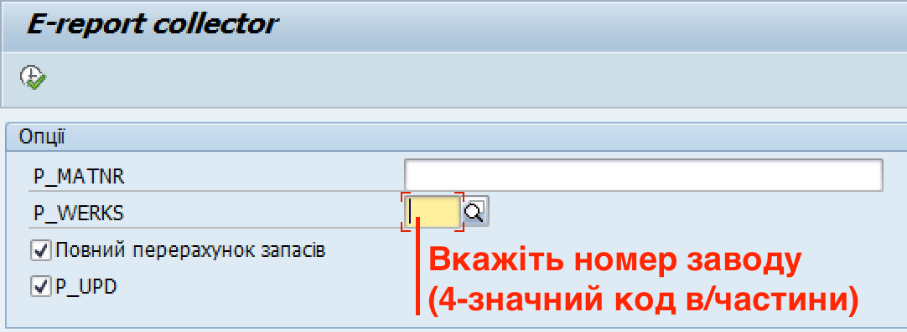

# Оперативне оновлення даних з наявності та руху майна

Система (SAP) оновлює дані про рух майна один раз на добу, чого може бути недостатньо для ваших потреб.

Для того, щоб оперативно оновити дані з руху майна (без очікування, поки система планово оновить дані у автоматичному режимі), виконайте наступні кроки:

1\. Увійдіть у систему.

Див. деталі у розділі ["Вхід до системи"](%D0%9F%D0%BE%D1%87%D0%B0%D1%82%D0%BE%D0%BA-%D1%80%D0%BE%D0%B1%D0%BE%D1%82%D0%B8-%D1%83-%D1%81%D0%B8%D1%81%D1%82%D0%B5%D0%BC%D1%96.md#вхід-до-системи-загальні-кроки).

2\. Відкрийте вікно "Робоче місце користувача", якщо воно не відкрилося автоматично.

Див. розділ ["Початкове вікно роботи з системою"](%D0%9F%D0%BE%D1%87%D0%B0%D1%82%D0%BE%D0%BA-%D1%80%D0%BE%D0%B1%D0%BE%D1%82%D0%B8-%D1%83-%D1%81%D0%B8%D1%81%D1%82%D0%B5%D0%BC%D1%96.md#початкове-вікно-роботи-з-системою).

3\. Натисніть кнопку "Оновлення: Наявність та рух речового майна \[CP0130\]".

{width="6.299212598425197in" height="2.6377952755905514in"}

4\. У вікні "E-report collector", у полі "P_WERKS", вкажіть номер вашого заводу (чотиризначний код вашої в/частини).

5\. Поставте прапорець у квадраті-опції "Повний перерахунок запасів"

Поле "P_MATNR" можна не заповняти.

{width="4.72741469816273in" height="1.7391305774278216in"}

6\. Натисніть кнопку {width="0.2222222222222222in" height="0.20833333333333334in"} "Виконати" (або натисніть клавішу F8 на клавіатурі комп'ютера).

Операція позачергово запустить механізми оновлення даних системи, після чого залишки та рух майна будуть коректно відображені у еЗвіті по вашій в/частині.

