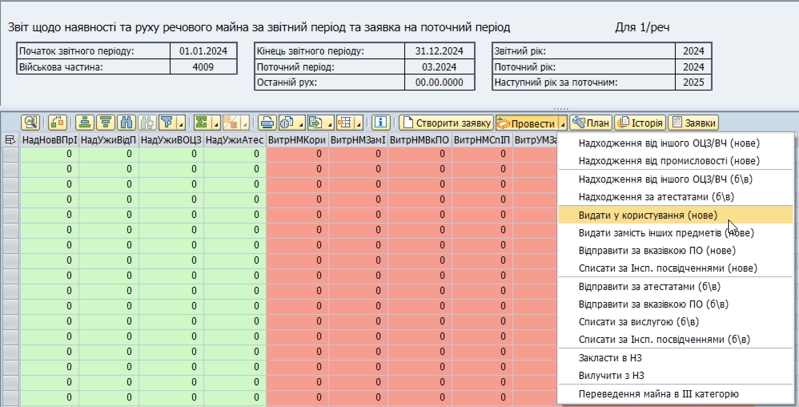
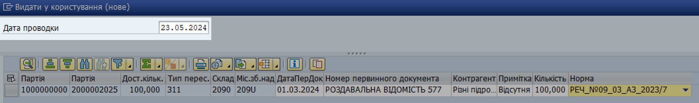
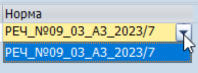
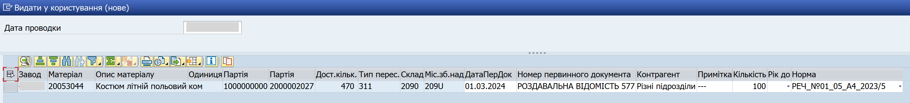
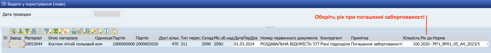

## Видати у користування (нове)

### Типи майна

У операції "Видати у користування (нове)" обліковується речове майно I категорії, яке в звітному періоді видається в користування згідно з нормами забезпечення.

### Кроки проведення операції

**1. Сформуйте еЗвіт.**

> Див. розділ ["Формування еЗвіту у системі LIS"](../%D0%B5%D0%97%D0%B2%D1%96%D1%82-%D1%83-%D1%81%D0%B8%D1%81%D1%82%D0%B5%D0%BC%D1%96-%D0%9B%D0%86%D0%A1-SAP/%D0%A4%D0%BE%D1%80%D0%BC%D1%83%D0%B2%D0%B0%D0%BD%D0%BD%D1%8F-%D0%B5%D0%97%D0%B2%D1%96%D1%82%D1%83-%D1%83-%D1%81%D0%B8%D1%81%D1%82%D0%B5%D0%BC%D1%96%D0%9B%D0%86%D0%A1-%D0%BA%D1%80%D0%BE%D0%BA%D0%B8.md#формування-езвіту-у-системі-ліс-кроки).

**2. Запустіть операцію.**

2.1. У вікні еЗвіту, виділіть рядок (або декілька рядків) з майном, з яким потрібно провести операцію.

Щоб виділити рядок, натисніть лівою кнопкою миші на сірий квадрат з лівого боку потрібного рядку. Обраний рядок змінить колір на жовтий.

{width="6.425336832895888in" height="1.0260870516185476in"}

Щоб виділити декілька рядків, розташованих поруч, протягніть натиснутий курсор мишки вниз чи вгору, щоб захопити потрібні рядки.

Щоб виділити декілька рядків, не розташованих поруч, після виділення одного рядку, натисніть клавішу "Ctrl" (Control) та, утримуючи її натиснутою, виділіть інші рядки, один за одним.

{width="6.425in" height="1.2201301399825022in"}

2.2. Натисніть стрілку на правому боці кнопки {width="1.0833333333333333in" height="0.2222222222222222in"} та оберіть "Видати у користування (нове)".

{width="6.299212598425197in" height="3.204724409448819in"}

Або, у рядку з потрібним матеріалом у еЗвіті, у колонці "ІД" натисніть піктограму {width="0.19641951006124234in" height="0.20869531933508312in"} та оберіть "Видати у користування (нове)".

> Якщо потрібно провести операцію руху одразу з декількома матеріалами:
>
> \- Оберіть рядки з потрібними матеріалами у еЗвіті.
>
> \- Натисніть стрілку у правому боці кнопки {width="0.8910258092738408in" height="0.18277449693788275in"} та оберіть "Видати у користування (нове)".

**3. Вкажіть дані проводки операції.**

3.1. У полі "Дата проводки", вверху вікна операції, вкажіть дату впродовж поточного або попереднього місяця.

Див. розділ ["Дата проводки для операцій з руху майна"](%D0%94%D0%B0%D1%82%D0%B0-%D0%BF%D1%80%D0%BE%D0%B2%D0%BE%D0%B4%D0%BA%D0%B8-%D0%B4%D0%BB%D1%8F-%D0%BE%D0%BF%D0%B5%D1%80%D0%B0%D1%86%D1%96%D0%B8%CC%86-%D0%B7-%D1%80%D1%83%D1%85%D1%83-%D0%BC%D0%B0%D0%B8%CC%86%D0%BD%D0%B0.md#дата-проводки-для-операцій-з-руху-майна) для детальних рекомендацій.

{width="6.299212598425197in" height="0.937007874015748in"}

3.2. У вікні обробки, вкажіть дані для кожного матеріалу у відповідних графах:

| ДатаПерДок     | Вкажіть дату одного з двох можливих первинних облікових документів, згідно якого операція з матеріалом була здійснена фактично:                                   |
|                |                                                                                                                                                                   |
|                | 1\. Накладна, АБО                                                                                                                                                 |
|                |                                                                                                                                                                   |
|                | 2\. Роздавальна відомість                                                                                                                                         |
|                |                                                                                                                                                                   |
|                | Наприклад: 01.05.2025                                                                                                                                             |
+================+===================================================================================================================================================================+
| №ПервДок       | Вкажіть номер одного з двох можливих первинних облікових документів, згідно якого операція з матеріалом була здійснена фактично:                                  |
|                |                                                                                                                                                                   |
|                | 1\. Накладна, АБО                                                                                                                                                 |
|                |                                                                                                                                                                   |
|                | 2\. Роздавальна відомість                                                                                                                                         |
|                |                                                                                                                                                                   |
|                | Наприклад: Роздавальна відомість 577                                                                                                                              |
+----------------+-------------------------------------------------------------------------------------------------------------------------------------------------------------------+
| Контрагент     | Підрозділ, у який видається майно.                                                                                                                                |
|                |                                                                                                                                                                   |
|                | Якщо видача відбулася на різні підрозділи, вкажіть "Різні підрозділи".                                                                                          |
|                |                                                                                                                                                                   |
|                | Якщо ви вважаєте, що графа не потребує додаткової інформації, вкажіть прочерк: - (дефіс), \-\-- (три дефіси), або інший символ для вказання прочерку.             |
+----------------+-------------------------------------------------------------------------------------------------------------------------------------------------------------------+
| Примітка       | Додаткова та уточнююча інформація про операцію або первинний обліковий документ.                                                                                  |
|                |                                                                                                                                                                   |
|                | Якщо ви вважаєте, що графа не потребує додаткової інформації, вкажіть прочерк: - (дефіс), \-\-- (три дефіси), або інший символ для вказання прочерку.             |
+----------------+-------------------------------------------------------------------------------------------------------------------------------------------------------------------+
| Кількість      | Кількість одиниць матеріалу, яка проводиться у операції.                                                                                                          |
+----------------+-------------------------------------------------------------------------------------------------------------------------------------------------------------------+
| Рік до         | Значення у цьому стовпці вказується ВИКЛЮЧНО при видачі майно в рахунок заборгованості.                                                                           |
|                |                                                                                                                                                                   |
|                | В такому випадку, вкажіть рік, у якому мало б вислужити майно, видане у минулому.                                                                                 |
|                |                                                                                                                                                                   |
|                | Див. розділ ["Видача майна, неотриманого за попередні роки (погашення заборгованості)"](#видача-майна-неотриманого-за-попередні-роки-погашення-заборгованості). |
+----------------+-------------------------------------------------------------------------------------------------------------------------------------------------------------------+
| Норма          | Норма забезпечення, згідно якої майно видається у користування. Від обраної норми залежить термін користування, який буде присвоєно проведеному майну у системі.  |
|                |                                                                                                                                                                   |
|                | Щоб обрати, у полі "Норма" натисніть кнопку зі стрілкою вниз та оберіть потрібну норму зі списку можливих.                                                      |
|                |                                                                                                                                                                   |
|                | Якщо норма забезпечення згідно вашого плану потреб можлива тільки одна, то така норма буде обрана автоматично; обирати її вручну не потрібно.                     |
|                |                                                                                                                                                                   |
|                | {width="2.20792104111986in" height="0.8194346019247594in"}             |
+----------------+-------------------------------------------------------------------------------------------------------------------------------------------------------------------+

Після закінчення введення даних проводки, перемістіть курсор з останнього поля, яке ви заповнювали, до будь-якого іншого поля. Поки курсор лишається у полі, система вважає, що дані у полі остаточно не введені.

{width="6.299212598425197in" height="0.7204724409448819in"}

**4. Проведіть операцію у системі.**

4.1. Після введення даних, натисніть піктограму {width="0.15625in" height="0.1736111111111111in"} в правому нижньому куті вікна операції.

Якщо операція була проведена у системі успішно, у нижньому лівому куті з'явиться зелена відмітка та повідомлення про номер операції у системі SAP.

\*\*\*

### Первинні документи

Накладна або роздавальна відомість.

### Тип пересування майна у системі

311\.

### Результати проведення операції у системі

1\. З віртуального складу 2090 (складське зберігання) НА віртуальний склад 209U (майно у використанні) заводу (в/частини) в системі буде переміщено відповідну кількість майна з партією 200000ХХХХ, де ХХХХ – рік вислуги майна.

2\. Збільшиться кількість майна у таких графах (колонках) еЗвіту: 13, 24 та одна з граф, що вказують рік вислуги відповідного майна (26, 27, 28).

3\. Зменшиться кількість майна у графах (колонках) еЗвіту: 23.

\*\*\*

### Видача майна, неотриманого за попередні роки (погашення заборгованості)

Операція "Видати у користування (нове)" також використовується для обліку майна, яке видається військовослужбовцям за минулі рокі (тобто, як компенсація за неотримане майно).

При видачі майна за минулі роки, при проведенні операції вкажіть рік, у якому мало б вислужити майно, видане у минулому. Оберіть такий рік вислуги у меню стовпця "Рік до".

Якщо ви видаєте майно за попередні роки, при проведенні операції:

\- вкажіть рік, у якому майно мало б вислужити (тобто, рік закінчення терміну використання). Для цього оберіть відповідний рік у меню стовпця "Рік до"

НАПРИКЛАД:

ЯКЩО в/службовець у 2024 році отримує майно, яке він не отримав у 2019 році,

ТО, при проведенні операції "Видати у користування (нове)",

У меню стовпця "Рік до" оберіть "2020" або "2021"\
(ТОБТО, рік вислуги майна, яке мало б бути видане у 2019 році).

\- у примітці зазначте, що майно видається в рахунок заборгованості.

{width="6.299212598425197in" height="0.6811023622047244in"}

Після проведення такої операції видачі, для вашого заводу у системі ЛІС зменшиться потреба у майні, яке належить до постачання від ОЦЗ. Це очікувана поведінка системи, але невірна у даній ситуації – оскільки майно, видане у рахунок заборгованості, повинно СПИСУВАТИСЬ з обліку, а не залишатись на обліку як майно у використанні.

Після проведення такої видачі у системі ЛІС потреба вашого заводу в майні від ОЦЗ зменшиться. Це очікувана поведінка системи, але в даному випадку вона некоректна – оскільки майно, видане як компенсація заборгованості, повинно СПИСУВАТИСЬ з обліку, а не залишатися як майно у використанні.

Щоб виправити це та збільшити потребу, проведіть операцію "Списати за вислугою (б/в)" для майна, виданого в рахунок заборгованості.

