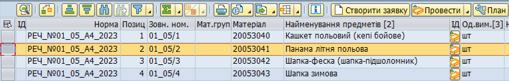
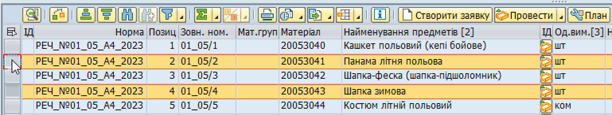
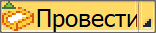
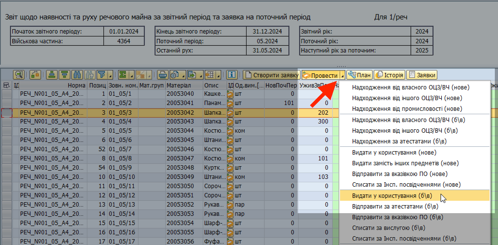
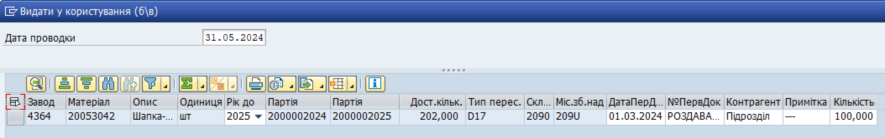
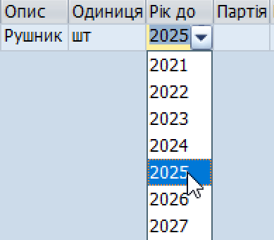

## Видача у користування (б/в)

### Типи майна

У операції "Видати у користування (б/в)" обліковується речове майно II категорії, яке в звітному періоді видано у користування.

Таке майно, на відміну від виданого у користування майна І категорії, не відображається окремим стовпцем у еЗвіті. Натомість, проведене у системі майно відображається у стовпці "Наявність уживаного ІІ на кінець звітного періоду (24)" (ця графа відповідає 24-й графі звіту 1/реч, "ІІ категорії в носінні та на складах").

### Передумови проведення операції

Для того, щоб провести цю операцію, у системі SAP на віртуальному складі 2090 (централізоване зберігання) вашого заводу повинно бути в наявності потрібне майно. Іншими словами, попередньо потрібно провести операцію з надходження потрібного майна – або як початкових залишків (станом на початок звітного року), або як рух майна впродовж звітного періоду.

### Кроки проведення операції 

**1. Сформуйте еЗвіт.**

> ℹ️ Див. розділ ["Формування еЗвіту у системі"](../%D0%B5%D0%97%D0%B2%D1%96%D1%82-%D1%83-%D1%81%D0%B8%D1%81%D1%82%D0%B5%D0%BC%D1%96-%D0%9B%D0%86%D0%A1-SAP/%D0%A4%D0%BE%D1%80%D0%BC%D1%83%D0%B2%D0%B0%D0%BD%D0%BD%D1%8F-%D0%B5%D0%97%D0%B2%D1%96%D1%82%D1%83-%D1%83-%D1%81%D0%B8%D1%81%D1%82%D0%B5%D0%BC%D1%96%D0%9B%D0%86%D0%A1-%D0%BA%D1%80%D0%BE%D0%BA%D0%B8.md#формування-езвіту-у-системі-ліс-кроки).

**2. Запустіть операцію.**

2.1. У вікні еЗвіту, виділіть рядок (або декілька рядків) з майном, з яким потрібно провести операцію.

Щоб виділити рядок, натисніть лівою кнопкою миші на сірий квадрат з лівого боку потрібного рядку. Обраний рядок змінить колір на жовтий.

{width="6.425336832895888in" height="1.0260870516185476in"}

Щоб виділити декілька рядків, розташованих поруч, протягніть натиснутий курсор мишки вниз чи вверх, щоб захопити потрібні рядки.

Щоб виділити декілька рядків, не розташованих поруч, після виділення одного рядку, натисніть клавішу "Ctrl" (Control) та, утримуючи її натиснутою, виділіть інші рядки, один за одним.

{width="6.425in" height="1.2201301399825022in"}

2.2. Натисніть стрілку на правому боці кнопки {width="1.0833333333333333in" height="0.2222222222222222in"} та оберіть "Видати у користування (б/в)".

{width="6.299212598425197in" height="3.1023622047244093in"}

Або, у рядку з потрібним матеріалом у еЗвіті, у колонці "ІД" натисніть піктограму {width="0.19641951006124234in" height="0.20869531933508312in"} та оберіть "Видати у користування (б/в)".

Якщо потрібно провести операцію руху одразу з декількома матеріалами:

\- Оберіть рядки з потрібними матеріалами у еЗвіті.

\- Натисніть стрілку у правому боці кнопки {width="1.0833333333333333in" height="0.2222222222222222in"} та оберіть "Видати у користування (б/в)".

**3. Вкажіть дані проводки операції.**

3.1. У полі "Дата проводки", вверху вікна операції, вкажіть дату впродовж поточного або попереднього місяця.

Див. розділ ["Дата проводки операції"](%D0%94%D0%B0%D1%82%D0%B0-%D0%BF%D1%80%D0%BE%D0%B2%D0%BE%D0%B4%D0%BA%D0%B8-%D0%B4%D0%BB%D1%8F-%D0%BE%D0%BF%D0%B5%D1%80%D0%B0%D1%86%D1%96%D0%B8%CC%86-%D0%B7-%D1%80%D1%83%D1%85%D1%83-%D0%BC%D0%B0%D0%B8%CC%86%D0%BD%D0%B0.md#дата-проводки-для-операцій-з-руху-майна) для детальних рекомендацій.

3.2. У вікні обробки, вкажіть дані для кожного матеріалу у відповідних графах:

{width="6.299212598425197in" height="0.9921259842519685in"}

+----------------------+------------------------------------------------------------------------------------------------------------------------------------------------------------------------------------------------------------------------+
| **Рік до**           | Оберіть рік вислуги майна (тобто рік, у якому закінчується термін користування матеріалом).                                                                                                                            |
|                      |                                                                                                                                                                                                                        |
|                      | Щоб обрати рік вислуги, у полі "Рік до" натисніть кнопку зі стрілкою вниз та оберіть потрібний рік зі списку можливих.                                                                                               |
|                      |                                                                                                                                                                                                                        |
|                      | {width="1.5592311898512685in" height="1.3663363954505687in"}                                                                |
+======================+========================================================================================================================================================================================================================+
| **ДатаПерДок**       | Вкажіть **дату** одного з двох можливих первинних облікових документів, згідно якого операція з матеріалом була здійснена фактично:                                                                                    |
|                      |                                                                                                                                                                                                                        |
|                      | 1\. Накладна                                                                                                                                                                                                           |
|                      |                                                                                                                                                                                                                        |
|                      | 2\. Роздавальна відомість                                                                                                                                                                                              |
+----------------------+------------------------------------------------------------------------------------------------------------------------------------------------------------------------------------------------------------------------+
| **№ПервДок**         | Вкажіть **назву та номер** одного з двох можливих первинних облікових документів, згідно якого операція з матеріалом була здійснена фактично:                                                                          |
|                      |                                                                                                                                                                                                                        |
|                      | 1\. Накладна                                                                                                                                                                                                           |
|                      |                                                                                                                                                                                                                        |
|                      | 2\. Роздавальна відомість                                                                                                                                                                                              |
|                      |                                                                                                                                                                                                                        |
|                      | Наприклад: Роздавальна відомість 577                                                                                                                                                                                   |
+----------------------+------------------------------------------------------------------------------------------------------------------------------------------------------------------------------------------------------------------------+
| **Контрагент**       | Підрозділ, у який видається майно.                                                                                                                                                                                     |
|                      |                                                                                                                                                                                                                        |
|                      | Якщо недоступна інформація про те, у який підрозділ видано майно, або ви вважаєте, що графа не потребує додаткової інформації, вкажіть прочерк: - (дефіс), \-\-- (три дефіси), або інший символ для вказання прочерку. |
+----------------------+------------------------------------------------------------------------------------------------------------------------------------------------------------------------------------------------------------------------+
| **Примітка**         | Додаткова та уточнююча інформація про операцію або первинний обліковий документ.                                                                                                                                       |
|                      |                                                                                                                                                                                                                        |
|                      | Якщо ви вважаєте, що графа не потребує додаткової інформації, вкажіть прочерк: - (дефіс), \-\-- (три дефіси), або інший символ для вказання прочерку.                                                                  |
+----------------------+------------------------------------------------------------------------------------------------------------------------------------------------------------------------------------------------------------------------+
| **Кількість**        | Кількість одиниць матеріалу, яка проводиться у операції.                                                                                                                                                               |
+----------------------+------------------------------------------------------------------------------------------------------------------------------------------------------------------------------------------------------------------------+

3.3. Після закінчення введення даних проводки, перемістіть курсор з останнього поля, яке ви заповнювали, до будь-якого іншого поля. Поки курсор лишається у полі, система вважає, що дані у полі остаточно не введені.

{width="6.299212598425197in" height="0.9921259842519685in"}

**4. Проведіть операцію у системі.**

4.1. Після введення даних, натисніть піктограму {width="0.15625in" height="0.1736111111111111in"} в правому нижньому куті вікна операції.

Якщо операція була проведена у системі успішно, у нижньому лівому куті з'явиться зелена відмітка та повідомлення про номер операції у системі SAP.

\*\*\*

### Первинні облікові документи

\- Накладна, або

\- Роздавальна відомість

### Тип пересування майна у системі SAP

D17

### Результати проведення операції у системі

1\. На склад 209U (майно у використанні) заводу (в/частини) в системі надійде відповідна кількість найменувань майна з партією 200000ХХХХ, де ХХХХ – рік вислуги майна.

2\. Збільшиться кількість майна у одній з наступних граф (колонок) еЗвіту: 26, 27, 28 (майно, що вислуговує у минулому, поточному, або наступному роках).

3\. Кількість майна у графі 24 не зміниться, тому що ця колонка відображає майно II категорії й на складах (2090), й у використанні (209U).

