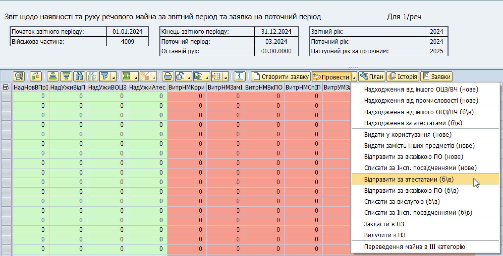
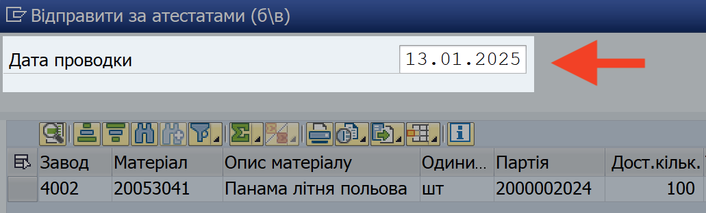

## Відправлення за атестатами (б/в)

### Типи майна

У операції "Відправити за атестатами (б/в)" обліковується:

\- речове майно ІІ категорії̈, яке в звітний̆ період відправлено за атестатами в/службовців, в/частин, команд та підрозділів;

\- речове майно ІІ категорії̈, яке списано з обліку в/частини в звітному періоді на підставі атестатів в/службовців, які звільнилися з військової служби.

### Кроки проведення операції

**1. Сформуйте еЗвіт.**

> ℹ️ Див. розділ ["Формування еЗвіту у системі"](../%D0%B5%D0%97%D0%B2%D1%96%D1%82-%D1%83-%D1%81%D0%B8%D1%81%D1%82%D0%B5%D0%BC%D1%96-%D0%9B%D0%86%D0%A1-SAP/%D0%A4%D0%BE%D1%80%D0%BC%D1%83%D0%B2%D0%B0%D0%BD%D0%BD%D1%8F-%D0%B5%D0%97%D0%B2%D1%96%D1%82%D1%83-%D1%83-%D1%81%D0%B8%D1%81%D1%82%D0%B5%D0%BC%D1%96%D0%9B%D0%86%D0%A1-%D0%BA%D1%80%D0%BE%D0%BA%D0%B8.md#формування-езвіту-у-системі-ліс-кроки).

**2. Запустіть операцію.**

2.1. У вікні еЗвіту, виділіть рядок (або декілька рядків) з майном, з яким потрібно провести операцію.

Щоб виділити рядок, натисніть лівою кнопкою миші на сірий квадрат з лівого боку потрібного рядку. Обраний рядок змінить колір на жовтий.

{width="6.425336832895888in" height="1.0260870516185476in"}

Щоб виділити декілька рядків, розташованих поруч, протягніть натиснутий курсор мишки вниз чи вверх, щоб захопити потрібні рядки.

Щоб виділити декілька рядків, не розташованих поруч, після виділення одного рядку, натисніть клавішу "Ctrl" (Control) та, утримуючи її натиснутою, виділіть інші рядки, один за одним.

{width="6.425in" height="1.2201301399825022in"}

2.2. Натисніть стрілку-трикутник ◢ на правому боці кнопки {width="1.0833333333333333in" height="0.2222222222222222in"} та у контекстному меню оберіть "Відправити за атестатами (б/в)".

{width="6.299212598425197in" height="3.216535433070866in"}

**3. Вкажіть дані проводки та проведіть операцію.**

3.1. У полі "Дата проводки", вверху вікна операції, вкажіть дату впродовж поточного або попереднього місяця.

Див. розділ ["Дата проводки операції"](%D0%94%D0%B0%D1%82%D0%B0-%D0%BF%D1%80%D0%BE%D0%B2%D0%BE%D0%B4%D0%BA%D0%B8-%D0%B4%D0%BB%D1%8F-%D0%BE%D0%BF%D0%B5%D1%80%D0%B0%D1%86%D1%96%D0%B8%CC%86-%D0%B7-%D1%80%D1%83%D1%85%D1%83-%D0%BC%D0%B0%D0%B8%CC%86%D0%BD%D0%B0.md#дата-проводки-для-операцій-з-руху-майна) для детальних рекомендацій.

{width="4.878261154855643in" height="1.4775853018372704in"}

3.2. У вікні операції, вкажіть дані для кожного найменування майна у відповідних полях:

+----------------------+-----------------------------------------------------------------------------------------------------------------------------------------------------------------------------------------------+
| **ДатаПерДок**       | Вкажіть **дату** одного з двох можливих первинних облікових документів, згідно якого операція з матеріалом була здійснена фактично:                                                           |
|                      |                                                                                                                                                                                               |
|                      | 1\. Атестат                                                                                                                                                                                   |
|                      |                                                                                                                                                                                               |
|                      | 2\. Зведена відомість по атестатам                                                                                                                                                            |
+======================+===============================================================================================================================================================================================+
| **№ПервДок**         | Вкажіть **назву та номер** одного з двох можливих первинних облікових документів, згідно якого операція з матеріалом була здійснена фактично:                                                 |
|                      |                                                                                                                                                                                               |
|                      | \- Атестат, АБО                                                                                                                                                                               |
|                      |                                                                                                                                                                                               |
|                      | \- Зведена відомість по атестатам                                                                                                                                                             |
|                      |                                                                                                                                                                                               |
|                      | Наприклад:\                                                                                                                                                                                   |
|                      | Зведена відомість 123 АБО                                                                                                                                                                     |
|                      |                                                                                                                                                                                               |
|                      | Атестат ВР 2345                                                                                                                                                                               |
+----------------------+-----------------------------------------------------------------------------------------------------------------------------------------------------------------------------------------------+
| **Контрагент**       | Номер в/частини, до якої вибув в/службовець.                                                                                                                                                  |
|                      |                                                                                                                                                                                               |
|                      | Наприклад: А2678.                                                                                                                                                                             |
|                      |                                                                                                                                                                                               |
|                      | Якщо інформація про контрагента операції недоступна, або в/службовці вибули у багато різних в/частин, вкажіть прочерк: - (дефіс), \-\-- (три дефіси), або інший символ для вказання прочерку. |
+----------------------+-----------------------------------------------------------------------------------------------------------------------------------------------------------------------------------------------+
| **Примітка**         | Додаткова та уточнююча інформація про операцію або первинний обліковий документ.                                                                                                              |
|                      |                                                                                                                                                                                               |
|                      | Якщо ви вважаєте, що графа не потребує додаткової інформації, вкажіть прочерк: - (дефіс), \-\-- (три дефіси), або інший символ для вказання прочерку.                                         |
+----------------------+-----------------------------------------------------------------------------------------------------------------------------------------------------------------------------------------------+
| **Кількість**        | Кількість одиниць матеріалу, яка проводиться у операції.                                                                                                                                      |
+----------------------+-----------------------------------------------------------------------------------------------------------------------------------------------------------------------------------------------+

3.3. Після закінчення введення даних проводки, перемістіть курсор з останнього поля, яке ви заповнювали, до будь-якого іншого поля. Поки курсор лишається у полі, система вважає, що дані у полі остаточно не введені.

**4. Проведіть операцію у системі.**

4.1. Після введення даних, натисніть піктограму {width="0.15625in" height="0.1736111111111111in"} в правому нижньому куті вікна операції.

Якщо операція була проведена у системі успішно, у нижньому лівому куті з'явиться зелена відмітка та повідомлення про номер операції у системі.

### Первинні облікові документи

\- Атестат в/службовця, АБО

\- Зведена кількість по атестатам

### Результати проведення операції

Проведене майно не переводиться на жодний з віртуальних складів в/частини у системі SAP (ані на 2090, ані на 209U). Натомість, майно повністю списується з балансу в/частини у системі.

Після проведення операції, перевірте, що після вибуття в/службовців з вашої в/частини ви зробили наступне:

1\. Оновили кількість о/складу у операції "Ведення планових показників"

2\. Створили новий план потреб у системі, щоб у еЗвіті вірно відображалась потреба у майні.

