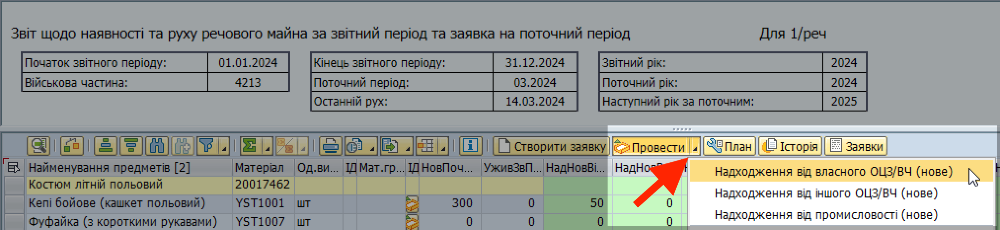
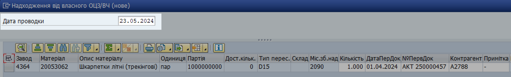
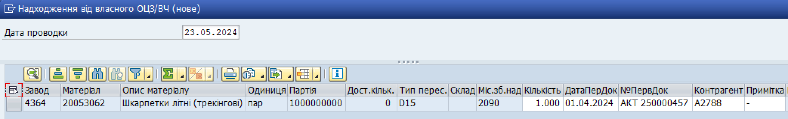

## Надходження від власного ОЦЗ/ВЧ (нове)

### Типи майна

У операції "Надходження від власного ОЦЗ/ВЧ (нове)" обліковується таке майно:

\- речове майно I категорії, яке надійшло у в/частину від постачального органу (ОЦЗ) за актами або накладними;

\- речове майно I категорії, яке надійшло для закладення в "НЗ".

### Обмеження операції

Фахівці речових служб повинні проводити операцію "Надходження від власного ОЦЗ/ВЧ (нове)" лише тоді, коли майно було замовлено від ОЦЗ (за актами або накладними) впродовж поточного року, але надходження не було проведено у системі.

Перед тим, як проводити операцію "Надходження від власного ОЦЗ/ВЧ (нове)", пригадайте важливий принцип роботи системи:

надходження майна, отриманого від власного органу постачання (ОЦЗ), проводиться у системі АВТОМАТИЧНО після фактичного отримання майна.

Див. розділ ["Заявка на отримання майна від постачального органу (еЗаявка)"](../%D0%97%D0%B0%D1%8F%D0%B2%D0%BA%D0%B0-%D0%BD%D0%B0-%D0%BE%D1%82%D1%80%D0%B8%D0%BC%D0%B0%D0%BD%D0%BD%D1%8F-%D0%BC%D0%B0%D0%B9%D0%BD%D0%B0-%D0%B2%D1%96%D0%B4-%D0%BF%D0%BE%D1%81%D1%82%D0%B0%D1%87%D0%B0%D0%BB%D1%8C%D0%BD%D0%BE%D0%B3%D0%BE-%D0%BE%D1%80%D0%B3%D0%B0%D0%BD%D1%83-%D0%B5%D0%97%D0%B0%D1%8F%D0%B2%D0%BA%D0%B0/%D0%97%D0%B0%D1%8F%D0%B2%D0%BA%D0%B0-%D0%BD%D0%B0-%D0%BE%D1%82%D1%80%D0%B8%D0%BC%D0%B0%D0%BD%D0%BD%D1%8F-%D0%BC%D0%B0%D0%B8%CC%86%D0%BD%D0%B0-%D0%B2%D1%96%D0%B4-%D0%BF%D0%BE%D1%81%D1%82%D0%B0%D1%87%D0%B0%D0%BB%D1%8C%D0%BD%D0%BE%D0%B3%D0%BE-%D0%BE%D1%80%D0%B3%D0%B0%D0%BD%D1%83-%D0%B5%D0%97%D0%B0%D1%8F%D0%B2%D0%BA%D0%B0.md#заявка-на-отримання-майна-від-постачального-органу-езаявка).

### Недоступність операції (нове майно)

Після того, як ви оновили дані про рух майна з початку звітного року та повідомили про це представників органу постачання, останні повинні обмежити доступ до операції "Надходження від власного ОЦЗ/ВЧ (нове)" для вашої в/частини (заводу) у системі.

Тому, якщо ця операція недоступна в еЗвіті, ймовірно, її заблокували для вас представники органу забезпечення.

Якщо у вас немає доступу до операції, але є потреба її провести, зверніться до представників вашого органу забезпечення.

НАПРИКЛАД:

ЯКЩО ви працювали у еЗвіті впродовж 2024 року,\
ТО, скоріш за все, операція "Надходження від власного ОЦЗ/ВЧ (нове)" буде недоступною для вас у 2025 році.

### Кроки проведення операції

**1. Сформуйте еЗвіт.**

Див. детальні кроки у розділі ["Формування еЗвіту у системі"](../%D0%B5%D0%97%D0%B2%D1%96%D1%82-%D1%83-%D1%81%D0%B8%D1%81%D1%82%D0%B5%D0%BC%D1%96-%D0%9B%D0%86%D0%A1-SAP/%D0%A4%D0%BE%D1%80%D0%BC%D1%83%D0%B2%D0%B0%D0%BD%D0%BD%D1%8F-%D0%B5%D0%97%D0%B2%D1%96%D1%82%D1%83-%D1%83-%D1%81%D0%B8%D1%81%D1%82%D0%B5%D0%BC%D1%96%D0%9B%D0%86%D0%A1-%D0%BA%D1%80%D0%BE%D0%BA%D0%B8.md#формування-езвіту-у-системі-ліс-кроки).

**2. Запустіть операцію.**

2.1. У вікні еЗвіту, виділіть рядок (або декілька рядків) з майном, з яким потрібно провести операцію.

Щоб виділити рядок, натисніть лівою кнопкою миші на сірий квадрат з лівого боку потрібного рядку. Обраний рядок змінить колір на жовтий.

{width="6.425336832895888in" height="1.0260870516185476in"}

Щоб виділити декілька рядків, розташованих поруч, протягніть натиснутий курсор мишки вниз чи вверх, щоб захопити потрібні рядки.

Щоб виділити декілька рядків, не розташованих поруч, після виділення одного рядку, натисніть клавішу "Ctrl" (Control) та, утримуючи її натиснутою, виділіть інші рядки, один за одним.

{width="6.425in" height="1.2201301399825022in"}

2.2. Натисніть стрілку на правому боці кнопки {width="1.0833333333333333in" height="0.2222222222222222in"} та оберіть "Надходження від власного ОЦЗ/ВЧ (нове)".

{width="6.299212598425197in" height="1.4488188976377954in"}

Або, у рядку з потрібним матеріалом у еЗвіті, у колонці "ІД" натисніть піктограму {width="0.19641951006124234in" height="0.20869531933508312in"} та оберіть "Надходження від власного ОЦЗ/ВЧ (нове)".

Якщо потрібно провести операцію руху одразу з декількома матеріалами:

\- Оберіть рядки з потрібними матеріалами у еЗвіті.

\- Натисніть стрілку у правому боці кнопки {width="1.0833333333333333in" height="0.2222222222222222in"} та оберіть "Надходження від власного ОЦЗ/ВЧ (нове)".

**3. Вкажіть дані проводки операції.**

3.1. У полі "Дата проводки", вверху вікна операції, вкажіть дату впродовж поточного або попереднього місяця.

Див. розділ ["Дата проводки операції"](%D0%94%D0%B0%D1%82%D0%B0-%D0%BF%D1%80%D0%BE%D0%B2%D0%BE%D0%B4%D0%BA%D0%B8-%D0%B4%D0%BB%D1%8F-%D0%BE%D0%BF%D0%B5%D1%80%D0%B0%D1%86%D1%96%D0%B8%CC%86-%D0%B7-%D1%80%D1%83%D1%85%D1%83-%D0%BC%D0%B0%D0%B8%CC%86%D0%BD%D0%B0.md#дата-проводки-для-операцій-з-руху-майна) для детальних рекомендацій.

{width="6.299212598425197in" height="0.9606299212598425in"}

3.2. У вікні обробки, вкажіть дані для кожного матеріалу у відповідних графах:

+-----------------+------------------------------------------------------------------------------------------------------------------------------------------+
| **Кількість**   | Кількість одиниць матеріалу, яка проводиться у операції.                                                                                 |
+=================+==========================================================================================================================================+
| **ДатаПерДок**  | Дата первинного облікового документу, згідно якого операція з матеріалом була здійснена фактично – **Акту приймання-передачі майна.**  |
+-----------------+------------------------------------------------------------------------------------------------------------------------------------------+
| **№ПервДок**    | Номер первинного облікового документу, згідно якого операція з матеріалом була здійснена фактично – **Акту приймання-передачі майна.** |
|                 |                                                                                                                                          |
|                 | Наприклад: Акт 250000457                                                                                                                 |
+-----------------+------------------------------------------------------------------------------------------------------------------------------------------+
| **Контрагент**  | Номер в/частини ОЦЗ (постачального органу).                                                                                              |
|                 |                                                                                                                                          |
|                 | Наприклад: А2788.                                                                                                                        |
+-----------------+------------------------------------------------------------------------------------------------------------------------------------------+
| **Примітка**    | Додаткова та уточнююча інформація про операцію або первинний обліковий документ.                                                         |
|                 |                                                                                                                                          |
|                 | Якщо ви вважаєте, що графа не потребує додаткової інформації, вкажіть "-" (прочерк).                                                   |
+-----------------+------------------------------------------------------------------------------------------------------------------------------------------+

Після закінчення введення даних проводки, перемістіть курсор з останнього поля, яке ви заповнювали, до будь-якого іншого поля. Поки курсор лишається у полі, система вважає, що дані у полі остаточно не введені.

{width="6.299212598425197in" height="0.9606299212598425in"}

**4. Проведіть операцію у системі.**

4.1. Після введення даних, натисніть піктограму {width="0.15625in" height="0.1736111111111111in"} в правому нижньому куті вікна операції.

Якщо операція була проведена у системі успішно, у нижньому лівому куті з'явиться зелена відмітка та повідомлення про номер операції у системі.

\*\*\*

### Первинні документи

Акт приймання-передачі майна.

### Тип пересування майна у системі

D15.

### Результати проведення операції у системі

1\. На склад 2090 (централізоване зберігання) заводу (в/частини) в системі надійде відповідна кількість найменувань майна з партією 1000000000.

2\. Збільшиться кількість майна у таких графах (колонках) еЗвіту: 6, 23, 29.

3\. Зменшиться кількість майна у графах (колонках) еЗвіту: 30.

### Часті питання та проблеми (нове майно)

**Операція недоступна.** Якщо у меню доступних операцій у еЗвіті операція "Надходження від іншого ОЦ3/ВЧ (нове)" не відображається, скоріш за все, вона була заблокована для вашої в/частини з боку органу постачання (ОЦЗ).

Див. розділ ["Недоступність операції"](#недоступність-операції-нове-майно).

