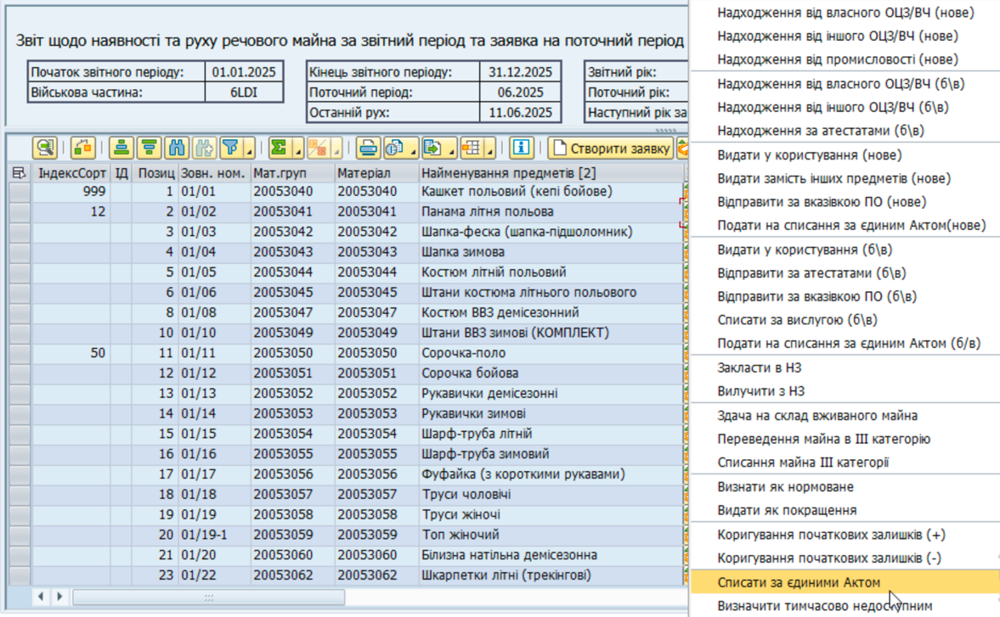

## Списання за єдиним актом

### Типи майна

Ця операція застосовується до майна, поданого на списання операціями «Подати на списання за єдиним актом (нове) або (б/в)".

### Кроки проведення операції

**1. Сформуйте еЗвіт.**

> Див. детальні кроки у розділі ["Формування еЗвіту у системі"](../%D0%B5%D0%97%D0%B2%D1%96%D1%82-%D1%83-%D1%81%D0%B8%D1%81%D1%82%D0%B5%D0%BC%D1%96-%D0%9B%D0%86%D0%A1-SAP/%D0%A4%D0%BE%D1%80%D0%BC%D1%83%D0%B2%D0%B0%D0%BD%D0%BD%D1%8F-%D0%B5%D0%97%D0%B2%D1%96%D1%82%D1%83-%D1%83-%D1%81%D0%B8%D1%81%D1%82%D0%B5%D0%BC%D1%96%D0%9B%D0%86%D0%A1-%D0%BA%D1%80%D0%BE%D0%BA%D0%B8.md#формування-езвіту-у-системі-ліс-кроки).

**2. Запустіть операцію.**

2.1. У вікні еЗвіту, виділіть рядок (або декілька рядків) з майном, з яким потрібно провести операцію.

Щоб виділити рядок, натисніть лівою кнопкою миші на сірий квадрат з лівого боку потрібного рядку. Обраний рядок змінить колір на жовтий.

{width="6.425336832895888in" height="1.0260870516185476in"}

Щоб виділити декілька рядків, розташованих поруч, протягніть натиснутий курсор мишки вниз чи вверх, щоб захопити потрібні рядки.

Щоб виділити декілька рядків, не розташованих поруч, після виділення одного рядку, натисніть клавішу "Ctrl" (Control) та, утримуючи її натиснутою, виділіть інші рядки, один за одним.

{width="6.425in" height="1.2201301399825022in"}

2.2. Натисніть стрілку-трикутник ◢ у правому боці кнопки "Провести" {width="0.9615944881889764in" height="0.19725065616797902in"} та у контекстному меню оберіть "Списати за єдиним актом (б/в)".

{width="5.324596456692913in" height="3.2888888888888888in"}

Або, у рядку з потрібним матеріалом у еЗвіті, у колонці "ІД" натисніть піктограму {width="0.19641951006124234in" height="0.20869531933508312in"} та оберіть "Списати за єдиним актом".

Якщо потрібно провести операцію руху одразу з декількома матеріалами:

\- Оберіть рядки з потрібними матеріалами у еЗвіті.

\- Натисніть стрілку у правому боці кнопки "Провести" {width="0.8224639107611549in" height="0.16871062992125985in"} та оберіть "Подати на списання за єдиним актом (б/в)".

**3. Вкажіть дані проводки та проведіть списання.**

3.1. У полі "Дата проводки", вверху вікна операції, вкажіть дату впродовж поточного або попереднього місяця.

Див. розділ ["Дата проводки операції"](%D0%94%D0%B0%D1%82%D0%B0-%D0%BF%D1%80%D0%BE%D0%B2%D0%BE%D0%B4%D0%BA%D0%B8-%D0%B4%D0%BB%D1%8F-%D0%BE%D0%BF%D0%B5%D1%80%D0%B0%D1%86%D1%96%D0%B8%CC%86-%D0%B7-%D1%80%D1%83%D1%85%D1%83-%D0%BC%D0%B0%D0%B8%CC%86%D0%BD%D0%B0.md#дата-проводки-для-операцій-з-руху-майна) для детальних рекомендацій.

3.2. Вкажіть дані для кожного найменування майна у відповідних полях проводки операції:

+-----------------+------------------------------------------------------------------------------------------------------------------------------------------------------------------------------------------+
| **Кількість**   | Вкажіть кількість одиниць матеріалу, яка списується у операції.                                                                                                                          |
|                 |                                                                                                                                                                                          |
|                 | Наприклад: 100                                                                                                                                                                           |
+=================+==========================================================================================================================================================================================+
| **ДатаПерДок**  | Вкажіть **дату первинного облікового документу**:                                                                                                                                        |
|                 |                                                                                                                                                                                          |
|                 | \- інспекторського посвідчення, АБО                                                                                                                                                      |
|                 |                                                                                                                                                                                          |
|                 | \- наказу командира в/частини за результатами проведення службового розслідування (якщо інспекторське посвідчення все ще оформлюється на момент проведення операції)                     |
|                 |                                                                                                                                                                                          |
|                 | Наприклад: 01.03.2024                                                                                                                                                                    |
+-----------------+------------------------------------------------------------------------------------------------------------------------------------------------------------------------------------------+
| **№ПервДок**    | Вкажіть **назву та номер первинного облікового документу**:                                                                                                                              |
|                 |                                                                                                                                                                                          |
|                 | \- інспекторського посвідчення, АБО                                                                                                                                                      |
|                 |                                                                                                                                                                                          |
|                 | \- наказу командира в/частини за результатами проведення службового розслідування (якщо інспекторське посвідчення все ще оформлюється на момент проведення операції)                     |
|                 |                                                                                                                                                                                          |
|                 | Наприклад:                                                                                                                                                                               |
|                 |                                                                                                                                                                                          |
|                 | Інспекторське посвідчення №123/87 АБО\                                                                                                                                                   |
|                 | Наказ 1568СР                                                                                                                                                                             |
+-----------------+------------------------------------------------------------------------------------------------------------------------------------------------------------------------------------------+
| **Контрагент**  | Якщо ви вважаєте, що графа не потребує додаткової інформації, вкажіть прочерк: - (дефіс), \-\-- (три дефіси), інший символ для вказання прочерку; або напишіть "Контрагент відсутній". |
+-----------------+------------------------------------------------------------------------------------------------------------------------------------------------------------------------------------------+
| **Примітка**    | Додаткова та уточнююча інформація про операцію або первинний обліковий документ.                                                                                                         |
|                 |                                                                                                                                                                                          |
|                 | Якщо ви вважаєте, що графа не потребує додаткової інформації, вкажіть прочерк: - (дефіс), \-\-- (три дефіси), інший символ для вказання прочерку; або напишіть "Примітка відсутня".    |
+-----------------+------------------------------------------------------------------------------------------------------------------------------------------------------------------------------------------+

**4. Проведіть операцію у системі.**

4.1. Після введення даних, натисніть піктограму {width="0.15625in" height="0.1736111111111111in"} в правому нижньому куті вікна операції.

Якщо операція була проведена у системі успішно, у нижньому лівому куті вікна еЗвіту з'явиться зелена відмітка та повідомлення про номер операції у системі.

\*\*\*

### Первинні облікові документи

\- Інспекторське посвідчення, ТА/АБО

\- Наказ командира в/частини за результатами проведення службового розслідування

\- Акт зміни якісного стану (ТІЛЬКИ якщо майно списується через [інтенсивне використання у бойових підрозділах](%D0%9F%D0%BE%D0%B4%D0%B0%D1%82%D0%B8-%D0%BD%D0%B0-%D1%81%D0%BF%D0%B8%D1%81%D0%B0%D0%BD%D0%BD%D1%8F-%D0%B7%D0%B0-%D1%94%D0%B4%D0%B8%D0%BD%D0%B8%D0%BC-%D0%B0%D0%BA%D1%82%D0%BE%D0%BC-%D0%B1%D0%B2.md#списання-майна-через-інтенсивне-використання-у-бойових-діях)).

### Результати проведення операції у системі

Майно повністю списується з запасів майна в/частини у системі, а потреба у відповідному майні зростає.

