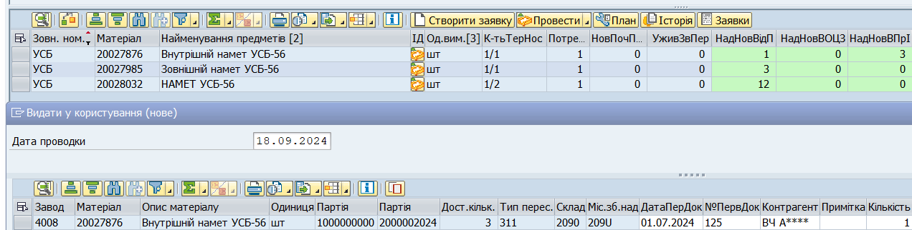
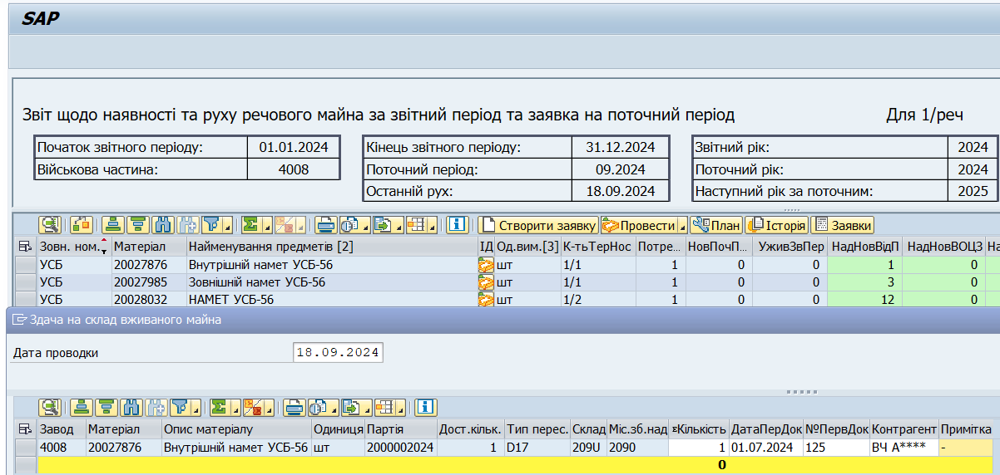
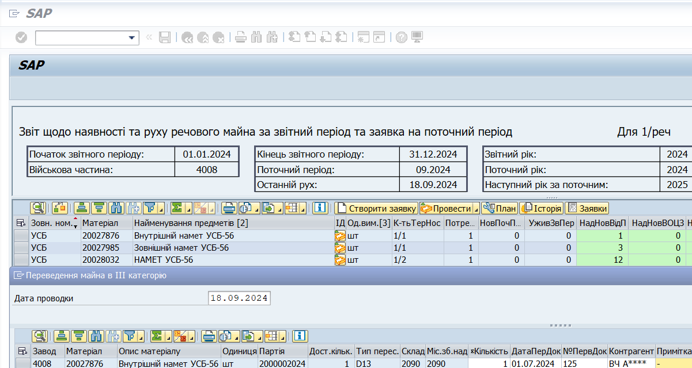
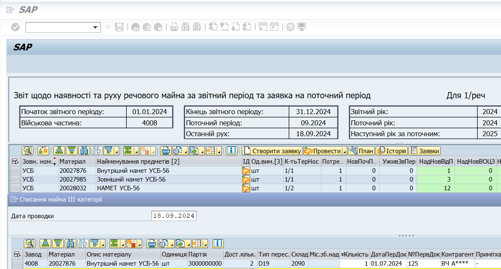

# Особливості окремих операцій у системі ЛІС

Деякі операції з руху (обліку) майна не мають прямих відповідників у еЗвіті. Нижче наведено перелік таких операцій, а також посилання на розділи з поясненнями та визначені ЦУРЗ операції-відповідники.

## Видача нового майна, неотриманого за попередні роки (погашення заборгованості)

Для цього руху майна, використовуйте операцію [\"Видати у користування (нове)\"](#видати-у-користування-нове).

Див. розділ [\"Видача майна, неотриманого за попередні роки (погашення заборгованості)\"](#видача-майна-неотриманого-за-попередні-роки-погашення-заборгованості).

## Видача вживаного майна замість інших предметів

Для цього руху майна, використовуйте операцію [\"Відправити за вказівкою ПО (б/в)\"](#відправлення-за-вказівкою-постачального-органу-бв).

Див. розділ [\"Видача ВЖИВАНОГО майна замість інших предметів\"](#видача-вживаного-майна-замість-інших-предметів).

## Списання майна б/в через інтенсивне використання у бойових діях

Для цього руху майна, використовуйте операцію [\"Подати на списання за єдиним актом (б/в)\"](#подати-на-списання-за-єдиним-актом-бв).

Див. розділ [\"Списання майна через інтенсивне використання у бойових діях\"](#списання-майна-через-інтенсивне-використання-у-бойових-діях).

## Списання нового та б/в майна на поховання в/службовців

Для цього руху майна, використовуйте операції \"Подати на списання за єдиним актом [(нове)](#подати-на-списання-за-єдиним-актом-нове) та [(б/в)](#подати-на-списання-за-єдиним-актом-бв)\".

## Укомплектування та розкомплектування (намети УСТ та УСБ)

Нижче наводимо порядок операцій з видачі в укомплектування зовнішніх/внутрішніх наметів – на прикладі внутрішнього намету УСБ-56.

Даний процес відображає дії з наметом, що надійшов на склади для проведення доукомплектації.

Для роботи з внутрішніми та зовнішніми частинами наметів, необхідно **додати відповідні норми** до плану потреб (вказавши потребу у таких внутрішніх та зовнішніх частинах). Див. розділ [\"Норми для наметів\"](#норми-для-наметів-уст-та-усб).

Для позиції **\"Внутрішній намет УСБ-56\"**, обрати операцію \"Видати у користування (нове)\" та вказати усі необхідні параметри (відображає видачу 1 внутрішнього намету в доукомплектування).

{width="6.299212598425197in" height="1.594488188976378in"}

Для відображення списання внутрішнього намету, який замінюється, необхідно виконати 3 операції:

\- Здача на склад вживаного майна

{width="5.701042213473316in" height="2.713008530183727in"}

\- Переведення майна в ІІІ категорію

{width="5.672813867016623in" height="3.0226749781277342in"}

\- Списання майна 3 категорії

{width="5.687977909011374in" height="3.056722440944882in"}

Ці 3 операції відображають повернення на сховище непридатного внутрішнього намету, його переведення у категорію для списання та саме списання.

