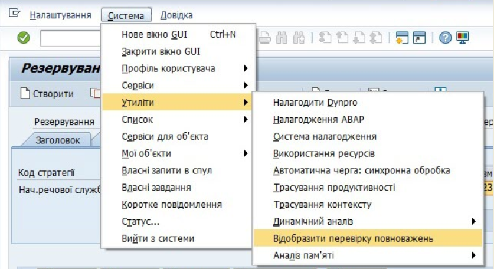
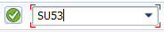
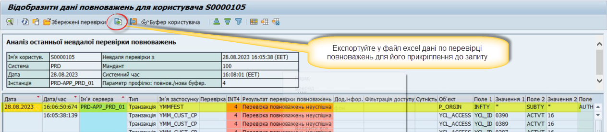

## Перевірка повноважень — інструмент ідентифікації помилки

Якщо при роботі в LIS з'являється системне повідомлення, яке свідчить про нестачу повноважень на виконання операції, необхідно перевірити наявність у Вас повноважень на цю дію. Для цього запустіть звіт перевірки повноважень через меню **«Система/Утиліти/Відобразити перевірку повноважень»**.

{width="4.403916229221347in" height="2.39910542432196in"}

***Примітка.** Перевірку повноважень можна запустити також транзакцією **SU53*** {width="1.9169346019247595in" height="0.3750524934383202in"}

Необхідно повторно виконати дії, що призводять до помилки, і одразу за цим -- перевірити повноваження.

Звіт перевірки повноважень потрібно прикріпити до запиту, який буде направлятись до служби підтримки і написати час появи сповіщення про нестачу у Вас повноважень.

{width="6.299212598425197in" height="1.3858267716535433in"}

