## Ведення планових показників (вибір норм та чисельності особового складу)

### Короткий огляд операції

За допомогою операції "Введення планових показників", фахівці речових служб можуть ввести до системи ЛІС (SAP):

\- норми забезпечення, згідно яких забезпечуються в/службовці в/частини

\- спискову чисельність о/складу, яка забезпечується згідно відповідних норм

\- вказати додаткові параметри для коректного обліку потреб у системі ЛІС

\- обґрунтувати зміни у нормах забезпечення та/або кількості о/складу по цим нормам.

Ведення планових показників потрібне для того, щоб пізніше створити сам план потреб. Саме на основі цього плану система ЛІС (SAP) визначить актуальну потребу у майні згідно норм для вашої в/частини.

**!!** Робота з нормами забезпечення та планами потреб у системі ЛІС (SAP) ведеться **виключно зі СПИСКОВОЮ чисельністю особового складу**, щоб не порушувати відповідний гриф таємності.

### Кроки введення планових показників

Щоб налаштувати план потреб, ввівши планові показники (норму забезпечення та відповідну ), виконайте наступні кроки.

1\. Увійдіть у систему SAP (LIS).

Див. розділ ["Вхід до системи"](../%D0%9F%D0%BE%D1%87%D0%B0%D1%82%D0%BE%D0%BA-%D1%80%D0%BE%D0%B1%D0%BE%D1%82%D0%B8-%D1%83-%D1%81%D0%B8%D1%81%D1%82%D0%B5%D0%BC%D1%96.md#вхід-до-системи-загальні-кроки).

2\. Відкрийте вікно "Робоче місце користувача.

Див. розділ ["Початкове вікно роботи з системою"](../%D0%9F%D0%BE%D1%87%D0%B0%D1%82%D0%BE%D0%BA-%D1%80%D0%BE%D0%B1%D0%BE%D1%82%D0%B8-%D1%83-%D1%81%D0%B8%D1%81%D1%82%D0%B5%D0%BC%D1%96.md#початкове-вікно-роботи-з-системою).

**3. Запустіть операцію "Ведення планових показників".**

3.1. У вікні "Робоче місце користувача", натисніть кнопку-кокпіт "Спрощений облік: потреби \[CP0116\].

{width="6.268055555555556in" height="1.3323436132983377in"}

3.2. Оберіть рядок "Ведення планових показників", натиснувши його один раз лівою кнопкою миші.

3.3. Натисніть кнопку {width="0.2222222222222222in" height="0.20833333333333334in"} "Виконати" (або ліворуч від рядку, або у панелі задач під назвою вікна "Відобразити область меню YPLSIMPL01").

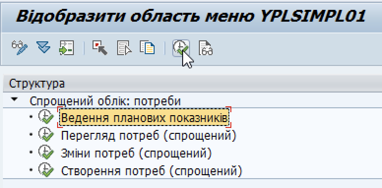{width="3.7441863517060368in" height="1.8431430446194226in"}

**4. Вкажіть параметри вашого заводу для подальшого введення планових показників.**

4.1. У вікні "Присвоєння норм до об'єктів" вкажіть такі параметри:

+-----------------+--------------------------------------------------------------------------------------------------------------------------------------------------------------------------------------------------+
| **Назва поля**  | **Що вказати**                                                                                                                                                                                   |
+=================+==================================================================================================================================================================================================+
| **Тип об'єкта** | Вкажіть *FORCE_ELEMENT*.                                                                                                                                                                         |
|                 |                                                                                                                                                                                                  |
|                 | FORCE_ELEMENT – це системний параметр, що вказує на військовий об'єкт). Цей параметр є однаковим для всіх заводів у системі ЛІС, що працюють з планами потреб згідно норм забезпечення.       |
+-----------------+--------------------------------------------------------------------------------------------------------------------------------------------------------------------------------------------------+
| **Об'єкт**      | Вкажіть код бойової одиниці вашого заводу в системі LIS.                                                                                                                                         |
|                 |                                                                                                                                                                                                  |
|                 | Наприклад: 100000000000000XXX,\                                                                                                                                                                  |
|                 | де Х – конкретні цифри коду для вашого заводу.                                                                                                                                                 |
|                 |                                                                                                                                                                                                  |
|                 | Код бойової одиниці – це 18-значний системний параметр у системі ЛІС. Цей код фахівці речової служби в/частини отримають від команди впровадження ІКС УЛЗ після успішного закінчення навчання. |
+-----------------+--------------------------------------------------------------------------------------------------------------------------------------------------------------------------------------------------+

4.2. Після вказання даних у відповідних полях, натисніть клавішу Enter на клавіатурі комп'ютера, щоб ввести дані в систему.

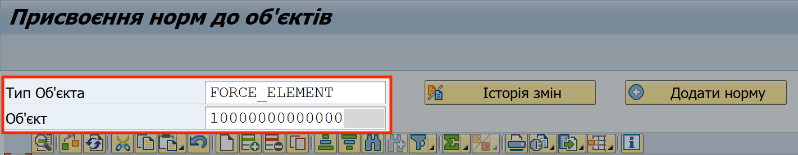{width="5.323077427821523in" height="1.0420866141732283in"}

**5. Додайте норму забезпечення та вкажіть кількість особового складу та інші параметри.**

5.1. Натисніть кнопку "Додати норму". Відкриється вікно "Вибір норми".

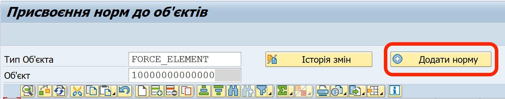{width="6.268055555555556in" height="1.2347222222222223in"}

5.2. У вікні "Вибір норми", вкажіть наступні значення:

+----------------+---------------------------------------------------------------------------------------------------------------------------------------------------------------------------------------------------------------------------------------------------------------------------------------------------------------------------------------------------------------------------------------------------------------------------------------------------------------------------------------------------------------------------------------------------------------------------------------------------------------------------------------+
| **Назва поля** | **Що вказати**                                                                                                                                                                                                                                                                                                                                                                                                                                                                                                                                                                                                                        |
+================+=======================================================================================================================================================================================================================================================================================================================================================================================================================================================================================================================================================================================================================================+
| **Норма**      | Оберіть код норми забезпечення.                                                                                                                                                                                                                                                                                                                                                                                                                                                                                                                                                                                                       |
|                |                                                                                                                                                                                                                                                                                                                                                                                                                                                                                                                                                                                                                                       |
|                | Наприклад: "РЕЧ_01 ЖІНОЧА"                                                                                                                                                                                                                                                                                                                                                                                                                                                                                                                                                                                                          |
|                |                                                                                                                                                                                                                                                                                                                                                                                                                                                                                                                                                                                                                                       |
|                | **Щоб вибрати код норми зі списку можливих**, з правого боку поля "Норма", натисніть кнопку {width="0.2in" height="0.2111111111111111in"}                                                                                                                                                                                                                                                                                                                                                                                                                                                               |
|                |                                                                                                                                                                                                                                                                                                                                                                                                                                                                                                                                                                                                                                       |
|                | 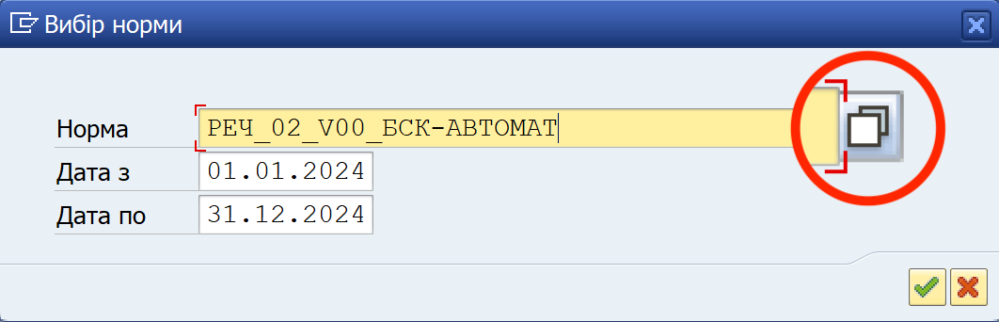{width="3.1049048556430447in" height="1.0in"}                                                                                                                                                                                                                                                                                                                                                                                                                                                                                               |
|                |                                                                                                                                                                                                                                                                                                                                                                                                                                                                                                                                                                                                                                       |
|                | У продуктивній системі список норм може не відображатись за замовчанням через їх велику кількість. У цьому випадку застосуйте фільтр (обмеження), натиснувши стрілку на жовтій панелі {width="0.2008552055993001in" height="0.12051290463692038in"} (у верхній частині вікна "Ідентифікатор норми"). У полі "Зовнішній номер" впишіть фрагмент назви норми, оточивши його зірочками, наприклад \*МВД\* -- так знайдуться всі норми, які містять вказаний фрагмент в будь-якому місці назви. Натисніть кнопку {width="0.1304582239720035in" height="0.14180227471566054in"}. |
|                |                                                                                                                                                                                                                                                                                                                                                                                                                                                                                                                                                                                                                                       |
|                | 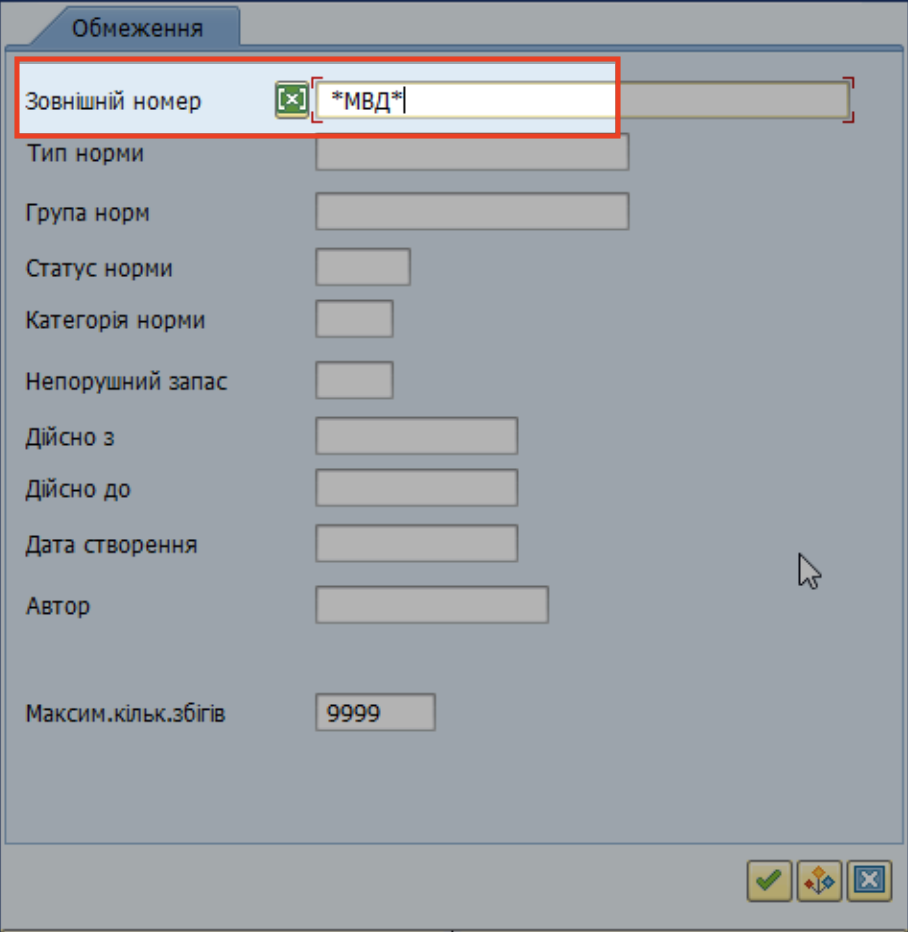{width="4.312501093613299in" height="4.426680883639545in"}                                                                                                                                                                                                                                                                                                                                                                                                                                                                                                                                                |
|                |                                                                                                                                                                                                                                                                                                                                                                                                                                                                                                                                                                                                                                       |
|                | У вікні "Ідентифікатор норми" зі списком норм, оберіть рядок з потрібною нормою та двічі натисніть його. Потрібна норма буде автоматично вставлена у поле "Норма" (з якого ви почали пошук).                                                                                                                                                                                                                                                                                                                                                                                                                                      |
|                |                                                                                                                                                                                                                                                                                                                                                                                                                                                                                                                                                                                                                                       |
|                | 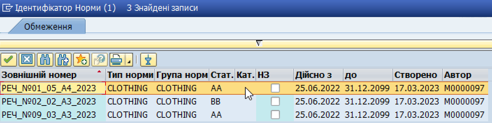{width="4.3699245406824145in" height="1.0925896762904637in"}                                                                                                                                                                                                                                                                                                                                                                                                                                                                                |
|                |                                                                                                                                                                                                                                                                                                                                                                                                                                                                                                                                                                                                                                       |
|                | **!!** Щоб коректно обрати норми, використовуйте Довідник норм, доступний у модулі SAP Business Workplace \> Спільні папки SAP.                                                                                                                                                                                                                                                                                                                                                                                                                                                                                                       |
|                |                                                                                                                                                                                                                                                                                                                                                                                                                                                                                                                                                                                                                                       |
|                | Див. розділ ["Норми забезпечення у системі SAP"](#_Норми_забезпечення_у)                                                                                                                                                                                                                                                                                                                                                                                                                                                                                                                                                            |
|                |                                                                                                                                                                                                                                                                                                                                                                                                                                                                                                                                                                                                                                       |
|                | Для навчальних серверів ІКС УЛЗ (SAP) використовуються **інші назви норм**, ніж при роботі з реальними даними на комп'ютерах у захищеному контурі "Слід". Назви норм для навчальних серверів команда навчання повідомляє окремо слухачам перед та під час занять.                                                                                                                                                                                                                                                                                                                                                                  |
+----------------+---------------------------------------------------------------------------------------------------------------------------------------------------------------------------------------------------------------------------------------------------------------------------------------------------------------------------------------------------------------------------------------------------------------------------------------------------------------------------------------------------------------------------------------------------------------------------------------------------------------------------------------+
| **Дійсно з**   | Вкажіть *01.01.20ХХ,\*                                                                                                                                                                                                                                                                                                                                                                                                                                                                                                                                                                                                                |
|                | \                                                                                                                                                                                                                                                                                                                                                                                                                                                                                                                                                                                                                                     |
|                | де "20ХХ" – це поточний звітний рік.                                                                                                                                                                                                                                                                                                                                                                                                                                                                                                                                                                                              |
|                |                                                                                                                                                                                                                                                                                                                                                                                                                                                                                                                                                                                                                                       |
|                | Наприклад: "01.01.2024"                                                                                                                                                                                                                                                                                                                                                                                                                                                                                                                                                                                                             |
+----------------+---------------------------------------------------------------------------------------------------------------------------------------------------------------------------------------------------------------------------------------------------------------------------------------------------------------------------------------------------------------------------------------------------------------------------------------------------------------------------------------------------------------------------------------------------------------------------------------------------------------------------------------+
| **Дійсно по**  | Вкажіть *31.01.20ХХ,\*                                                                                                                                                                                                                                                                                                                                                                                                                                                                                                                                                                                                                |
|                | \                                                                                                                                                                                                                                                                                                                                                                                                                                                                                                                                                                                                                                     |
|                | де "20ХХ" – це поточний звітний рік.                                                                                                                                                                                                                                                                                                                                                                                                                                                                                                                                                                                              |
|                |                                                                                                                                                                                                                                                                                                                                                                                                                                                                                                                                                                                                                                       |
|                | Наприклад: "31.12.2024"                                                                                                                                                                                                                                                                                                                                                                                                                                                                                                                                                                                                             |
+----------------+---------------------------------------------------------------------------------------------------------------------------------------------------------------------------------------------------------------------------------------------------------------------------------------------------------------------------------------------------------------------------------------------------------------------------------------------------------------------------------------------------------------------------------------------------------------------------------------------------------------------------------------+

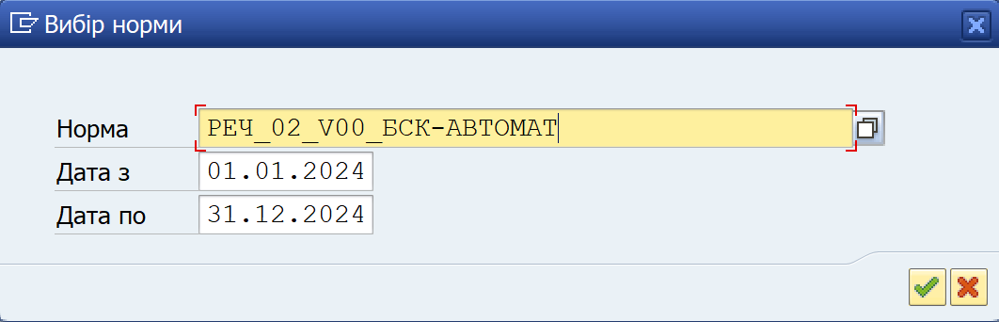{width="4.6096139545056865in" height="1.4846161417322834in"}

5.3. У стовпці "Значення", вкажіть спискову чисельність особового складу, яка забезпечується згідно обраної норми.

Наприклад: "1000"

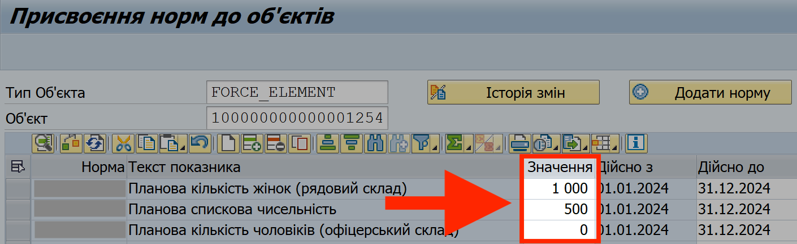{width="6.268055555555556in" height="1.9291666666666667in"}

> Якщо потрібно для конкретної норми, вкажіть кількість о/складу для кожної групи в/службовців в межах цієї норми.
>
> Наприклад, для норми "РЕЧ_04 СВ" (що відповідає нормі №04 (Повсякденний одяг) наказу №232), окремо вкажіть кількість о/складу для таких 8 груп в/службовців в межах цієї норми:
>
> 1\. Планова кількість чоловіків (рядовий склад)
>
> 2\. Планова кількість чоловіків (офіцерський склад)
>
> 3\. Планова кількість чоловіків (сержантський склад)
>
> 4\. Планова кількість чоловіків (старший офіцерський склад)
>
> 5\. Планова кількість жінок (рядовий склад)
>
> 6\. Планова кількість жінок (офіцерський склад)
>
> 7\. Планова кількість жінок (сержантський склад)
>
> 8\. Планова кількість жінок (старший офіцерський склад)
>
> 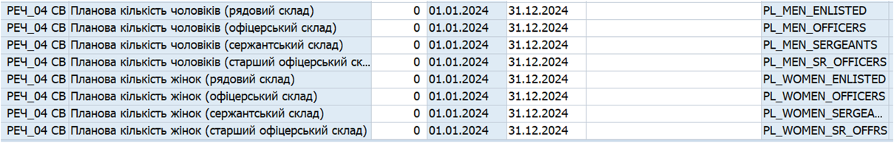{width="5.414209317585302in" height="0.8697769028871392in"}
>
> **!!** При заповненні нових параметрів на кшталт "Планова кількість чоловіків (офіцерський склад)" та інших, вказуйте спискову (фактичну) чисельність.

5.4. У стовпці "Обґрунтування останніх змін" вкажіть причини, через які були змінені норми або чисельність о/складу для обраних норм.

НАПРИКЛАД:\
\
Зміна о/складу згідно Розпорядження ХХ-ХХХ.

Обґрунтування змін має бути написано таким чином, щоб органи перевірки, які можуть проводити інспекції або аудит речової служби, у такому обґрунтуванні отримали вичерпну відповідь на питання "На підставі чого були проведені зміни у плані потреб?".

Бажано у обґрунтуванні згадати документ, на підставі якого речова служба змінює норми забезпечення або кількість о/складу (наказ по в/частині, розпорядження командування, тощо).

Коли ви вказуєте норму та о/склад для цієї норми в перший раз, достатньо зазначити, що це початкове введення норм та кількості о/складу.

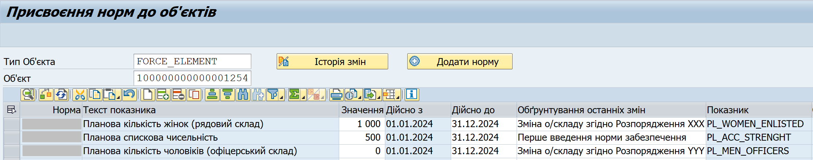{width="6.268055555555556in" height="1.2353729221347332in"}

5.5. Натисніть кнопку {width="0.18055555555555555in" height="0.18055555555555555in"} на верхній панелі інструментів, щоб зберегти налаштування у системі.

Як підтвердження, у нижньому лівому куті вікна з'явиться зелена відмітка 🟢 та повідомлення про те, що налаштування збережено у системі.

**6. Повторіть крок 5 для кожної норми, згідно якої забезпечується о/склад вашої в/частини.**

Кількість планових показників (рядків з нормами та відповідними показниками) у системі ЛІС не обмежено.

7\. Вийдіть з операції "Ведення планових показників", натиснувши кнопку на верхній панелі інструментів.

### Історія змін функціоналу ведення планових показників в системі

До грудня 2024, планові показники (норми забезпечення та відповідна спискова чисельність о/складу) вводились вручну.

> Для цього користувачі виконували такі операції:
>
> 1\. Додавали рядок для планового показника (за допомогою кнопки "Додати рядок" або "Вставити рядок")
>
> 2\. Заповнювали необхідні поля вручну або за допомогою вікна вибору значення, доступного для окремих полів (наприклад, для поля "Показник").

Детальні кроки приведені у розділі нижче: ["Ведення планових показників та тренувальному середовищі для навчання"](#_Ведення_планових_показників_1).

Починаючи з грудня 2024, додавання планових показників відбувається в частково автоматизованому режимі, за допомогою кнопки "Додати норму" (як описано у цьому Посібнику). Ручне введення більше не потрібно.

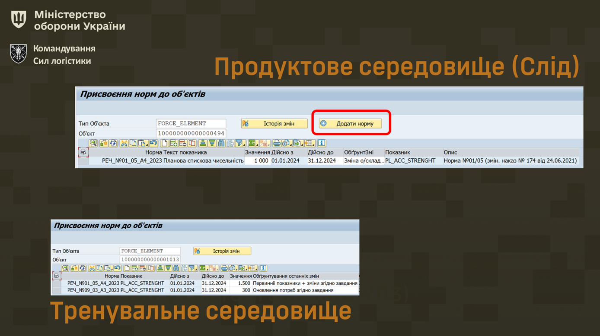{width="6.299212598425197in" height="3.5354330708661417in"}

> Це особливо стосується так званих "гнучких" норм, для яких потрібно окремо вказувати чисельність о/складу для декількох груп в/службовців в межах одної норми (наприклад, Норми №4 Наказу №232).

**!!** Планові показники, які були введені до системи ЛІС до грудня 2024 року (вручну, без застосування кнопки "Додати норму"), НЕ ПОТРІБНО вводити наново – система продовжує працювати з такими плановими показниками цілком коректно.[]{#_Ведення_планових_показників_1 .anchor}

