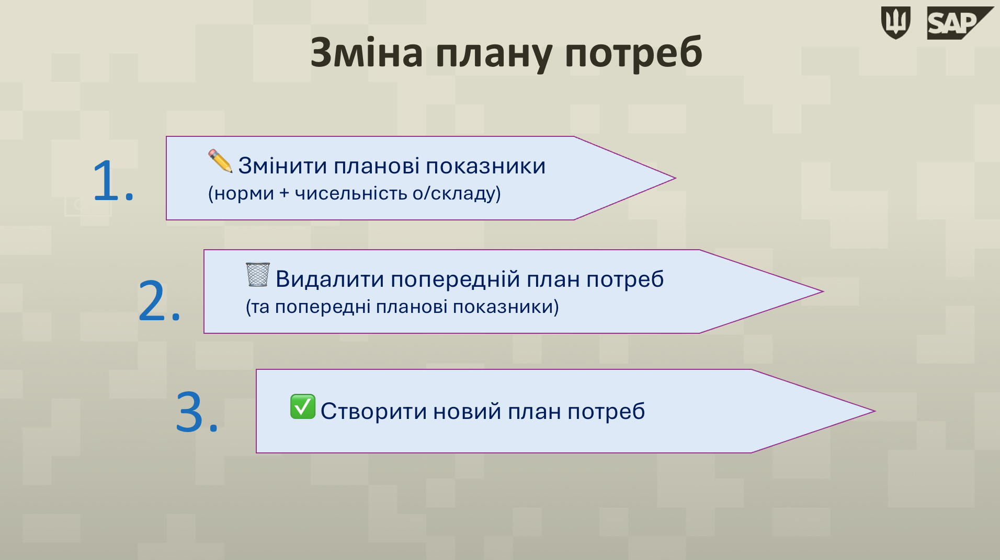
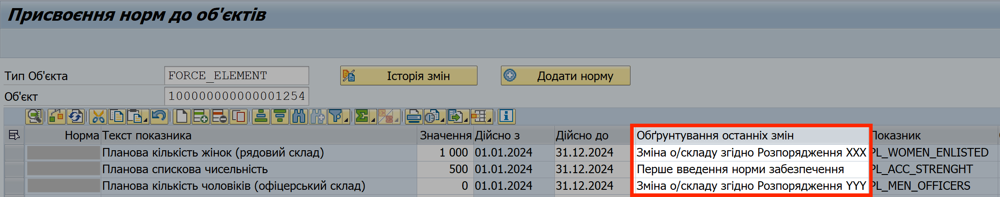
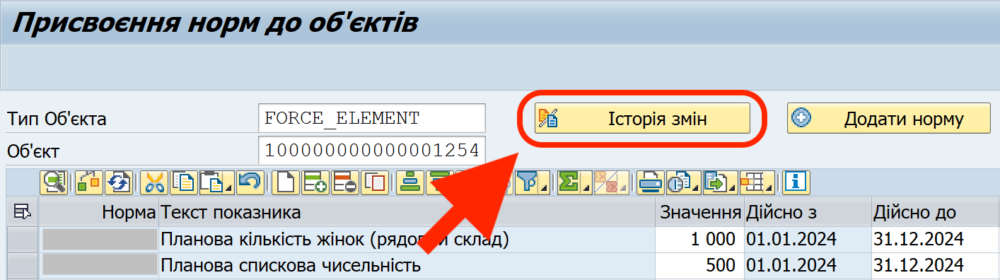
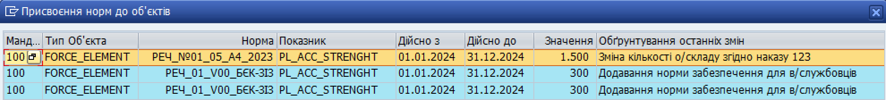
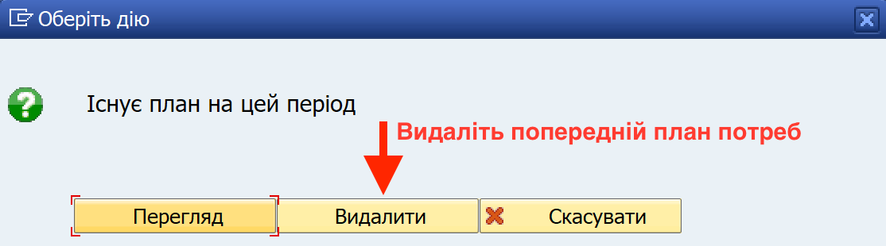

## Зміна плану потреб

### Огляд процесу зміни плану потреб

У вашій в/частини може зміниться кількість особового складу, яка забезпечується згідно певної норми, або можуть змінитися самі норми.

**Як часто можна (або треба) змінювати план потреб?** План потреб необхідно змінити, коли має місце СУТТЄВЕ збільшення кількості особового складу (наприклад, коли до складу в/частини приєднується підрозділ згідно офіційного розпорядження). Також, план потрібно змінити, щоб додати або прибрати норму забезпечення.

Досвід користувачів свідчить про те, що оптимально оновлювати чисельність о/складу принаймні раз на місяць; за потреби, це можна робити частіше.

### Кроки зміну плану потреб

Зміна плану потреб складається з таких етапів:

\- Оновлення або введення нових планових показників (норми та/або чисельність о/складу)

\- Видалення старого плану потреб

\- Створення нового плану потреб

{width="6.299212598425197in" height="3.531496062992126in"}

Щоб змінити план потреб, виконайте наступні кроки:

**Етап 1. Змініть налаштування плану потреб,** вказавши нову кількість о/складу чи додавши нові норми, за допомогою операції "Ведення планових показників".

Потрібні кроки детально описані у розділі ["Ведення планових показників (вибір норм та чисельності особового складу)"](%D0%92%D0%B5%D0%B4%D0%B5%D0%BD%D0%BD%D1%8F-%D0%BF%D0%BB%D0%B0%D0%BD%D0%BE%D0%B2%D0%B8%D1%85-%D0%BF%D0%BE%D0%BA%D0%B0%D0%B7%D0%BD%D0%B8%D0%BA%D1%96%D0%B2-%D0%B2%D0%B8%D0%B1%D1%96%D1%80-%D0%BD%D0%BE%D1%80%D0%BC-%D1%82%D0%B0-%D1%87%D0%B8%D1%81%D0%B5%D0%BB%D1%8C%D0%BD%D0%BE%D1%81%D1%82%D1%96-%D0%BE%D1%81%D0%BE%D0%B1%D0%BE%D0%B2%D0%BE%D0%B3%D0%BE-%D1%81%D0%BA%D0%BB%D0%B0%D0%B4%D1%83.md#ведення-планових-показників-вибір-норм-та-чисельності-особового-складу).

1.1. Якщо змінилася **чисельність о/складу**, введіть нову кількість у поле "Значення" – у рядку, де кількість о/складу вказана з відповідною нормою.

{width="6.268055555555556in" height="1.9291666666666667in"}

> **!!** В межах одного звітного року, повинен бути лише один рядок "норма – кількість о/складу". Якщо у нормі декілька груп осіб, і для кожної створюється окремий рядок (наприклад, норма №4 наказу 232), то такий рядок також повинен бути тільки один.\
> \
> Це дійсно навіть у випадках, якщо кількість о/складу змінюється не з початку року, а у будь-який інший момент року (наприклад, у середині року).

1.2. Якщо потрібно додати **норму забезпечення**, використовуйте кнопку "Додати норму".

Потрібні кроки детально описані у розділі ["Ведення планових показників (вибір норм та чисельності особового складу)"](%D0%92%D0%B5%D0%B4%D0%B5%D0%BD%D0%BD%D1%8F-%D0%BF%D0%BB%D0%B0%D0%BD%D0%BE%D0%B2%D0%B8%D1%85-%D0%BF%D0%BE%D0%BA%D0%B0%D0%B7%D0%BD%D0%B8%D0%BA%D1%96%D0%B2-%D0%B2%D0%B8%D0%B1%D1%96%D1%80-%D0%BD%D0%BE%D1%80%D0%BC-%D1%82%D0%B0-%D1%87%D0%B8%D1%81%D0%B5%D0%BB%D1%8C%D0%BD%D0%BE%D1%81%D1%82%D1%96-%D0%BE%D1%81%D0%BE%D0%B1%D0%BE%D0%B2%D0%BE%D0%B3%D0%BE-%D1%81%D0%BA%D0%BB%D0%B0%D0%B4%D1%83.md#ведення-планових-показників-вибір-норм-та-чисельності-особового-складу).

{width="6.268055555555556in" height="1.2347222222222223in"}

1.3. Після змін у нормах чи кількості о/складу, обов'язково вкажіть причини для таких змін у полі (полях) "Обґрунтування останніх змін".

Обґрунтування змін має бути написано таким чином, щоб органи перевірки, які можуть проводити інспекції або аудит речової служби, у такому обґрунтуванні отримали вичерпну відповідь на питання "На підставі чого були проведені зміни у плані потреб?".

Бажано у обґрунтуванні згадати документ, на підставі якого речова служба змінює норми забезпечення або кількість о/складу (наказ по в/частині, розпорядження командування, тощо).

{width="6.268055555555556in" height="1.2354166666666666in"}

Щоб переглянути історію змін планів забезпечення та чисельності о/складу, натисніть кнопку "Історія змін".

{width="4.434782370953631in" height="1.2420931758530185in"}

У вікні, що відкриється, кожна зміна відображена у вигляді відповідного рядку.

{width="6.299212598425197in" height="0.7125984251968503in"}

**Етап 2. Видаліть поточний план потреб** (той, якій повинен змінитися з новими плановими показниками).

2.1. У вікні "Робоче місце користувача", натисніть кнопку-кокпіт "Спрощений облік: потреби \[CP0116\]".

{width="6.268055555555556in" height="1.3319444444444444in"}

2.2. Оберіть рядок "Створення потреб (спрощений)", натиснувши його один раз лівою кнопкою миші.

2.3. Натисніть кнопку {width="0.2222222222222222in" height="0.20833333333333334in"} "Виконати" (або ліворуч від рядку, або у панелі задач під назвою вікна "Відобразити область меню...").

{width="2.8646391076115485in" height="1.6296292650918636in"}

2.4. На сторінці "Створити план потреб", заповніть поля:

\- **Завод:** номер вашої військової частини

\- **Група норм:** "CLOTHING" (система заповнює це поле автоматично)

\- **Фінансовий рік:** рік, на який був створений план потреб, який потрібно видалити

Після заповнення, натисніть кнопку {width="0.2222222222222222in" height="0.20833333333333334in"} "Виконати".

{width="2.622153324584427in" height="1.4166666666666667in"}

2.5. У діалоговому вікні "Існує план на цей період", натисніть "Видалити".

{width="4.182608267716535in" height="1.1640496500437445in"}

Етап 2 завершено: попередній план потреб видалено.

**Етап 3. Створіть новий план потреб**.

Одразу після видалення старого плану, відкриється вікно "Перегляд знайдених присвоєнь об'єктів". У вікні, система відобразить НОВІ планові показники, які ви ввели у Етапі 1.

Щоб створити новий план потреб, натисніть кнопку "Генерувати план".

Перед створенням нового плану потреб перевірте, чи система коректно відображає нові планові показники.

{width="3.9544553805774276in" height="2.1130435258092737in"}

> Детальні кроки створення плану потреб описані у розділі ["Створення плану потреб"](%D0%A1%D1%82%D0%B2%D0%BE%D1%80%D0%B5%D0%BD%D0%BD%D1%8F-%D0%BF%D0%BB%D0%B0%D0%BD%D1%83-%D0%BF%D0%BE%D1%82%D1%80%D0%B5%D0%B1.md#створення-плану-потреб).

Після цього кроку, система працюватиме з оновленим планом потреб. Щоб перевірити, чи новий план потреб вірно відображає дані по вашій в/частині, ви можете переглянути новий план (див. розділ ["Перегляд створеного плану"](#_Редагування_плану_потреб)).

