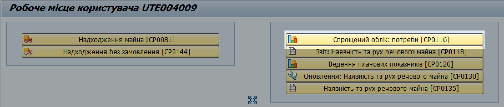
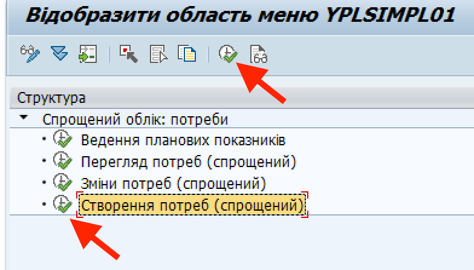
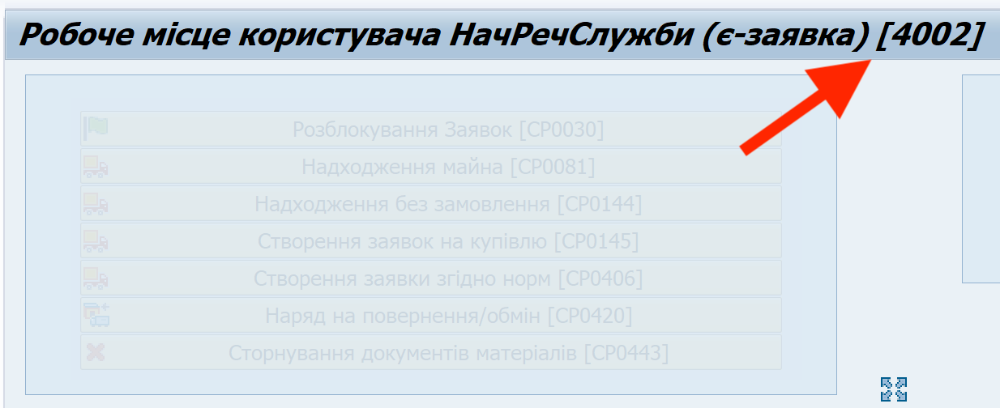
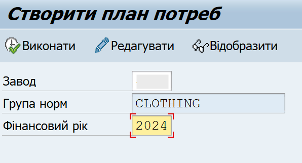
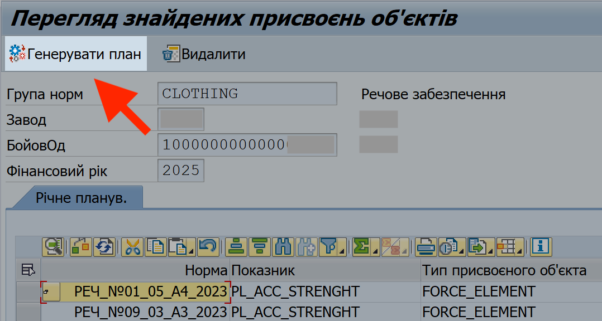
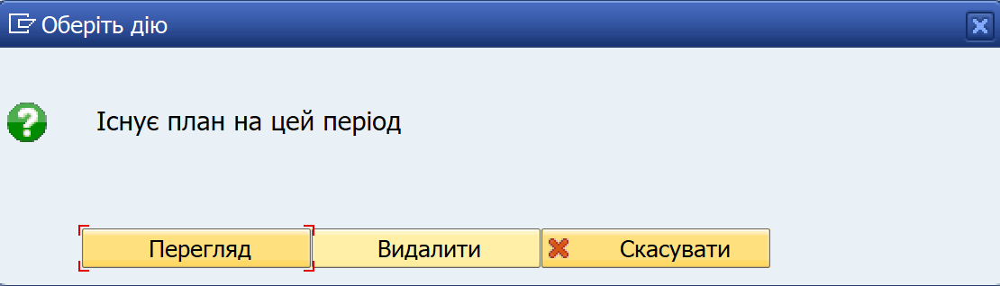
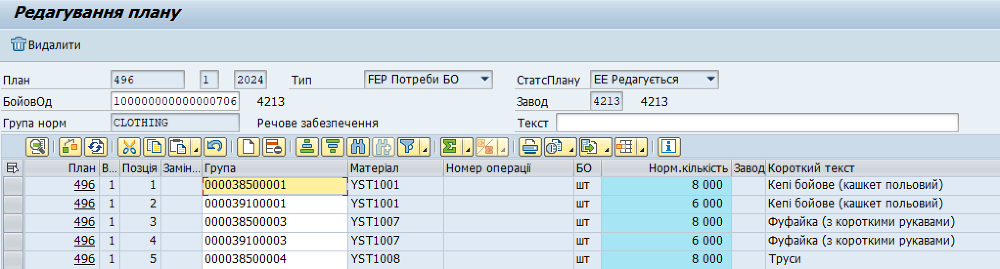
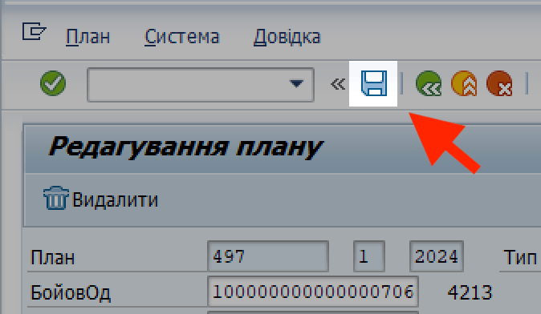

## Створення плану потреб

{width="0.28692257217847766in" height="0.28692257217847766in"} Інформація, викладена у цьому розділі, також доступна у відео на навчальному порталі adl.mil.gov.ua: ["Створення плану потреб"](https://adl.mil.gov.ua/mod/resource/view.php?id=285594).

На основі плану потреб та кількості особового складу, система визначає потребу в/частини у майні згідно норм забезпечення. Дані про потребу відображаються у еЗвіті в системі у стовпчику "Потреба згідно з нормами забезпечення (22)".

Щоб створити план потреб, виконайте наступні кроки.

1\. Увійдіть у систему (SAP).

Див. розділ ["Вхід до системи"](../%D0%9F%D0%BE%D1%87%D0%B0%D1%82%D0%BE%D0%BA-%D1%80%D0%BE%D0%B1%D0%BE%D1%82%D0%B8-%D1%83-%D1%81%D0%B8%D1%81%D1%82%D0%B5%D0%BC%D1%96.md#вхід-до-системи-загальні-кроки).

2\. Відкрийте вікно "Робоче місце користувача.

Див. розділ ["Початкове вікно роботи з системою"](../%D0%9F%D0%BE%D1%87%D0%B0%D1%82%D0%BE%D0%BA-%D1%80%D0%BE%D0%B1%D0%BE%D1%82%D0%B8-%D1%83-%D1%81%D0%B8%D1%81%D1%82%D0%B5%D0%BC%D1%96.md#початкове-вікно-роботи-з-системою).

**3. Запустіть операцію "Створення потреб".**

3.1. У вікні "Робоче місце користувача", натисніть кнопку-кокпіт "Спрощений облік: потреби \[CP0116\].

{width="6.268055555555556in" height="1.3323436132983377in"}

3.2. Оберіть рядок "Створення потреб (спрощений)", натиснувши його один раз лівою кнопкою миші.

3.3. Натисніть кнопку {width="0.2222222222222222in" height="0.20833333333333334in"} "Виконати" (або ліворуч від рядку, або у панелі задач під назвою вікна "Відобразити область меню YPLSIMPL01").

{width="2.8646391076115485in" height="1.6296292650918636in"}

4\. На сторінці "Створити план потреб", заповніть поля:

**- Завод:** код заводу вашої військової частини у системі.

> Цей номер, дійсний для вашого облікового запису, завжди зазначений на верхній панелі вікні "Робоче місце користувача".
>
> {width="3.0277777777777777in" height="1.2366262029746282in"}
>
> Після введення коду, система автоматично замінить введений номер на код маскування. Це очікувана поведінка системи; див. розділ ["Введення номеру заводу"](../%D0%92%D0%B2%D0%B5%D0%B4%D0%B5%D0%BD%D0%BD%D1%8F%20%D0%BD%D0%BE%D0%BC%D0%B5%D1%80%D1%83%20%D0%B7%D0%B0%D0%B2%D0%BE%D0%B4%D1%83.md#введення-номеру-заводу-з-кодом-маскування).

**- Група норм:** "CLOTHING" (система заповнює це поле автоматично)

**- Фінансовий рік:** рік, на який ви створюєте план потреб

Після заповнення, натисніть кнопку {width="0.2222222222222222in" height="0.20833333333333334in"} "Виконати".

{width="2.622153324584427in" height="1.4166666666666667in"}

5\. У вікні "Перегляд знайдених присвоєнь об'єктів" з'являться рядки з плановими показниками (нормами та кількістю особового складу). Перевірте, чи система завантажила саме ті рядки з нормами та особовим складом, які наразі є актуальними.

Значення у рядках з нормами та чисельністю о/складу були внесені у попередньому кроці: ["Ведення планових показників (вибір норм та чисельності особового складу)"](%D0%92%D0%B5%D0%B4%D0%B5%D0%BD%D0%BD%D1%8F-%D0%BF%D0%BB%D0%B0%D0%BD%D0%BE%D0%B2%D0%B8%D1%85-%D0%BF%D0%BE%D0%BA%D0%B0%D0%B7%D0%BD%D0%B8%D0%BA%D1%96%D0%B2-%D0%B2%D0%B8%D0%B1%D1%96%D1%80-%D0%BD%D0%BE%D1%80%D0%BC-%D1%82%D0%B0-%D1%87%D0%B8%D1%81%D0%B5%D0%BB%D1%8C%D0%BD%D0%BE%D1%81%D1%82%D1%96-%D0%BE%D1%81%D0%BE%D0%B1%D0%BE%D0%B2%D0%BE%D0%B3%D0%BE-%D1%81%D0%BA%D0%BB%D0%B0%D0%B4%D1%83.md#ведення-планових-показників-вибір-норм-та-чисельності-особового-складу).

Якщо рядки з'явились та інформація в них вірна, натисніть кнопку "Генерувати план".

{width="4.263649387576553in" height="2.278260061242345in"}

> Якщо замість вікна "Перегляд знайдених присвоєнь об'єктів" з'явиться повідомлення "Існує план на цей період", це означає, що ви не видалили попередньо створений та збережений план потреб.
>
> {width="3.6695647419072617in" height="1.051350612423447in"}
>
> Щоб видалити попередній план, натисніть "Видалити". Після цього, створіть новий план, на основі поточних планових показників (повторіть кроки 1-5).
>
> Якщо будь-яка інформація в рядках НЕВІРНА (наприклад, кількість особового складу чи дати дійсності норм), змініть налаштування плану потреб.

Див. розділ ["Ведення планових показників (вибір норм та чисельності особового складу)"](%D0%92%D0%B5%D0%B4%D0%B5%D0%BD%D0%BD%D1%8F-%D0%BF%D0%BB%D0%B0%D0%BD%D0%BE%D0%B2%D0%B8%D1%85-%D0%BF%D0%BE%D0%BA%D0%B0%D0%B7%D0%BD%D0%B8%D0%BA%D1%96%D0%B2-%D0%B2%D0%B8%D0%B1%D1%96%D1%80-%D0%BD%D0%BE%D1%80%D0%BC-%D1%82%D0%B0-%D1%87%D0%B8%D1%81%D0%B5%D0%BB%D1%8C%D0%BD%D0%BE%D1%81%D1%82%D1%96-%D0%BE%D1%81%D0%BE%D0%B1%D0%BE%D0%B2%D0%BE%D0%B3%D0%BE-%D1%81%D0%BA%D0%BB%D0%B0%D0%B4%D1%83.md#ведення-планових-показників-вибір-норм-та-чисельності-особового-складу).

6\. У вікні "Редагування плану" з'явиться план забезпечення особового складу згідно норм.

> Занотуйте номер плану потреб: цей номер вказано у колонці "План" та відображено у правому нижньому куті вікна. Номер плану знадобиться для подальшої роботи.

{width="6.299212598425197in" height="1.6968503937007875in"}

7\. Натисніть кнопку {width="0.18055555555555555in" height="0.18055555555555555in"} "Зберегти" на верхній панелі інструментів.

{width="2.3243569553805776in" height="1.3518514873140857in"}

{width="0.2in" height="0.2in"} Операція виконана успішно: план потреб для вашого заводу в системі створено.

**Після успішної генерації плану**, дані з плану будуть відображати потреби в/частини у майні в системі. Ці дані можна побачити у еЗвіті, у графі "Потреба".

Повна назва графи: "Потреба згідно з нормами забезпечення (22)"[]{#_Редагування_плану_потреб .anchor}.

