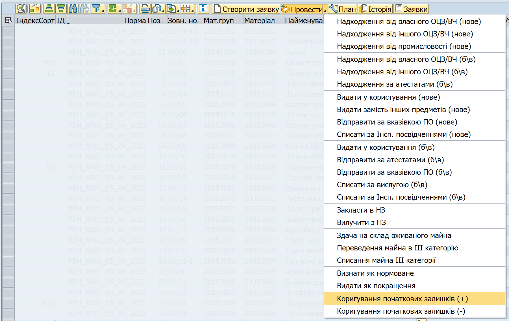
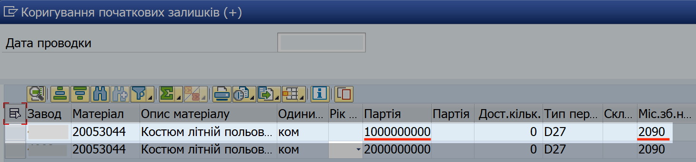
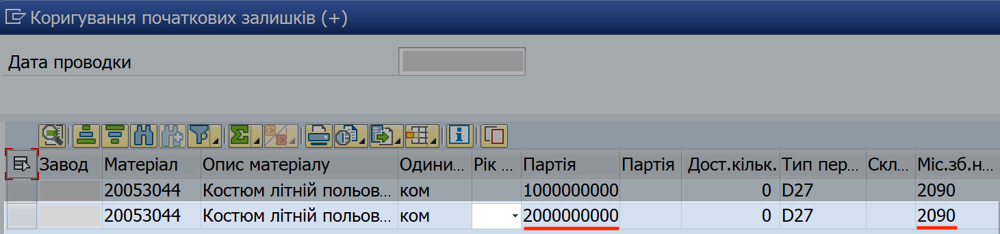
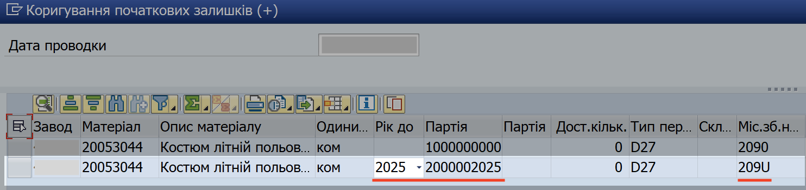
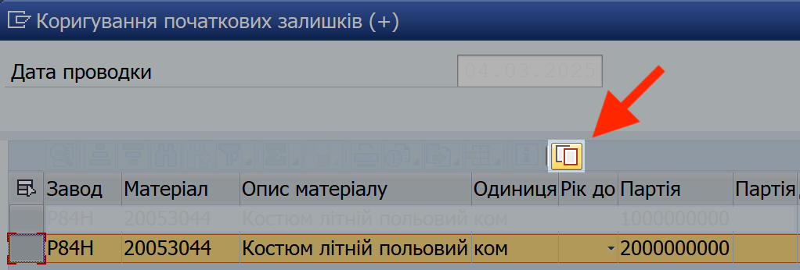
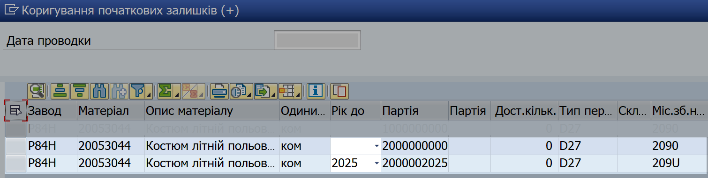
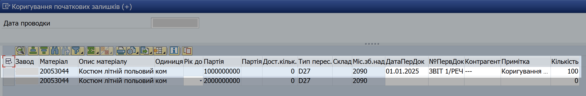

## Коригування початкових залишків

### Огляд операції коригування

Функція "Коригування початкових залишків", доступна у еЗвіті, дозволяє вирішувати наступні задачі:

1\. Вводити початкові залишки майна.

2\. Коригувати (зменшити або збільшити) кількість майна, яке ви попередньо провели як початкові залишки майна.

{width="0.20018153980752407in" height="0.20018153980752407in"} Використовуючи операцію "Коригування початкових залишків", ви можете збільшувати та зменшувати залишки майна:

\- I та II категорії на складському зберіганні (віртуальний склад 2090)

\- II категорії у використанні (віртуальний склад 209U).

### Особливості операції коригування

1\. При проведенні операції потрібно вказувати РІЗНИЦЮ одиниць майна, на яку збільшуються або зменшуються початкові залишки. Подробиці дивіться нижче, у кроці 3.2 щодо проведення операції коригування.

2\. В якості дати проводки, вказуйте поточну дату.

НЕ вказуйте дату проводки, яка знаходиться поза межами поточного та попереднього місяців.

3\. Після того, як ви завершили операцію коригування, **обов'язково** проведіть операцію "Оновлення: Наявність та рух речового майна \[CP0130\]". Без оперативного оновлення даних, еЗвіт може не відображати актуальні, коректні дані. Після оновлення, сформуйте еЗвіт наново, щоб побачити коректні дані.

### Кроки проведення операції коригування початкових залишків

Щоб ввести початкові залишки або відкоригувати введені залишки, виконайте наступні кроки.

**1. Увійдіть у систему ЛІС (SAP) та сформуйте еЗвіт.**

Див. детальні кроки у розділах ["Початок роботи в системі"](../%D0%9F%D0%BE%D1%87%D0%B0%D1%82%D0%BE%D0%BA-%D1%80%D0%BE%D0%B1%D0%BE%D1%82%D0%B8-%D1%83-%D1%81%D0%B8%D1%81%D1%82%D0%B5%D0%BC%D1%96.md#початок-роботи-у-системі) та ["Формування еЗвіту у системі ЛІС (SAP)"](../%D0%B5%D0%97%D0%B2%D1%96%D1%82-%D1%83-%D1%81%D0%B8%D1%81%D1%82%D0%B5%D0%BC%D1%96-%D0%9B%D0%86%D0%A1-SAP/%D0%A4%D0%BE%D1%80%D0%BC%D1%83%D0%B2%D0%B0%D0%BD%D0%BD%D1%8F-%D0%B5%D0%97%D0%B2%D1%96%D1%82%D1%83-%D1%83-%D1%81%D0%B8%D1%81%D1%82%D0%B5%D0%BC%D1%96%D0%9B%D0%86%D0%A1-%D0%BA%D1%80%D0%BE%D0%BA%D0%B8.md#формування-езвіту-у-системі-ліс-кроки).

**2. Запустіть операцію корегування.**

2.1. У вікні еЗвіту, виділіть рядок (або декілька рядків) з майном, з яким потрібно провести операцію.

Щоб виділити рядок, натисніть лівою кнопкою миші на сірий квадрат з лівого боку потрібного рядку. Обраний рядок змінить колір на жовтий.

{width="6.425336832895888in" height="1.0260870516185476in"}

Щоб виділити декілька рядків, розташованих поруч, протягніть натиснутий курсор мишки вниз чи вверх, щоб захопити потрібні рядки.

Щоб виділити декілька рядків, не розташованих поруч, після виділення одного рядку, натисніть клавішу "Ctrl" (Control) та, утримуючи її натиснутою, виділіть інші рядки, один за одним.

{width="6.425in" height="1.2201301399825022in"}

2.2. Натисніть стрілку на правому боці кнопки {width="1.0833333333333333in" height="0.2222222222222222in"} та оберіть "Коригування початкових залишків" зі знаком "+" або "-" (в залежності від потреби).

Або, у рядку з потрібним матеріалом у еЗвіті, у колонці "ІД" натисніть піктограму {width="0.19641951006124234in" height="0.20869531933508312in"} та оберіть "Коригування початкових залишків" зі знаком "+" або "-" (в залежності від потреби).

{width="6.268055555555556in" height="3.951388888888889in"}

**3. Вкажіть дату проводки операції.**

В полі "Дата проводки", вкажіть ПОТОЧНУ ДАТУ на момент коригування.

ПРИКЛАД 1:

ЯКЩО ви вперше вводите початкові залишки станом на 01.01.2025,\
ТА поточна дата – 10.03.2025,

ТО вкажіть дату проводки як 10.03.2025.

ПРИКЛАД 2:

ЯКЩО ви коригуєте початкові залишки станом на 01.01.2025,\
ТА поточна дата – 05.05.2025,

ТО вкажіть дату проводки як 05.05.2025.

**4. Оберіть залишки майна, які потрібно коригувати.**

У вікні операції "Коригування початкових залишків", дані потрібно вносити у рядок, якій містить відповідні залишки майна – I чи II категорії, на складах чи у використанні.

4.1. Для коригування залишків майна **I категорії на складах**, вводьте дані у рядок з такими значеннями у стовпцях:

  ----------------------------------------------
  **Стовпець**                    **Значення**
  ------------------------------- --------------
  Партія                          1000000000

  Місце зберігання надходження\   2090
  (Міс.зб.над)                    
  ----------------------------------------------

{width="6.268055555555556in" height="1.4680555555555554in"}

4.2. Для коригування залишків майна II категорії на складах, вводьте дані у рядок з такими значеннями у стовпцях:

  ----------------------------------------------------
  **Стовпець**                    **Значення**
  ------------------------------- --------------------
  Партія                          2000000000

  Рік до                          значення не обране

  Місце зберігання надходження\   209U
  (Міс.зб.над)                    
  ----------------------------------------------------

{width="6.268055555555556in" height="1.4680555555555554in"}

4.3. Для коригування залишків майна II категорії у використанні, вводьте дані у рядок з такими значеннями у стовпцях:

  ----------------------------------------------
  **Стовпець**                    **Значення**
  ------------------------------- --------------
  Партія                          2000000000

  Місце зберігання надходження\   209U
  (Міс.зб.над)                    
  ----------------------------------------------

У меню стовпця "Рік до", оберіть рік вислуги майна. Значення у рядку "Партія" зміниться відповідно на "200000ХХХХ" (де ХХХХ – рік вислуги майна, наприклад, 2025).

{width="6.268055555555556in" height="1.4784722222222222in"}

4.4. Якщо ви хочете провести у одній операції "Коригування..." майно II категорії **і на складах і у використанні**, виконайте такі кроки:

\- Виділіть рядок з майном II категорії та натисніть кнопку {width="0.2040080927384077in" height="0.17340660542432196in"}

{width="3.5737707786526682in" height="1.209961723534558in"}

\- У одному рядку, лишіть майно II категорії на складах (без року вислуги), а у рядку під ним (який було скопійовано), оберіть рік вислуги майна – щоб вказати інформацію для майна II категорії у використанні.

{width="4.459015748031496in" height="1.1219542869641295in"}

\*\*\*

{width="0.20869531933508312in" height="0.20869531933508312in"} Для більш детальної інформації про партії майна та віртуальні склади, див. розділ ["Базові поняття системи ЛІС (SAP) щодо руху та зберігання майна"](#_Базові_поняття_системи).

**5. Вкажіть дані проводки для обраних залишків.**

У рядках з потрібними залишками, вкажіть дані проводки у чарунках білого кольору:

+------------------------------+------------------------------------------------------------------------------------------------------------------------------------------------------------------------------------------------------------------------------------------------+
| **СТОВПЕЦЬ**                 | **ЩО ВКАЗАТИ**                                                                                                                                                                                                                                 |
+==============================+================================================================================================================================================================================================================================================+
| Кількість                    | Вкажіть РІЗНИЦЮ, яку потрібно додати або відняти від початкових залишків, які були введені попередньо.                                                                                                                                         |
|                              |                                                                                                                                                                                                                                                |
|                              | Наприклад:\                                                                                                                                                                                                                                    |
|                              | ЯКЩО ви колись ввели початкові залишки у 100 одиниць майна,\                                                                                                                                                                                   |
|                              | А реальні залишки складають 90 одиниць,\                                                                                                                                                                                                       |
|                              | ТО вкажіть кількість у 10 одиниць майна.                                                                                                                                                                                                       |
|                              |                                                                                                                                                                                                                                                |
|                              | {width="0.19130358705161854in" height="0.19130358705161854in"} Не вказуйте відкориговану кількість початкових залишків (тобто, кількість, яка повинна бути ПІСЛЯ проведення коригування). |
+------------------------------+------------------------------------------------------------------------------------------------------------------------------------------------------------------------------------------------------------------------------------------------+
| ДатаПерДок                   | Вкажіть 01.01.20ХХ, де 20XX – звітний рік.                                                                                                                                                                                                   |
|                              |                                                                                                                                                                                                                                                |
| (Дата первинного документа)  | Наприклад: 01.01.2025.                                                                                                                                                                                                                         |
|                              |                                                                                                                                                                                                                                                |
|                              | Оскільки для операції коригування початкових залишків немає офіційного облікового документа, дата 01.01 вказується уточнення, що були проведені залишки майна станом на початок звітного року.                                                 |
+------------------------------+------------------------------------------------------------------------------------------------------------------------------------------------------------------------------------------------------------------------------------------------+
| №ПервДок                     | Вкажіть Звіт 1/реч.                                                                                                                                                                                                                            |
|                              |                                                                                                                                                                                                                                                |
| (Номер первинного документа) |                                                                                                                                                                                                                                                |
+------------------------------+------------------------------------------------------------------------------------------------------------------------------------------------------------------------------------------------------------------------------------------------+
| Контрагент                   | Поставте один чи декілька дефісів або тире (-), що позначатиме "прочерк".                                                                                                                                                                    |
+------------------------------+------------------------------------------------------------------------------------------------------------------------------------------------------------------------------------------------------------------------------------------------+
| Примітка                     | Вкажіть Коригування початкових залишків згідно звіту 1/реч.                                                                                                                                                                                    |
+------------------------------+------------------------------------------------------------------------------------------------------------------------------------------------------------------------------------------------------------------------------------------------+

{width="6.268055555555556in" height="1.0402777777777779in"}

**6. Проведіть операцію у системі.**

Після введення даних, натисніть піктограму {width="0.15625in" height="0.1736111111111111in"} в правому нижньому куті вікна операції.

Якщо операція була проведена у системі успішно, у нижньому лівому куті еЗвіту з'явиться зелена відмітка та номер, присвоєний проведеній операції.

**7. Проведіть оперативне оновлення даних у системі.**

Після того, як операція коригування була успішно проведена, виконайте операцію "Оновлення: Наявність та рух речового майна \[CP0130\]".

{width="6.299212598425197in" height="2.6377952755905514in"}

Див. розділ ["Оперативне оновлення даних з наявності та руху майна"](#коригування-початкових-залишків).

Після оновлення, сформуйте еЗвіт наново, щоб відобразити оновлені дані.

\*\*\*

**Результат коригування:** кількість попередньо введених початкових залишків, відображених у еЗвіті, зменшиться або збільшиться.

Щоб перевірити результати, подивіться кількість відповідного майна, вказаного у таких стовпцях еЗвіту:

\- Наявність нового на початок звітного періоду \[4\]

\- Наявність уживаного на початок звітного періоду \[5\]

