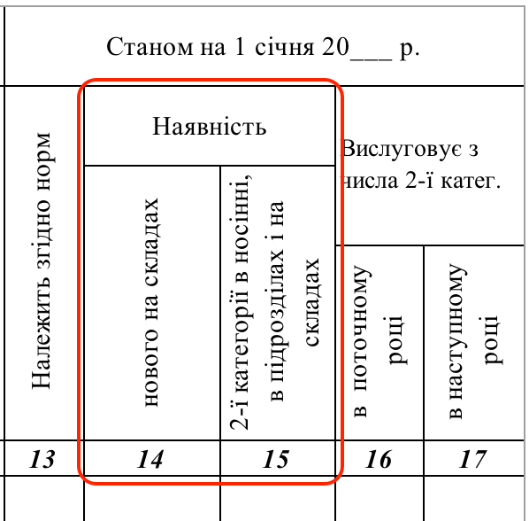

## Яке майно вводиться як початкові залишки у ЛІС? 

В якості початкових залишків, до еЗвіту системи ЛІС вводиться майно, яке:

\- знаходилось у розпорядженні в/частини станом на початок звітного року (01.01), ТА

\- є частиною норм забезпечення, доступних у системі ЛІС, та введених до плану потреб цієї в/частини

НАПРИКЛАД:\
До системи ЛІС вводиться нормоване майно, зазначене у таких двох графах шаблону паперового звіту 1/РЕЧ:\
\
- 14 ("Наявність нового на складах")

\- 15 ("Наявність 2-ї категорії в носінні, в підрозділах і на складах").

> {width="2.144775809273841in" height="2.1089107611548554in"}

