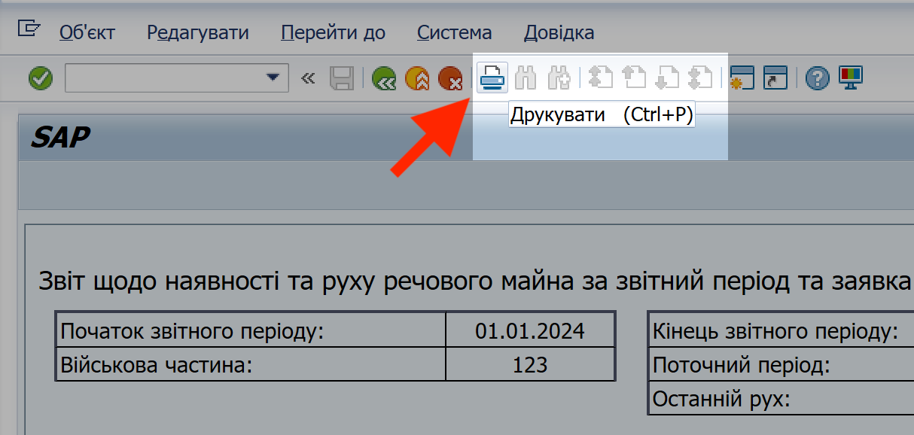

# ДОДАТОК 2. Складання звіту 1/РЕЧ у 2024: інструкція та рекомендації на рівні системи ЛІС

## Про цей розділ 

У цій інструкції описані кроки та рекомендації, які начальникам речових служб необхідно виконати для подання звіту щодо наявності та руху речового майна військової частини (звіт 1/реч) за 2024 рік до постачального органу (ОЦЗ), з урахуванням обліку майна у ІКС УЛЗ.

## Крок 1. Введення даних з руху майна за 2024 у системі ЛІС (SAP)

Для надання повної інформації щодо наявності та руху майна, фахівці речових служб повинні в/частин повинні виконати наступні кроки:

**1. Внести початкові залишки станом на 01.01.2024 року.**

Станом на грудень 2024 – січень 2025 року, для в/частин, які почали працювати у системі ЛІС протягом 2024, для роботи з початковими залишками доступна тільки операція "Коригування початкових залишків", (+) та (-).

Для детальних кроків, див. ["Коригування введених початкових залишків"](%D0%9F%D0%BE%D1%87%D0%B0%D1%82%D0%BA%D0%BE%D0%B2%D1%96-%D0%B7%D0%B0%D0%BB%D0%B8%D1%88%D0%BA%D0%B8/%D0%9A%D0%BE%D1%80%D0%B8%D0%B3%D1%83%D0%B2%D0%B0%D0%BD%D0%BD%D1%8F-%D0%BF%D0%BE%D1%87%D0%B0%D1%82%D0%BA%D0%BE%D0%B2%D0%B8%D1%85-%D0%B7%D0%B0%D0%BB%D0%B8%D1%88%D0%BA%D1%96%D0%B2.md#коригування-початкових-залишків).

**2. Відобразити весь рух майна за 2024 рік (надходження, видачі та списання) за допомогою відповідних операцій у еЗвіті.**

Відповідно до принципів роботи системи ЛІС:

\- Якщо операція з коригування чи руху майна проведена **у грудні 2024 року**, то параметр "Дата проводки" може бути датою **в межах листопада та грудня 2024 року**.

\- Якщо операція з коригування чи руху майна проведена **у січні 2025 року**, то параметр "Дата проводки" може бути датою **виключно в межах грудня 2024 року**.

Звітності у еЗвіті підлягає наступне:

\- Майно, вказане у Розділі 1 звіту 1/РЕЧ

\- Майно матеріально-військової допомоги (МВД)

Для детальної інформації про майно, доступне для обліку у системі ЛІС, див. документ "Довідник норм" у модулі SAP Business Workplace (Спільні папки).

Див. розділ ["Довідник норм забезпечення у "Спільних папках" системи ЛІС "](%D0%9F%D0%BB%D0%B0%D0%BD-%D0%BF%D0%BE%D1%82%D1%80%D0%B5%D0%B1-%D0%B7%D0%B3%D1%96%D0%B4%D0%BD%D0%BE-%D0%BD%D0%BE%D1%80%D0%BC-%D0%B7%D0%B0%D0%B1%D0%B5%D0%B7%D0%BF%D0%B5%D1%87%D0%B5%D0%BD%D0%BD%D1%8F/%D0%9D%D0%BE%D1%80%D0%BC%D0%B8-%D0%B7%D0%B0%D0%B1%D0%B5%D0%B7%D0%BF%D0%B5%D1%87%D0%B5%D0%BD%D0%BD%D1%8F-%D1%83-%D1%81%D0%B8%D1%81%D1%82%D0%B5%D0%BC%D1%96-%D0%9B%D0%86%D0%A1-SAP.md#довідник-норм-забезпечення-у-спільних-папках-системи-ліс).

## Крок 2. Звірка та коригування даних звіту 1/реч з постачальним органом 

**Звірка.** Начальники речових служб повинні провести звірку даних, вказаних у еЗвіті, з представниками відповідних служб постачального органу. Організація процесу звірки покладається на начальників речових служб та представників відповідних служб постачального органу.

**Коригування.** В разі виявлення розбіжностей, фахівці речової служби в/частини (начальники служби, заступники, діловоди) повинні внести до еЗвіту необхідні виправлення:

1\. Для початкових залишків майна станом 01.01.2024, використати операції "Коригування початкових залишків" (+) та (-). Вказуйте системний параметр "Дата проводки" для операції коригування у грудні 2024 року.

Див. розділ ["Коригування введених початкових залишків"](%D0%9F%D0%BE%D1%87%D0%B0%D1%82%D0%BA%D0%BE%D0%B2%D1%96-%D0%B7%D0%B0%D0%BB%D0%B8%D1%88%D0%BA%D0%B8/%D0%9A%D0%BE%D1%80%D0%B8%D0%B3%D1%83%D0%B2%D0%B0%D0%BD%D0%BD%D1%8F-%D0%BF%D0%BE%D1%87%D0%B0%D1%82%D0%BA%D0%BE%D0%B2%D0%B8%D1%85-%D0%B7%D0%B0%D0%BB%D0%B8%D1%88%D0%BA%D1%96%D0%B2.md#коригування-початкових-залишків).

2\. Для руху майна впродовж року, провести відповідні коригуючі операції.

- Якщо рух майна не був відображений, його необхідно провести у еЗвіті відповідними операціями.

- Якщо кількість майна у проведеній операції була вказана невірно, таку операцію необхідно сторнувати (відмінити) та провести повторно, вказавши правильну кількість майна.

Див. розділ ["Сторнування проведених операцій"](#сторнування-проведених-операцій).

Якщо на основі невірно проведеної операції були проведені інші операції, то, перед сторнуванням такої невірної операції необхідно сторнувати ті операції, що були проведені пізніше.

**Терміни та дати проводки коригування.** Всі операції коригування (для початкових залишків та руху майна впродовж року) повинні бути проведені у системі ЛІС протягом січня 2025 року. Останній день для проведення – 31 січня 2025 року; з 01 лютого 2025 коригування за 2024 буде неможливим через принципи роботи системи ЛІС (SAP).

Відповідно:

\- Якщо операція з коригування проведена у грудні 2024 року, то параметр "Дата проводки" може бути датою в межах листопада та грудня 2024 року.

\- Якщо операція з коригування проведена у січні 2025 року, то параметр "Дата проводки" може бути датою виключно в межах грудня 2024 року.

**Блокування після звірки та коригування.** Після того, як начальник речової служби в/частини відзвітує перед представниками постачального органу про завершення коригування, представники постачального органу блокують для фахівців речової служби можливість проведення, сторнування чи коригування операцій у еЗвіті за 2024 рік. Всі проведені після такого блокування операції будуть відображені як проведені у 2025 році.

## Крок 3. Підготовка та подання звіту 1/реч до постачального органу 

Щоб подати звіт 1/реч у повному обсязі, фахівці речових служб в/частин повинні виконати наступні кроки:

**1. Експортувати дані з єЗвіту у файл формату Excel.**

Для даного типу експорту, використовуйте функцію "Друкувати", доступну на верхній панелі задач еЗвіту.

{width="4.121211723534558in" height="1.9621117672790902in"}

Див. розділ ["Експорт у вигляді (форматі) звіту 1/реч"](#експорт-у-вигляді-форматі-звіту-1реч).

**2. До файлу з даними еЗвіту, додати інформацію про майно, недоступне у еЗвіті станом на 31 грудня 2024.**

**3. Надіслати результуючий файл звіту 1/реч до постачального органу за допомогою внутрішньої пошти ЛІС (SAP).**

Зауважте, що коди ОЦЗ в системі ЛІС не можуть використовуватись в якості одержувачів (адресатів) у внутрішній пошті SAP. Імена користувачів (логіни), які потрібно вказувати в полі "Отримувач", потрібно дізнаватись особисто у представників ОЦЗ.

Див. розділ ["Внутрішня пошта та спільні папки системи ЛІС (SAP)"](#внутрішня-пошта-та-спільні-папки-системи-ліс-sap).

**4. За вимоги постачального органу, подати звіт повний звіт 1/реч у роздрукованому вигляді.**

З методологічних питань обліку речового майна, звертайтесь до представників вашого постачального органу та ЦУРЗ. З технічними питаннями використання ЛІС (SAP), звертайтесь до команди підтримки ІКС УЛЗ.

Див. розділ ["Підтримка користувачів при роботі в системі ІКС УЛЗ"](%D0%9F%D1%96%D0%B4%D1%82%D1%80%D0%B8%D0%BC%D0%BA%D0%B0-%D0%BA%D0%BE%D1%80%D0%B8%D1%81%D1%82%D1%83%D0%B2%D0%B0%D1%87%D1%96%D0%B2-%D0%BF%D1%80%D0%B8-%D1%80%D0%BE%D0%B1%D0%BE%D1%82%D1%96-%D0%B2-%D1%81%D0%B8%D1%81%D1%82%D0%B5%D0%BC%D1%96-%D0%86%D0%9A%D0%A1-%D0%A3%D0%9B%D0%97.md#підтримка-користувачів-при-роботі-в-системі-ікс-улз).

