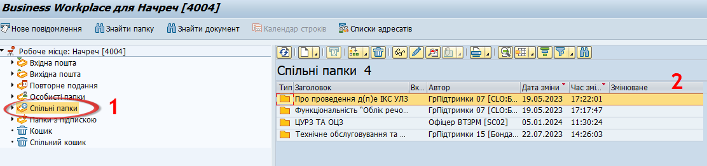

## Спільні папки

Для спільного доступу користувачів до даних в системі передбачена опція «Спільні папки». В неї можуть завантажуватись довідники, інструкції, накази, інші додатки тощо. Достатньо натиснути на відповідну категорію (1), щоб отримати до них доступ (2).

{width="6.299212598425197in" height="1.4881889763779528in"}