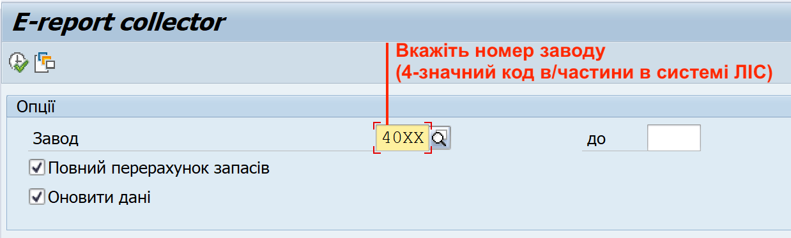

## Перевірка результатів сторнування

Щоб перевірити, чи коректно було проведено сторнування, виконайте такі кроки:

1.Оновіть дані в системі SAP за допомогою операції "Оновлення: Наявність та рух речового майна \[СР0130\]".

{width="5.721738845144357in" height="1.7194214785651794in"}

Див. розділ ["Оперативне оновлення даних з наявності та руху майна"](../%D0%9E%D0%BF%D0%B5%D1%80%D0%B0%D1%82%D0%B8%D0%B2%D0%BD%D0%B5-%D0%BE%D0%BD%D0%BE%D0%B2%D0%BB%D0%B5%D0%BD%D0%BD%D1%8F-%D0%B4%D0%B0%D0%BD%D0%B8%D1%85-%D0%B7-%D0%BD%D0%B0%D1%8F%D0%B2%D0%BD%D0%BE%D1%81%D1%82%D1%96-%D1%82%D0%B0-%D1%80%D1%83%D1%85%D1%83-%D0%BC%D0%B0%D0%B9%D0%BD%D0%B0.md#оперативне-оновлення-даних-з-наявності-та-руху-майна).

2\. Сформуйте еЗвіт.

Див. розділ "Формування еЗвіту".

3\. Знайдіть рядок з потрібним матеріалом (найменуванням майна) та перевірте, чи кількість майна у відповідній чарунці еЗвіту зменшилась на ту кількість, яку ви сторнували.

Наприклад:

ЯКЩО ви сторнували надходження 100 одиниць костюму літнього польового (КЛП),

ЯКІ були проведені у системі як початкові залишки майна (станом на 01.01.2024) за допомогою операції "Надходження без замовлення \[CP0144\]",

ТА до сторнування відображались у графі (стовпчику) еЗвіту "Наявність нового на початок звітного періоду \[4\]",

ТОДІ, після вдало проведеного сторнування, кількість КЛП у стовпчику "Наявність нового на початок звітного періоду \[4\]" повинна зменшитись на 100 одиниць.

4\. Ви також можете перевірити наявність операції сторнування за допомогою операції-кокпіту "Звіт: Список документів матеріалів \[CP0004\]".

4.1. У якості критерія пошуку у цьому звіті код найменування майна (у полі "Матеріал").

4.2. Впевніться, що для щойно проведеної операції сторнування було додано окремий рядок (запис) із документом матеріалу. Рядок повинен відображати кількість майна з іншим знаком, ніж операція, яка була сторнована.

