## Сторнування за допомогою операції "Сторнування документів матеріалів \[CP0443\]"

**1. Запустіть операцію сторнування.**

Відкрийте вікно "Робоче місце користувача" та запустіть операцію сторнування, натиснувши кнопку-кокпіт "Сторнування документів матеріалів (CP0446)".

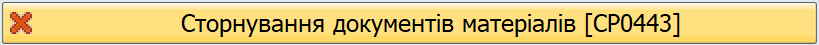{width="5.680555555555555in" height="0.3055555555555556in"}

Див. розділ ["Робоче місце користувача"](../%D0%9F%D0%BE%D1%87%D0%B0%D1%82%D0%BE%D0%BA-%D1%80%D0%BE%D0%B1%D0%BE%D1%82%D0%B8-%D1%83-%D1%81%D0%B8%D1%81%D1%82%D0%B5%D0%BC%D1%96.md#вікно-2-робоче-місце-користувача).

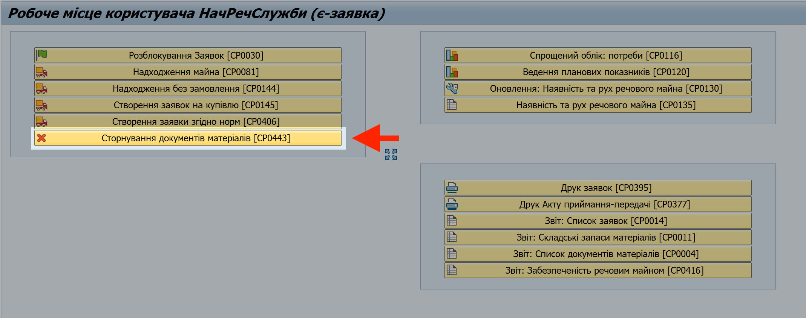{width="6.299212598425197in" height="2.4921259842519685in"}

**2. Вкажіть критерії (фільтри) для пошуку операції, яку потрібно сторнувати.**

2.1. У вікні "Сторнування документів матеріалів", на вкладці "Критерії відбору", у полі "Документ матеріалу" вкажіть номер операції, яку потрібно сторнувати.

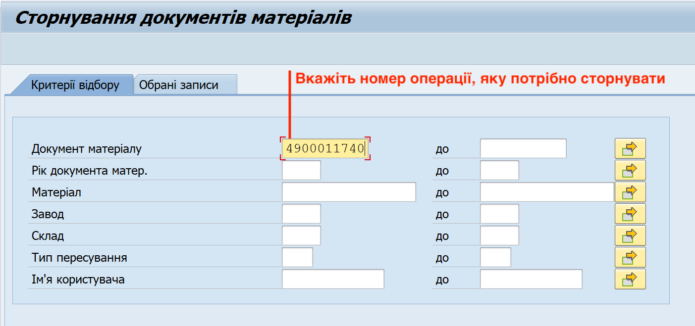{width="6.268055555555556in" height="2.941666666666667in"}

Ви також можете вказавши тільки номер вашого заводу в системі у полі "Завод". Тоді, на наступних кроках вам доведеться обрати операцію зі списку всіх операцій, які були проведені на вашому заводі, що може буде важко, тому що операцій може бути багато.

2.2. Натисніть вкладку "Обрані записи", щоб продовжити роботу із обраними документами матеріалів.

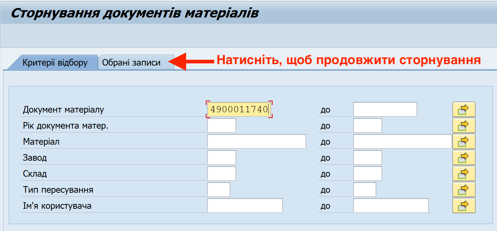{width="6.268055555555556in" height="2.9180555555555556in"}

**3. Додайте позиції, які потрібно сторнувати, до вікна обробки**

> У цьому посібнику, вікно (кошик) обробки розташований знизу вікна "Сторнування документів матеріалів". Вікно обробки також може бути розташовано справа; розташування не має впливу на результат чи кроки проведення операції.

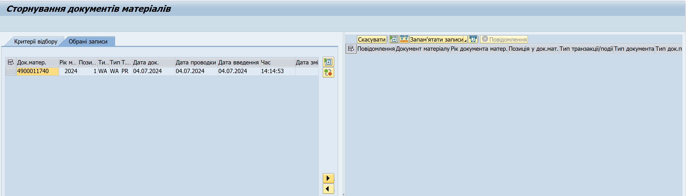{width="6.268055555555556in" height="1.801388888888889in"}

> Якщо ви хочете, щоб вікно обробки було розташовано знизу (як у посібнику), натисніть кнопку 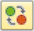{width="0.22532370953630795in" height="0.20654636920384953in"} "Змінити розташування кошику" у правій частині вікна "Сторнування документів матеріалів".

У вікні "Сторнування документів матеріалів", на вкладці "Обрані записи", кожне найменування майна (позиція) із відібраної операції відображається окремим рядком.

Зрозуміти, яке найменування відповідає конкретній позиції, ви можете у операції "Звіт: список документів матеріалів".

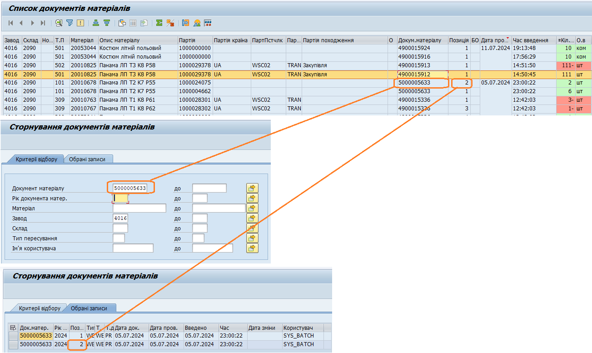{width="6.299212598425197in" height="3.7559055118110236in"}

3.1. Оберіть рядок з потрібною позицією із відібраної операції. Для цього, натисніть лівою кнопкою миші на сірий квадрат з лівого боку потрібного рядку. Обраний рядок змінить колір на жовтий.

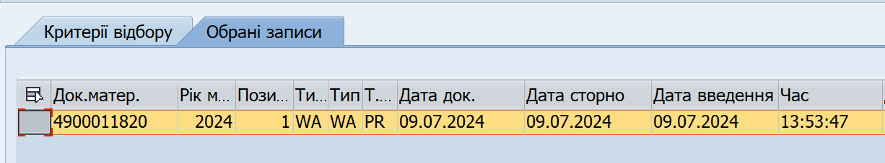{width="6.268055555555556in" height="1.1555555555555554in"}

Щоб виділити декілька рядків, розташованих поруч, протягніть натиснутий курсор мишки вниз чи вверх, щоб захопити потрібні рядки.

Щоб виділити декілька рядків, не розташованих поруч, після виділення одного рядку, натисніть клавішу "Ctrl" (Control) та, утримуючи її натиснутою, виділіть інші рядки, один за одним.

3.2. Додайте обране найменування майна (позицію з операції) до вікна обробки. Для цього, натисніть кнопку {width="0.1985695538057743in" height="0.21842629046369205in"} у правій частині вікна з обраними записами. Або, двічі натисніть рядок з потрібною операцією лівою кнопкою миші.

Якщо ви сторнуєте декілька позицій, виділіть всі позиції та перемістіть їх до вікна обробки, натиснувши кнопку {width="0.1985695538057743in" height="0.21842629046369205in"}.

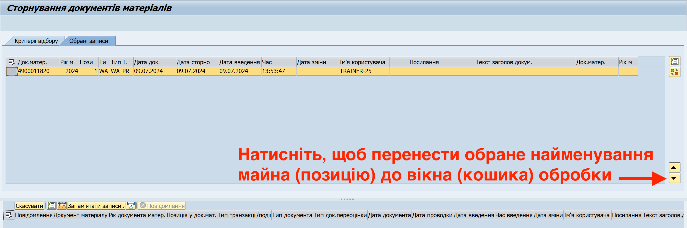{width="6.268055555555556in" height="2.089583333333333in"}

Обране майно буде відображено у нижній частині вікна "Сторнування документів матеріалів"; ця частина вікна й називається "Вікном обробки".

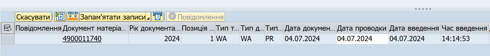{width="6.268055555555556in" height="0.73125in"}

**4. Проведіть сторнування обраної операції або операцій.**

4.1. У панелі інструментів над вікном (кошиком) обробки, натисніть кнопку "Скасувати". Всі операції у вікні обробки буде сторновано.

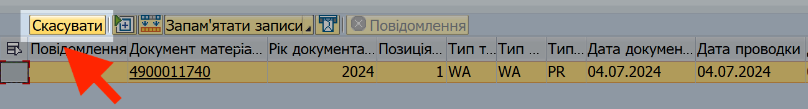{width="6.268055555555556in" height="0.85in"}

Якщо сторнування пройшло успішно, система відобразить відповідне повідомлення у лівому нижньому куті вікна "Сторнування документів матеріалів".

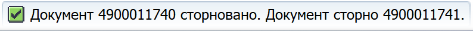{width="5.513888888888889in" height="0.3611111111111111in"}

