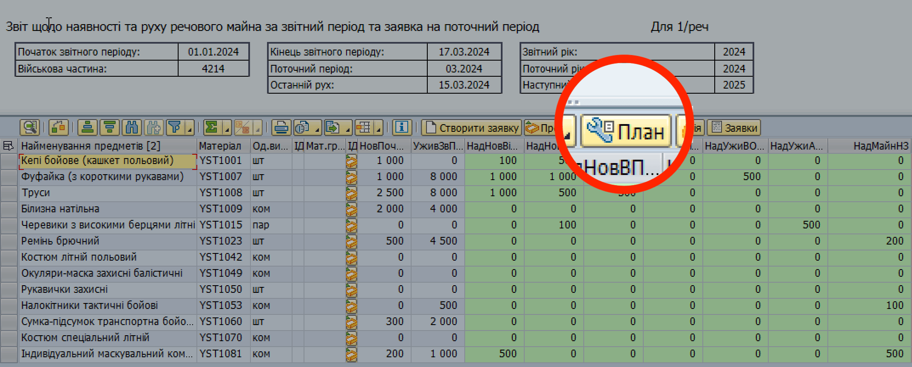
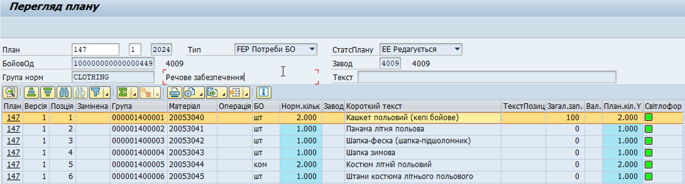
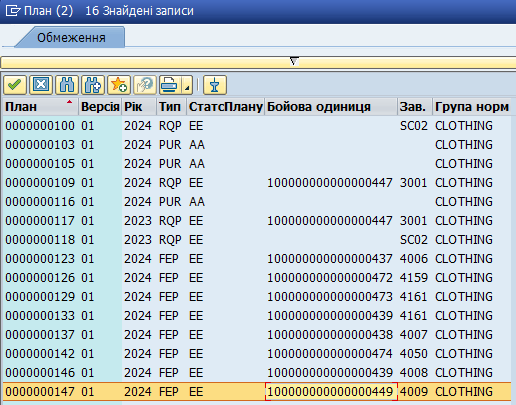

## Перегляд плану потреб з еЗвіту

Перегляд плану з вікна еЗвіту подібний до вже описаної операції "Перегляд створеного плану потреб" – за тією відмінністю, що запустити перегляд можна безпосередньо з вікна еЗвіту, що є зручнішим. Виконайте наступні кроки:

1. Сформуйте еЗвіт.

2. У вікні еЗвіту натисніть кнопку "План".

{width="4.620370734908136in" height="1.866421697287839in"}

3. На сторінці "Перегляд плану" ви побачите створений план потреб з усією необхідною інформацією.

{width="6.299212598425197in" height="1.7007874015748032in"}

Якщо на сторінці "Перегляд плану" план не відобразився автоматично, у полі "План" вкажіть номер плану та натисніть "Enter" на клавіатурі комп'ютера.\
\
Якщо ви не пам'ятаєте номер плану, оберіть план зі списку можливих:

3.1. Натисніть кнопку {width="0.25in" height="0.2638888888888889in"} праворуч від поля "План"

3.2. Знайдіть запис потрібного плану у списку.

У колонці "Завод" поруч з потрібним планом має бути зазначений номер вашого заводу (4-значний код вашої в/частини у системі).

{width="3.3941141732283464in" height="2.6574070428696412in"}

3.3. Двічі натисніть потрібний запис.

3.4. На сторінці "Перегляд плану", натисніть "Enter" на клавіатурі комп'ютера, щоб відобразити план.

{width="6.299212598425197in" height="1.7007874015748032in"}

