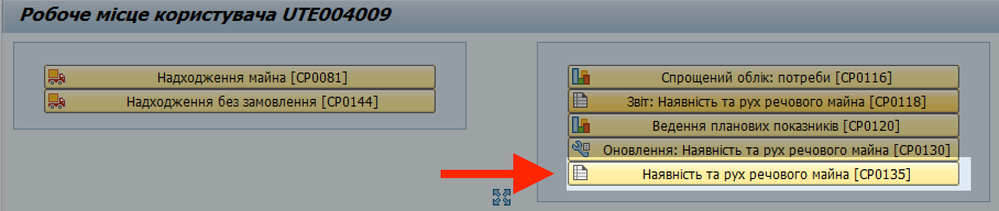
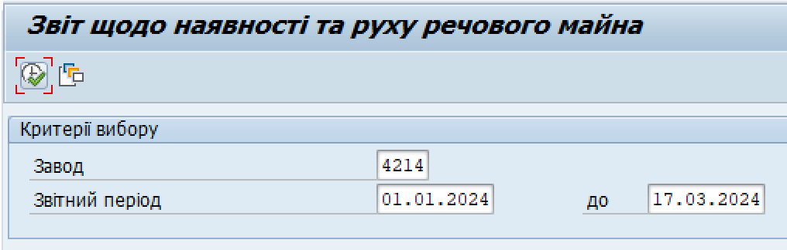
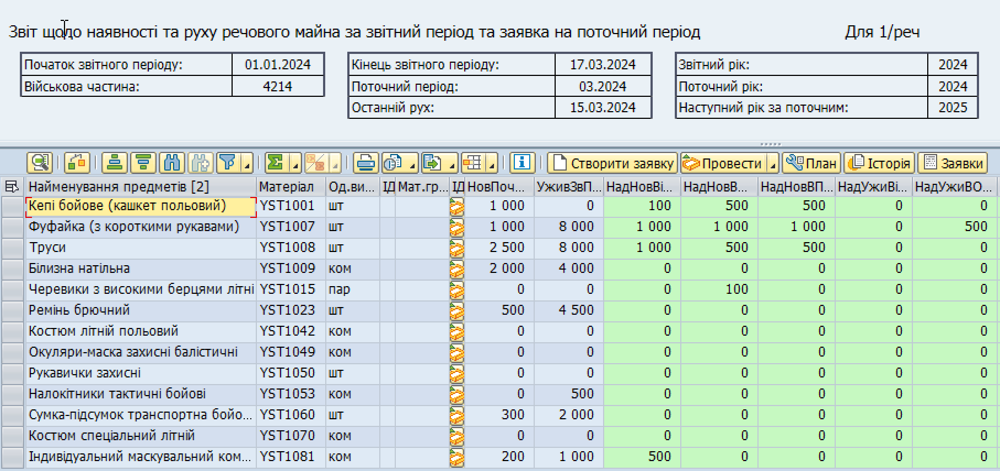

## Формування еЗвіту у системі ЛІС (кроки)

1. Увійдіть у систему ЛІС.

> Див. деталі у розділі ["Вхід до системи"](../%D0%9F%D0%BE%D1%87%D0%B0%D1%82%D0%BE%D0%BA-%D1%80%D0%BE%D0%B1%D0%BE%D1%82%D0%B8-%D1%83-%D1%81%D0%B8%D1%81%D1%82%D0%B5%D0%BC%D1%96.md#вхід-до-системи-загальні-кроки).

2. Відкрийте вікно "Робоче місце користувача".

Див. розділ ["Початкове вікно роботи з системою"](../%D0%9F%D0%BE%D1%87%D0%B0%D1%82%D0%BE%D0%BA-%D1%80%D0%BE%D0%B1%D0%BE%D1%82%D0%B8-%D1%83-%D1%81%D0%B8%D1%81%D1%82%D0%B5%D0%BC%D1%96.md#початкове-вікно-роботи-з-системою).

3. Натисніть кнопку-кокпіт "Наявність та рух речового майна \[CP0135\]".

{width="6.379630358705162in" height="1.3490857392825897in"}

4. У вікні "Критерії вибору", вкажіть такі дані:

| **Завод**  | 4-значний код вашої в/частини у системі.|Наприклад: 4000. 
-------------------------------------------------------
|                    | Цей номер, дійсний для вашого облікового запису, завжди зазначений на верхній панелі вікні "Робоче місце користувача".                                                                                  |
|                    |                                                                                                                                                                                                           |
|                    | {width="3.0277777777777777in" height="1.2366262029746282in"}                                                 |
|                    |                                                                                                                                                                                                           |
|                    | Після введення коду, система автоматично замінить введений номер на код маскування. Це очікувана поведінка системи; див. розділ ["Введення номеру заводу"](../%D0%92%D0%B2%D0%B5%D0%B4%D0%B5%D0%BD%D0%BD%D1%8F%20%D0%BD%D0%BE%D0%BC%D0%B5%D1%80%D1%83%20%D0%B7%D0%B0%D0%B2%D0%BE%D0%B4%D1%83.md#введення-номеру-заводу-з-кодом-маскування). |
+====================+===========================================================================================================================================================================================================+
| **Звітний період** | Дати, які повинен охоплювати звіт.                                                                                                                                                                        |
|                    |                                                                                                                                                                                                           |
|                    | Наприклад: якщо формуєте річний звіт, вкажіть дати з 01.01.20ХХ по 31.12.20ХХ, де "20ХХ" вказує звітний рік.                                                                                            |
|                    |                                                                                                                                                                                                           |
|                    | Див. також розділ ["Річні плани потреб"](../%D0%9F%D0%BB%D0%B0%D0%BD-%D0%BF%D0%BE%D1%82%D1%80%D0%B5%D0%B1-%D0%B7%D0%B3%D1%96%D0%B4%D0%BD%D0%BE-%D0%BD%D0%BE%D1%80%D0%BC-%D0%B7%D0%B0%D0%B1%D0%B5%D0%B7%D0%BF%D0%B5%D1%87%D0%B5%D0%BD%D0%BD%D1%8F/%D0%A0%D1%96%D1%87%D0%BD%D1%96-%D0%BF%D0%BB%D0%B0%D0%BD%D0%B8-%D0%BF%D0%BE%D1%82%D1%80%D0%B5%D0%B1.md#річні-плани-потреб).                                                                                                                                          |
+--------------------+-----------------------------------------------------------------------------------------------------------------------------------------------------------------------------------------------------------+

5. Натисніть кнопку {width="0.25in" height="0.25in"} "Виконати" (або натисніть клавішу F8 на клавіатурі комп'ютера).

{width="4.462963692038495in" height="1.4231988188976379in"}

Сформований еЗвіт відображатиметься у вікні "Звіт щодо наявності та руху речового майна за звітний період".

{width="6.299212598425197in" height="2.97244094488189in"}

